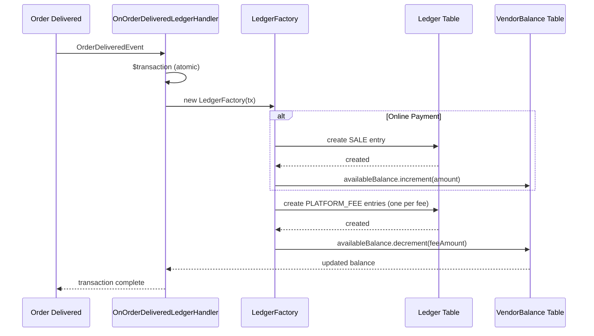

# VendorBalance Model - Developer Documentation

## Overview

The [`VendorBalance`](prisma/models/vendor_balance.prisma) model tracks the available balance for vendors. It is updated **synchronously** with the Ledger entries to maintain accurate vendor earnings.

---

## Data Model

| Field | Type | Description |
|-------|------|-------------|
| `vendorId` | String (PK) | Foreign key to Vendor |
| `availableBalance` | Decimal(14,2) | Current available balance |
| `version` | Int | Optimistic locking (not currently enforced) |
| `updatedAt` | DateTime | Auto-updated timestamp |
| `createdAt` | DateTime | Creation timestamp |

---

## Update Flow



---

## Key Functions

### 1. [`LedgerFactory.createSaleEntry()`](src/ledger/services/handlers/ledger.factory.ts:10)

Called when an order is delivered with **ONLINE** payment mode.

- Creates a SALE ledger entry
- **Increments** `availableBalance` by the order amount
- Uses Prisma `increment` for atomic update

```typescript
await this.tx.vendorBalance.update({
  where: { vendorId: params.vendorId },
  data: { availableBalance: { increment: params.amount } }
});
```

### 2. [`LedgerFactory.createPlatformFeeEntry()`](src/ledger/services/handlers/ledger.factory.ts:40)

Called for each platform fee (commission) applied to an order.

- Creates a PLATFORM_FEE ledger entry (amount stored as negative)
- **Decrements** `availableBalance` by the fee amount
- Skips if fee amount ≤ 0

```typescript
if (params.amount.lte(0)) return;  // Validation: positive amounts only
await this.tx.vendorBalance.update({
  where: { vendorId: params.vendorId },
  data: { availableBalance: { decrement: params.amount } }
});
```

### 3. [`OnOrderDeliveredLedgerHandler.handle()`](src/ledger/services/handlers/on-order-delivered-ledger.handler.ts:53)

Main event handler triggered when an order is delivered.

**Flow:**
1. Wraps everything in `$transaction` for atomicity
2. Checks for existing SALE entries (idempotency)
3. For **ONLINE** payments: creates SALE entry + all platform fees
4. For **COD** payments: creates only PRODUCT_LISTING fee

---

## Data Validation Rules

| Rule | Implementation |
|------|----------------|
| Amount must be positive | `if (params.amount.lte(0)) return;` in `createPlatformFeeEntry()` |
| Decimal precision | `@db.Decimal(14, 2)` - max 14 digits, 2 decimal places |
| Idempotency | Checks for existing `SALE` entry by `orderItemId` before creating |
| Atomic updates | All balance changes wrapped in Prisma `$transaction` |

---

## Side Effects

| Side Effect | Trigger | Description |
|-------------|---------|-------------|
| Balance increase | Order delivered (ONLINE) | Vendor receives order amount |
| Balance decrease | Platform fee applied | Vendor pays commission |
| Ledger entry created | Any balance change | Full audit trail maintained |
| Timestamp update | Any balance change | `updatedAt` auto-updated by Prisma |
| Payout eligibility | Balance > threshold | [`VendorPayoutCronService`](src/vendor-payout/services/vendor-payout-cron.service.ts) queries for balances > 10 |

---

## Payout Consumption

The balance is **consumed** when payouts are processed (future implementation). Currently:

- [`VendorPayoutCronService`](src/vendor-payout/services/vendor-payout-cron.service.ts) runs weekly
- Queries `availableBalance > 10`
- Sends admin notification for manual payout processing

---

## Quick Reference

| Scenario | Balance Change |
|----------|----------------|
| Order delivered (ONLINE) | + Order amount |
| Platform fee applied | - Fee amount |
| Refund issued | - Sale amount (future) |
| Payout processed | - Payout amount (future) |

---

## Files Involved

| File | Purpose |
|------|---------|
| [`prisma/models/vendor_balance.prisma`](prisma/models/vendor_balance.prisma) | Database model |
| [`prisma/models/ledger.prisma`](prisma/models/ledger.prisma) | Audit trail model |
| [`src/ledger/services/handlers/ledger.factory.ts`](src/ledger/services/handlers/ledger.factory.ts) | Balance update logic |
| [`src/ledger/services/handlers/on-order-delivered-ledger.handler.ts`](src/ledger/services/handlers/on-order-delivered-ledger.handler.ts) | Event handler |
| [`src/vendor-payout/services/vendor-payout-cron.service.ts`](src/vendor-payout/services/vendor-payout-cron.service.ts) | Balance consumption trigger |
