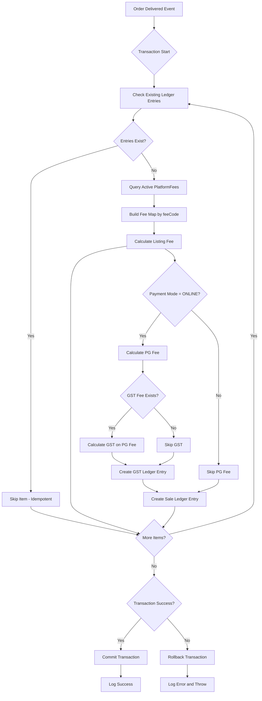

# On-Order-Delivered Ledger Handler - Implementation Plan

## Overview
This plan outlines the updates needed for the `OnOrderDeliveredLedgerHandler` to correctly work with the new `PlatformFee` Prisma model and ensure proper data relationships, accurate fee calculations, and appropriate error handling.

---

## Current Issues Identified

### 1. Outdated PlatformFee Field References
The handler references old field names that no longer exist in the schema:
- `platformFees.product_listing_fee` ❌ → Should query by `feeCode: "LISTING_FEE"`
- `platformFees.transaction_fee` ❌ → Should query by `feeCode: "PAYMENT_GATEWAY_FEE"`
- `platformFees.gst` ❌ → Should query by `feeCode: "GST"`

### 2. Incorrect PlatformFee Query
Current: Queries for a single `PlatformFee` by `categoryId`
Expected: Query all active fees for the category with proper date filtering

### 3. Missing PlatformFeeType Enum
The handler imports `PlatformFeeType` from `@prisma.client` but this enum doesn't exist in the schema. Solution: Use fee codes as strings.

### 4. Inadequate Error Handling
Current: Try-catch inside transaction that continues processing
Expected: Transaction should fail entirely if any item fails (proper rollback)

---

## New PlatformFee Model Structure

```prisma
model PlatformFee {
  id              String   @id @default(uuid())
  categoryId      String
  feeName         String          // Display name: "Listing Fee", "Payment Gateway Fee", etc.
  calculationType FeeCalculationType  // PERCENTAGE or FIXED
  value           Decimal @db.Decimal(10, 2)  // Fee value
  applyOnFeeCode  String?  // null = applies to order total, fee code = applies to result of specified fee
  effectiveFrom   DateTime
  effectiveTo     DateTime?
  isActive        Boolean @default(true)
  createdAt       DateTime @default(now())
  updatedAt       DateTime @updatedAt
  categories      Categories @relation(...)
  @@index([categoryId])
  @@index([feeName])
}
```

### Fee Codes Standardization
- `LISTING_FEE` - Product listing/commission fee
- `PAYMENT_GATEWAY_FEE` - Payment processing fee (online orders only)
- `GST` - Goods and Services Tax (on payment gateway fee)
- `SALE` - Sale amount (income, not a PlatformFee)

---

## Implementation Steps

### Step 1: Update PlatformFee Query Logic
**File:** `src/ledger/services/handlers/on-order-delivered-ledger.handler.ts`

```typescript
// Query active fees for category within validity period
const platformFees = await tx.platformFee.findMany({
  where: {
    categoryId: item.product.categoryId,
    isActive: true,
    effectiveFrom: { lte: deliveryTimestamp },
    OR: [
      { effectiveTo: null },
      { effectiveTo: { gte: deliveryTimestamp } }
    ]
  }
});
```

### Step 2: Create Fee Lookup Map
Build a map of feeCode -> PlatformFee for efficient access:
```typescript
const feeMap = new Map(platformFees.map(f => [f.feeCode, f]));
```

### Step 3: Implement Calculation Based on Type
```typescript
function calculateFee(fee: PlatformFee, baseAmount: Decimal): Decimal {
  if (fee.calculationType === 'PERCENTAGE') {
    return baseAmount.mul(fee.value).div(100);
  }
  // FIXED - apply once per order item
  return fee.value;
}
```

### Step 4: Handle Fee Chaining (applyOnFeeCode)
For GST that applies on Payment Gateway Fee:
```typescript
const paymentGatewayFee = calculateFee(paymentGatewayFeeRecord, itemAmount);
const gstFee = calculateFee(gstRecord, paymentGatewayFee); // Base is PG fee
```

### Step 5: Update Ledger Entry Creation
Use standardized fee codes as strings instead of PlatformFeeType enum:
```typescript
data: {
  vendorId: event.vendorId,
  orderItemId: item.id,
  type: 'PLATFORM_FEE',
  feeType: 'LISTING_FEE',  // String instead of enum
  amount: listingFee.mul(-1),
  // ...
}
```

### Step 6: Improve Transaction Error Handling
Move try-catch outside transaction to ensure proper rollback:
```typescript
try {
  await this.prisma.$transaction(async (tx) => {
    // All ledger operations here
    // If any operation fails, entire transaction rolls back
  });
} catch (error) {
  this.logger.error(`Failed to create ledger entries: ${error.message}`, error.stack);
  throw error; // Re-throw to trigger any upstream error handling
}
```

### Step 7: Add Idempotency Check
Check if ledger entries already exist for the order item to prevent duplicates:
```typescript
const existingEntry = await tx.ledger.findFirst({
  where: { orderItemId: item.id, type: 'SALE' }
});
if (existingEntry) {
  this.logger.warn(`Ledger entries already exist for order item ${item.id}, skipping`);
  continue;
}
```

---

## Edge Cases to Handle

| Edge Case | Handling |
|-----------|----------|
| No PlatformFee records found | Use default zero values, log warning |
| Fee with FIXED calculation type | Apply once per order item, not per unit |
| Fee with expired effectiveTo | Query should filter by current delivery timestamp |
| applyOnFeeCode references missing fee | Skip chaining, apply to order total |
| Order already has ledger entries | Skip to prevent duplicate entries (idempotency) |
| Database connection failure | Transaction rollback, error logged and re-thrown |
| Negative or zero itemAmount | Skip fee calculation for that item |

---

## Data Flow Diagram



---

## Summary of Changes

1. **Replace enum with string constants** for feeType
2. **Update PlatformFee query** to use `findMany` with proper filters
3. **Implement calculation logic** based on `calculationType` (PERCENTAGE/FIXED)
4. **Handle fee chaining** using `applyOnFeeCode`
5. **Add idempotency check** to prevent duplicate entries
6. **Improve error handling** with proper transaction rollback

---

## Files to Modify
- `src/ledger/services/handlers/on-order-delivered-ledger.handler.ts`
