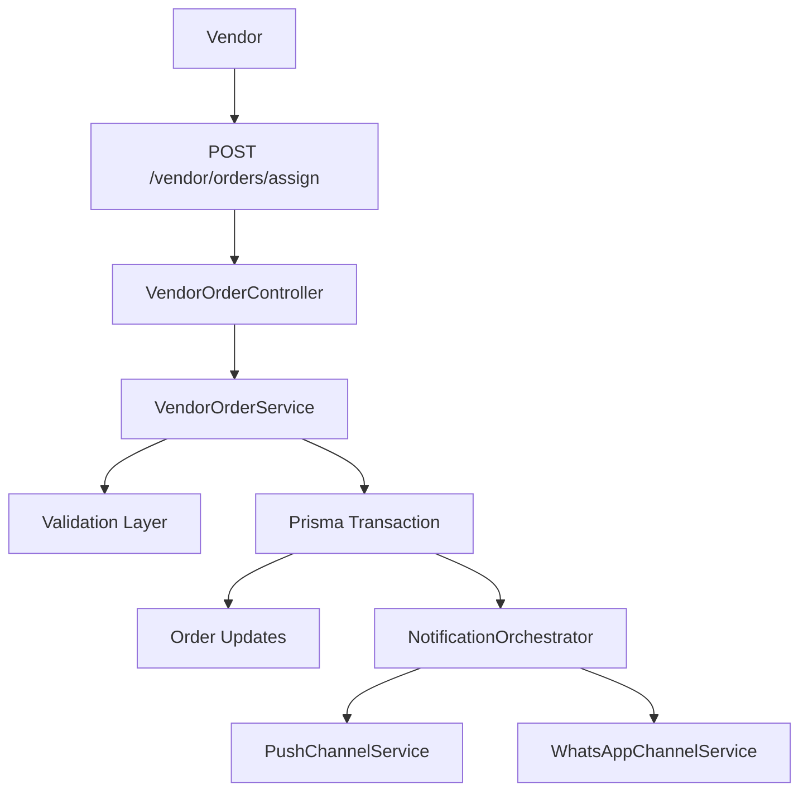

# Order Assignment Feature - Implementation Plan

## Overview
This document outlines the implementation plan for adding bulk and single order assignment feature to assign orders to riders with proper error handling, notifications, and schema updates.

## Architecture Diagram



## 1. Prisma Schema Modifications

### 1.1 Add CancellationOrigin Enum
**File**: `prisma/base.prisma`

```prisma
enum CancellationOrigin {
  CUSTOMER
  VENDOR
  RIDER
  ADMIN
}
```

### 1.2 Update Order Model
**File**: `prisma/models/order.prisma`

```prisma
// Remove: assigned_rider_phone String?
// Add: rider_id String? with FK relationship

model Order {
  // ... existing fields ...
  
  rider_id String?
  rider    Rider? @relation("orderAssignments", fields: [rider_id], references: [id])
  
  cancellation_origin CancellationOrigin?
  
  // Update indexes
  @@index([rider_id])
  @@index([vendorId, delivery_status])
}
```

### 1.3 Update Rider Model
**File**: `prisma/models/rider.prisma`

```prisma
model Rider {
  // ... existing fields ...
  
  orders Order[] @relation("orderAssignments")
}
```

## 2. DTO Implementation

### 2.1 AssignOrdersDto
**File**: `src/order/dto/assign-orders.dto.ts`

```typescript
import { IsArray, IsNotEmpty, IsString, IsUUID, ArrayMinSize, ValidateNested } from 'class-validator';
import { Type } from 'class-transformer';
import { ApiProperty } from '@nestjs/swagger';

export class AssignOrdersDto {
  @ApiProperty({
    description: 'Array of order IDs to assign',
    type: [String],
    example: ['order-uuid-1', 'order-uuid-2']
  })
  @IsArray()
  @ArrayMinSize(1)
  @IsUUID('4', { each: true })
  orderIds: string[];

  @ApiProperty({
    description: 'Rider ID to assign orders to',
    type: String,
    example: 'rider-uuid'
  })
  @IsNotEmpty()
  @IsUUID('4')
  riderId: string;
}
```

## 3. Service Implementation

### 3.1 VendorOrderService Updates

**File**: `src/order/services/vendor-order.service.ts`

#### Method Signature:
```typescript
async assignOrders(
  dto: AssignOrdersDto,
  user: User
): Promise<{
  success: boolean;
  assignedOrders: Array<{ orderId: string; orderNo: string }>;
  failedOrders: Array<{ orderId: string; reason: string }>;
}>
```

#### Validation Logic:
1. Validate all order IDs exist
2. Verify orders belong to the requesting vendor
3. Verify orders are in assignable state (PENDING or CONFIRMED)
4. Validate rider exists
5. Verify rider belongs to vendor (if required)

#### Database Operations:
```typescript
await this.prisma.$transaction(async (tx) => {
  // Update all orders within transaction
  await tx.order.updateMany({
    where: { id: { in: dto.orderIds } },
    data: {
      rider_id: dto.riderId,
      delivery_status: 'OUT_FOR_DELIVERY'
    }
  });
});
```

### 3.2 Notification Orchestrator Updates

**File**: `src/notification/services/orchestrators/order-notification.orchestrator.ts`

#### New Method:
```typescript
async sendBulkOrderAssignmentNotification(
  orderIds: string[],
  riderId: string
): Promise<{ pushSent: boolean; whatsappSent: boolean; errors: string[] }>
```

## 4. Controller Implementation

### 4.1 New Endpoint
**File**: `src/order/controllers/vendor-order.controller.ts`

```typescript
@Post('assign')
@ApiOperation({
  summary: 'Assign orders to a rider',
  description: 'Assign single or bulk orders to a rider for delivery'
})
@ApiBody({ type: AssignOrdersDto })
@ApiResponse({ status: 200, description: 'All orders assigned successfully' })
@ApiResponse({ status: 207, description: 'Partial success - some orders failed' })
@ApiResponse({ status: 400, description: 'Invalid request data' })
@ApiResponse({ status: 404, description: 'Orders or rider not found' })
async assignOrders(@Body() dto: AssignOrdersDto, @CurrentUser() user: User) {
  return this.vendorOrderService.assignOrders(dto, user);
}
```

## 5. Error Handling

### 5.1 Error Response Format
```typescript
{
  errorCode: string;
  message: string;
  details: Array<{ field: string; message: string }>;
  timestamp: string;
  correlationId: string;
}
```

### 5.2 HTTP Status Codes
| Scenario | Status Code |
|----------|-------------|
| All successful | 200 |
| Partial success | 207 |
| Invalid input | 400 |
| Not found | 404 |
| Business rule violation | 422 |
| Server error | 500 |

## 6. Logging

### 6.1 Structured Log Entries
```typescript
// Entry
this.logger.log(`Starting order assignment for ${dto.orderIds.length} orders`, {
  correlationId,
  orderCount: dto.orderIds.length,
  riderId: dto.riderId
});

// Validation failure
this.logger.warn(`Validation failed for order ${orderId}`, {
  correlationId,
  orderId,
  reason: 'Not in assignable state'
});

// Success
this.logger.log(`Orders assigned successfully`, {
  correlationId,
  assignedCount: successCount,
  failedCount: failureCount
});
```

## 7. Testing Scenarios

### 7.1 Success Cases
- Single order assignment
- Bulk order assignment
- Assign orders to rider with active device tokens
- Assign orders when rider has no device tokens (only WhatsApp)

### 7.2 Validation Failure Cases
- Empty orderIds array
- Invalid UUID format
- Order not found
- Order belongs to different vendor
- Order already delivered
- Order already cancelled
- Rider not found
- Rider not available

### 7.3 Edge Cases
- All orders fail validation
- Mixed success/failure
- Notification service unavailable
- Database connection failure mid-transaction

## 8. Environment Variables

No new environment variables required. Uses existing:
- `TWILIO_ACCOUNT_SID`
- `TWILIO_AUTH_TOKEN`
- `TWILIO_WHATSAPP_NUMBER`
- Firebase credentials (already configured)

## 9. Files to Create/Modify

### New Files:
1. `src/order/dto/assign-orders.dto.ts`

### Modified Files:
1. `prisma/base.prisma` - Add CancellationOrigin enum
2. `prisma/models/order.prisma` - Update Order model
3. `prisma/models/rider.prisma` - Add orders relation
4. `src/order/controllers/vendor-order.controller.ts` - Add endpoint
5. `src/order/services/vendor-order.service.ts` - Add assignOrders method
6. `src/notification/services/orchestrators/order-notification.orchestrator.ts` - Add bulk notification method

## 10. Migration Steps

1. Create Prisma migration:
   ```bash
   npx prisma migrate dev --name add_rider_assignment_schema
   ```

2. Generate TypeScript types:
   ```bash
   npx prisma generate
   ```

3. Verify migration:
   ```bash
   npx prisma migrate status
   ```

## 11. Rollback Plan

If issues arise:
1. Rollback migration: `npx prisma migrate rollback`
2. Revert code changes
3. Re-deploy previous version

## 12. Security Considerations

1. **Vendor Isolation**: Ensure orders can only be assigned by the vendor who owns them
2. **Rider Validation**: Verify rider belongs to the vendor (if applicable)
3. **Input Sanitization**: Validate all UUIDs to prevent injection attacks
4. **Rate Limiting**: Consider adding rate limiting for the assignment endpoint
