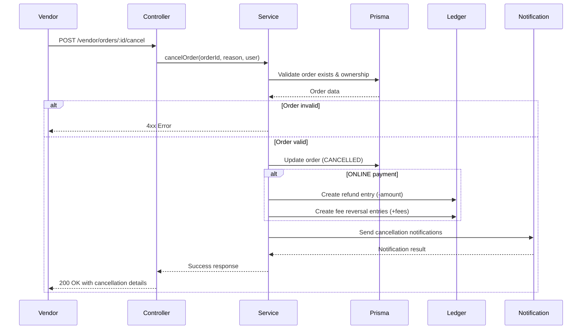

# Order Cancellation Endpoint Implementation Plan

## Overview

This document outlines the comprehensive implementation plan for adding a vendor-initiated order cancellation endpoint to the existing order management system. The implementation follows SOLID principles, KISS methodology, and maintains loose coupling between components.

## Requirements Summary

### Functional Requirements
1. **Endpoint**: Vendor-order controller must handle order cancellations
2. **Validation**: Reject cancellations for orders with `delivery_status` = DELIVERED
3. **Order Updates**:
   - Set `delivery_status` to CANCELLED
   - Populate `cancelledAt` with current timestamp
   - Populate `cancelReason` with "Vendor-Cancellation: {reason}"
4. **Payment Handling**:
   - For ONLINE payments: Create refund ledger entry (negative amount)
   - Create fee reversal ledger entries (positive values)
5. **Notifications**:
   - Users: Email + Push notifications
   - Vendors: Email + Push notifications  
   - Admins: Email notifications

### Non-Functional Requirements
- SOLID principles compliance
- KISS methodology
- Loose coupling
- Comprehensive logging
- Unit testable without extensive mocking
- No UI changes
- TypeScript compilation verified
- Error handling with proper HTTP status codes

---

## Implementation Steps

### Step 1: Update CancelOrderDto

**File**: `src/order/dto/cancel-order.dto.ts`

Add vendor-specific fields for cancellation:
```typescript
export class CancelOrderDto {
  @IsString()
  @IsNotEmpty()
  @MaxLength(500)
  cancelReason: string;
}
```

**Changes Required**: Add validation for cancellation reason, ensure existing DTO is compatible with vendor-initiated cancellation.

---

### Step 2: Create CancelOrderResponseDto

**File**: `src/order/dto/cancel-order-response.dto.ts` (already exists, needs update)

Update to include:
- Order ID
- Cancellation status
- Refund details (if applicable)
- Timestamp

```typescript
export class CancelOrderResponseDto {
  success: boolean;
  orderId: string;
  orderNumber: string;
  deliveryStatus: 'CANCELLED';
  cancelledAt: Date;
  cancelReason: string;
  refundAmount?: number;
  refundStatus?: 'PENDING' | 'PROCESSED';
}
```

---

### Step 3: Implement CancelOrder Endpoint in Controller

**File**: `src/order/controllers/vendor-order.controller.ts`

Add new endpoint:
```typescript
@Post(':id/cancel')
@ApiOperation({
  summary: 'Cancel order',
  description: 'Vendor-initiated cancellation for non-delivered orders'
})
@ApiParam({ name: 'id', description: 'Order UUID' })
@ApiBody({ type: CancelOrderDto })
@ApiResponse({ status: 200, description: 'Order cancelled successfully' })
@ApiResponse({ status: 400, description: 'Bad Request - validation failed' })
@ApiResponse({ status: 403, description: 'Forbidden - order does not belong to vendor' })
@ApiResponse({ status: 404, description: 'Order not found' })
@ApiResponse({ status: 409, description: 'Conflict - order already delivered' })
async cancelOrder(
  @Param('id') id: string,
  @Body() dto: CancelOrderDto,
  @CurrentUser() user: User,
) {
  return this.vendorOrderService.cancelOrder(id, dto.cancelReason, user);
}
```

---

### Step 4: Implement CancelOrder Service Method

**File**: `src/order/services/vendor-order.service.ts`

Key implementation details:

```typescript
/**
 * Cancels an order initiated by the vendor.
 * 
 * Business Rules:
 * - Only orders not yet delivered can be cancelled
 * - For ONLINE payments: Creates refund and fee reversal ledger entries
 * - For COD orders: No refund required, only status update
 * 
 * @param orderId - The order UUID
 * @param cancelReason - Vendor's reason for cancellation
 * @param user - Authenticated vendor user
 * @returns Cancellation result with order details
 */
async cancelOrder(
  orderId: string,
  cancelReason: string,
  user: User,
): Promise<CancelOrderResponseDto>
```

**Validation Steps**:
1. Validate orderId format (UUID)
2. Fetch order with relations (customer, vendor, payment, orderItems)
3. Check order ownership (vendorId match)
4. Validate order is not already delivered
5. Validate order is not already cancelled

**Order Update**:
```typescript
const updateData = {
  delivery_status: 'CANCELLED',
  cancelledAt: new Date(),
  cancelReason: `Vendor-Cancellation: ${cancelReason}`,
};
```

**Payment Processing (ONLINE only)**:
```typescript
if (order.payment_mode === 'ONLINE') {
  // Create refund ledger entry (negative amount)
  await tx.ledger.create({
    data: {
      vendorId: order.vendorId,
      orderItemId: orderItem.id, // Use first orderItem or create aggregated
      type: 'REFUND',
      feeType: 'ADJUSTMENT',
      amount: -order.total_amount, // Negative for refund
      paymentMode: 'ONLINE',
    },
  });

  // Create fee reversal entries (positive values)
  for (const orderItem of orderItems) {
    // Calculate and reverse platform fees
    const listingFee = await calculateListingFee(orderItem);
    await tx.ledger.create({
      data: {
        vendorId: order.vendorId,
        orderItemId: orderItem.id,
        type: 'PLATFORM_FEE',
        feeType: 'LISTING_FEE',
        amount: listingFee, // Positive to reverse the fee
        paymentMode: 'ONLINE',
      },
    });
  }
}
```

---

### Step 5: Update OrderNotificationOrchestrator

**File**: `src/notification/services/orchestrators/order-notification.orchestrator.ts`

Update `sendOrderCancellationNotifications` method to include:
1. Admin email notification (currently missing)
2. Customer push notification (currently missing)

**Changes**:
```typescript
async sendOrderCancellationNotifications(orderId: string): Promise<{
  customerEmailSent: boolean;
  customerPushSent: boolean;  // NEW
  vendorEmailSent: boolean;
  vendorPushSent: boolean;
  adminEmailSent: boolean;    // NEW
  errors: string[];
}>
```

**Add Admin Email Section**:
```typescript
// Send admin email
try {
  const adminEmail = process.env.ADMIN_EMAIL || 'admin@waterdelivery.com';
  const html = await renderToHtml(
    React.createElement(AdminOrderCancellationTemplate, {
      orderId: order.id,
      orderNumber: order.orderNo,
      formattedAmount,
      cancellationReason: order.cancelReason || 'No reason provided',
      customerName: order.customer?.name,
      vendorName: order.vendor?.name || 'Vendor',
    }),
  );
  
  await this.emailChannel.sendEmail(
    adminEmail,
    `Order Cancelled - ${order.orderNo}`,
    html,
    correlationId,
  );
} catch (error) {
  // Handle error
}
```

**Add Customer Push Notification**:
```typescript
// Send customer push notification
if (order.customerId) {
  const payload: PushNotificationPayload = {
    title: 'Order Cancelled 🚫',
    body: `Your order #${order.orderNo} has been cancelled`,
    data: {
      orderId: order.id,
      orderNumber: order.orderNo,
      notificationType: NotificationType.ORDER_CANCELLED_CUSTOMER,
      screen: 'OrderDetails',
    },
  };
  
  await this.sendPushToUser(order.customerId, UserType.CUSTOMER, payload, correlationId);
}
```

---

### Step 6: Error Handling Implementation

**File**: `src/order/services/vendor-order.service.ts`

Comprehensive error handling with proper HTTP status codes:

```typescript
// Input validation
if (!orderId || typeof orderId !== 'string') {
  throw new BadRequestException('Order ID is required and must be a string');
}

if (!this.isValidUuid(orderId)) {
  throw new BadRequestException('Invalid order ID format. Expected UUID');
}

if (!cancelReason || cancelReason.trim().length === 0) {
  throw new BadRequestException('Cancellation reason is required');
}

if (cancelReason.length > 500) {
  throw new BadRequestException('Cancellation reason must not exceed 500 characters');
}

// Order not found
if (!order) {
  throw new NotFoundException(`Order with ID ${orderId} not found`);
}

// Ownership validation
if (order.vendorId !== user.id) {
  this.logger.warn(`Vendor ${user.id} attempted to cancel order ${orderId} owned by ${order.vendorId}`);
  throw new ForbiddenException('You do not have permission to cancel this order');
}

// Order state validation
if (order.delivery_status === 'DELIVERED') {
  throw new ConflictException('Cannot cancel an order that has already been delivered');
}

if (order.delivery_status === 'CANCELLED') {
  throw new ConflictException('Order has already been cancelled');
}
```

---

### Step 7: Logging Implementation

**File**: `src/order/services/vendor-order.service.ts`

Add structured logging throughout:

```typescript
private readonly logger = new Logger(VendorOrderService.name);

// In cancelOrder method:
this.logger.log(`Order cancellation initiated for order ${orderId} by vendor ${user.id}`);

this.logger.warn(`Cancellation rejected - order already delivered: ${orderId}`);

this.logger.log(`Order ${orderId} cancelled successfully. Reason: ${cancelReason}`);

this.logger.error(`Failed to cancel order ${orderId}: ${errorMessage}`);

// For refund processing:
this.logger.log(`Created refund ledger entry for order ${orderId}: ₹${Math.abs(refundAmount)}`);
```

---

### Step 8: Create Documentation

**File**: `src/order/docs/order-cancellation.md`

Create comprehensive documentation covering:
1. API endpoint documentation
2. Request/response schemas
3. Error scenarios
4. Debugging guide
5. Extension points

---

## Architecture Diagram



---

## Error Response Format

All errors follow a consistent format:

```typescript
{
  statusCode: number,
  message: string,
  error: string,
  timestamp: string,
  path: string,
  correlationId: string,
}
```

**Common Error Scenarios**:

| Scenario | Status Code | Message |
|----------|-------------|---------|
| Invalid order ID format | 400 | Invalid order ID format. Expected UUID |
| Missing cancellation reason | 400 | Cancellation reason is required |
| Order not found | 404 | Order with ID {orderId} not found |
| Vendor doesn't own order | 403 | You do not have permission to cancel this order |
| Order already delivered | 409 | Cannot cancel an order that has already been delivered |
| Order already cancelled | 409 | Order has already been cancelled |
| Database error | 500 | Failed to process cancellation. Please try again. |

---

## Testing Considerations

1. **Unit Tests**:
   - Order validation logic
   - Ledger entry creation
   - Notification triggering
   
2. **Integration Tests**:
   - Full cancellation flow
   - Error handling scenarios
   - Notification delivery

3. **Manual Testing**:
   - Vendor cancelling own order
   - Vendor attempting to cancel other's order
   - Attempting to cancel delivered order
   - Verifying ledger entries

---

## Extension Points

### Future Capabilities:
1. **Partial Cancellation**: Allow cancelling individual order items
2. **Automated Rules**: Auto-cancel orders after X hours without confirmation
3. **Cancellation Window**: Limit cancellation to specific timeframes
4. **Refund Policy**: Different refund rules based on cancellation timing
5. **Cancellation Appeals**: Customer can appeal vendor-initiated cancellations

### Code Extensibility:
- `cancelOrder` method accepts `CancelOrderOptions` interface for future features
- `NotificationStrategy` pattern for adding new notification channels
- `RefundCalculator` interface for custom refund logic

---

## Files to Modify

| File | Change Type | Description |
|------|-------------|-------------|
| `src/order/dto/cancel-order.dto.ts` | Modify | Add vendor-specific validation |
| `src/order/dto/cancel-order-response.dto.ts` | Create/Update | Response DTO |
| `src/order/controllers/vendor-order.controller.ts` | Add endpoint | Cancel endpoint |
| `src/order/services/vendor-order.service.ts` | Add method | Cancel logic + ledger |
| `src/notification/services/orchestrators/order-notification.orchestrator.ts` | Modify | Add admin + customer push |
| `src/order/docs/order-cancellation.md` | Create | Documentation |

---

## Verification Checklist

- [ ] TypeScript compilation passes
- [ ] No build failures
- [ ] No runtime errors in execution path
- [ ] Inline documentation for complex logic
- [ ] API documentation updated
- [ ] Error handling covers all scenarios
- [ ] Logging provides sufficient context
