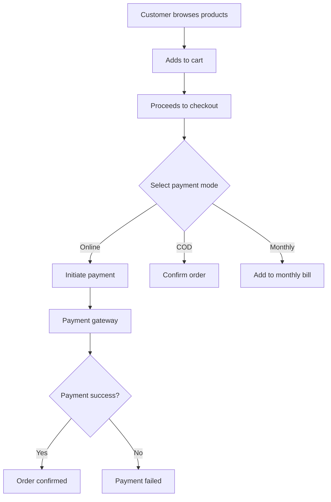
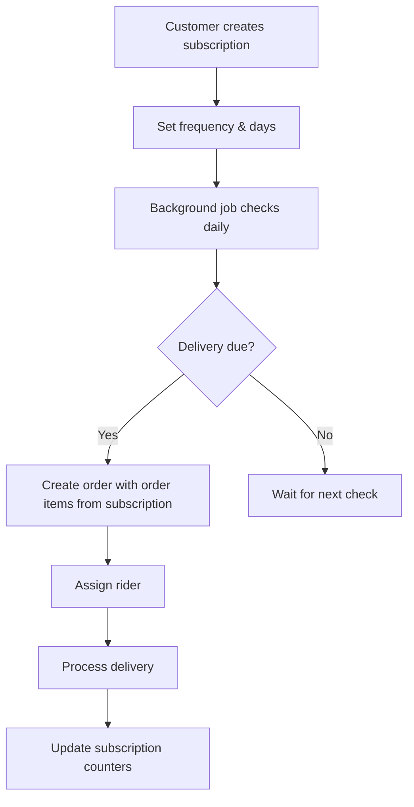
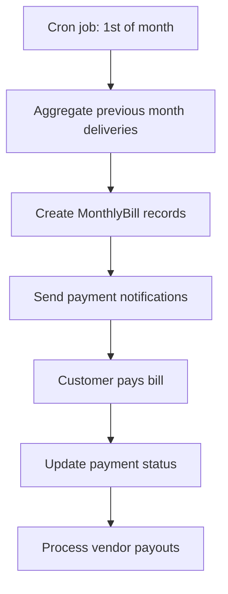
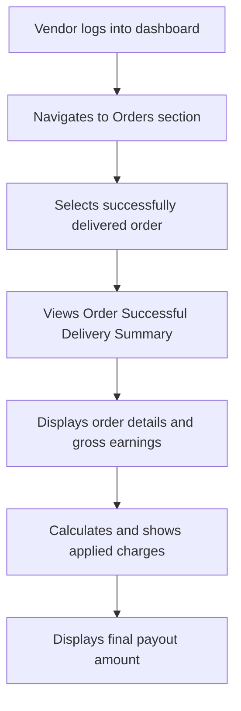

# End-to-End Product Order Processing and Payment System Implementation Plan

## Overview
This plan outlines the implementation of a comprehensive e-commerce platform for product ordering, payment processing, scheduled deliveries, and vendor management. The system supports multiple payment modes, automated billing with charges applied on successful delivery, notifications, and delivery tracking with OTP verification.

## High-Level Architecture

### System Components
- **Backend**: NestJS framework with TypeScript, Prisma ORM, PostgreSQL database
- **Authentication**: JWT tokens with OTP verification for login and delivery
- **Job Scheduling**: Bull Queue for background tasks (subscription processing, monthly billing)
- **Caching**: Redis for session management and temporary data
- **External Services**:
  - Payment Gateway (Razorpay/Stripe)
  - Notification Service (Firebase push, SMS, Email)
  - Delivery Tracking (GPS integration)
  - Location Services (for address validation)

### Microservices/Modules
- Auth Service: User authentication and authorization
- Customer Service: Customer profiles, addresses, orders
- Vendor Service: Vendor management, products, analytics
- Admin Service: Product approval, system oversight
- Order Service: Order lifecycle management
- Payment Service: Payment processing and refunds
- Notification Service: Multi-channel notifications
- Delivery Service: Rider assignment, OTP verification

## Database Schema Mappings and Modifications

### Existing Models (Core)
- **Customer**: Basic profile, addresses, orders, payments
- **Vendor**: Profile, products, bank accounts, riders
- **Product**: Details, pricing, categories, vendor association
- **Order**: Status tracking, payment info, delivery details
- **Payment**: Transaction records with provider integration
- **Subscription**: Scheduled delivery configuration
- **MonthlyBill**: Monthly payment aggregation
- **Notification**: Communication records
- **Cart/CartItem**: Shopping cart functionality

### Required Modifications and Additions

#### Product Model Additions
```prisma
model Product {
  // ... existing fields
  approval_status ProductApprovalStatus @default(PENDING)
  approved_by String? // Admin ID
  approved_at DateTime?
  is_schedulable Boolean @default(false) // Vendor can select for scheduling
}

enum ProductApprovalStatus {
  PENDING
  APPROVED
  REJECTED
}
```

#### Order Model Additions
```prisma
model Order {
  // ... existing fields (remove cartId)
  payment_mode PaymentMode
  subscriptionId String? // Link to subscription for scheduled orders
  delivery_otp String?
  otp_verified Boolean @default(false)
  otp_generated_at DateTime?
  orderItems OrderItem[] // New relation to order items
}

enum PaymentMode {
  ONLINE
  COD
  MONTHLY
}

#### New OrderItem Model
```prisma
model OrderItem {
  id          String     @id @default(uuid())
  orderId     String
  order       Order     @relation(fields: [orderId], references: [id], onDelete: Cascade)

  /// Reference to the product in the order
  productId   String
  product     Product  @relation(fields: [productId], references: [id], onDelete: Cascade)

  /// Quantity of the product in order
  quantity    Int      @default(1)

  /// Price of the product at time of order (snapshotted)
  price       Decimal  @db.Decimal(10, 2)

  /// Deposit amount for the product at time of order (snapshotted)
  deposit     Decimal? @db.Decimal(10, 2)

  /// Timestamp when item was added to order
  createdAt   DateTime @default(now())

  /// Timestamp when item was last updated
  updatedAt   DateTime @default(now())

  /// Index for efficient order queries
  @@index([orderId])

  /// Index for efficient product-based queries
  @@index([productId])
}
```

#### Subscription Model Additions
```prisma
model Subscription {
  // ... existing fields
  last_delivery_date DateTime?
  total_deliveries Int @default(0)
}
```

#### MonthlyBill Model Additions
```prisma
model MonthlyBill {
  // ... existing fields
  billing_period_start DateTime
  billing_period_end DateTime
}
```

#### Payment Model Additions
```prisma
model Payment {
  // ... existing fields
  refund_reason String?
  refunded_at DateTime?
}
```

#### New PlatformFee Model
```prisma
model PlatformFee {
  id String @id @default(uuid())
  categoryId
  product_listing_fee @db.Decimal  @default(5.00) // Platform fee percentage on each order
  platform_fee Decimal @db.Decimal(8, 2) @default(5.00) // Platform fee percentage on each order
  transaction_fee Decimal @db.Decimal(8, 2) @default(2.00) // Fee for online transactions
  sms_fee Decimal @db.Decimal(5, 2) @default(1.00) // Fee per SMS sent
  whatsapp_fee Decimal @db.Decimal(5, 2) @default(2.00) // Fee per WhatsApp message sent
  created_at DateTime @default(now())
  updated_at DateTime @default(now())
}
```

## API Endpoints and Workflows

### 1. Order Placement and Payment Options
**Endpoints:**
- `POST /orders` - Create order from cart
- `POST /payments/initiate` - Initiate online payment
- `POST /payments/webhook` - Payment gateway webhook

**Workflow:**
1. Customer adds items to cart
2. Checkout with payment mode selection
3. Create order from cart: Copy cart items to order items, calculate total
4. Mark cart as CHECKED_OUT
5. For ONLINE: Redirect to payment gateway
6. For COD/MONTHLY: Confirm order immediately
7. Update order and payment status accordingly

### 2. Scheduled Deliveries
**Endpoints:**
- `POST /subscriptions` - Create subscription
- `PUT /subscriptions/{id}` - Update subscription
- `DELETE /subscriptions/{id}` - Cancel subscription

**Workflow:**
- Background job runs daily to check active subscriptions
- Creates orders with order items based on subscription product details
- Updates subscription next_delivery_date and total_deliveries

### 3. Payment for Scheduled Orders
**Workflow:**
- Monthly job generates MonthlyBill for previous month's deliveries
- Sends payment notification to customer
- For MONTHLY mode: Auto-charge or prompt payment
- Updates payment status and vendor receivables

### 4. Notifications for Scheduled Orders
**Endpoints:**
- `POST /notifications/send` - Manual notification trigger

**Workflow:**
- Automatic notifications on subscription creation
- Delivery reminders 1 hour before scheduled time
- Status updates for orders

### 5. Order Cancellation
**Endpoints:**
- `PUT /orders/{id}/cancel` - Cancel order

**Workflow:**
1. Validate cancellation eligibility (not delivered)
2. Update order status to CANCELLED
3. Process refund for online payments
4. Adjust monthly bill if applicable
5. Send cancellation notifications

### 6. Monthly Billing
**Endpoints:**
- `GET /monthly-bills` - List bills for customer/vendor
- `POST /monthly-bills/{id}/pay` - Pay monthly bill

**Workflow:**
- Cron job runs on 1st of each month
- Aggregates all deliveries from previous month
- Creates MonthlyBill records
- Sends payment notifications

### 7. Vendor Receivables and Payment Requests
**Endpoints:**
- `GET /vendors/{id}/receivables` - View pending payments
- `POST /vendors/{id}/request-payment` - Request payout
- `GET /vendors/{id}/earnings-summary` - Get earnings summary after deductions

**Workflow:**
- Calculate total amount owed to vendor
- Deduct platform fee, transaction fee, and communication fees
- Process payout through bank transfer

### 8. Refunds
**Endpoints:**
- `POST /payments/{id}/refund` - Initiate refund

**Workflow:**
1. Validate refund eligibility
2. Update payment status to REFUND_INITIATED
3. Process through payment gateway
4. Update to REFUNDED on completion

### 9. Vendor Product Selection
**Endpoints:**
- `PUT /products/{id}/toggle-schedulable` - Enable/disable scheduling

**Workflow:**
- Vendor updates product schedulability
- Only approved products can be made schedulable

### 10. Admin Product Approval
**Endpoints:**
- `PUT /admin/products/{id}/approve` - Approve/reject product
- `GET /admin/products/pending` - List pending approvals

**Workflow:**
1. Admin reviews product details
2. Updates approval_status
3. Sends notification to vendor

### 11. Delivery OTP
**Endpoints:**
- `POST /orders/{id}/generate-otp` - Generate delivery OTP
- `POST /orders/{id}/verify-otp` - Verify delivery OTP

**Workflow:**
1. Generate 6-digit OTP when order status changes to OUT_FOR_DELIVERY
2. Send OTP to customer via SMS
3. Rider enters OTP for verification
4. Update order status to DELIVERED

## User Flow Diagrams

### Order Placement Flow


### Scheduled Delivery Flow


### Monthly Billing Flow


### Vendor Order Summary Flow
When a vendor views the "Order Successful Delivery Summary" after a delivery is completed and OTP verified, the system displays the following details, referencing the PlatformFee model categories for charge calculations:

- **Order Details**: Order ID, customer info, delivery date, items delivered
- **Gross Earnings**: Total order amount before deductions
- **Applied Charges** (based on PlatformFee categories):
  - Platform Fee: 5% of the order total (default platform_fee from PlatformFee model)
  - Transaction Fee: 2% of the order total if payment mode was ONLINE (transaction_fee from PlatformFee model)
  - Communication Fees: 
    - SMS Fee: ₹1 per SMS sent (sms_fee from PlatformFee model)
    - WhatsApp Fee: ₹2 per WhatsApp message sent (whatsapp_fee from PlatformFee model)
- **Final Payout**: Gross earnings minus all applicable deductions

The PlatformFee model defines these fees per product category (via categoryId), allowing for customized charges based on the product's category.



## Pseudocode for Key Processes

### Subscription Order Generation
**Note:** The `calculateNextDelivery` function is implemented as `getNextDeliveryDate` in the `DeliveryFrequencyService`. The `createOrderFromSubscription` function is not yet implemented and remains as pseudocode.

```typescript
async function processSubscriptions() {
  const activeSubscriptions = await prisma.subscription.findMany({
    where: { status: 'ACTIVE' }
  });

  for (const sub of activeSubscriptions) {
    if (isDeliveryDue(sub)) {
      // Create order from subscription (pending implementation)
      const order = await createOrderFromSubscription(sub);

      // Update subscription using DeliveryFrequencyService
      const deliveryFrequencyService = new DeliveryFrequencyService();
      const nextDeliveryDate = deliveryFrequencyService.getNextDeliveryDate(
        sub.next_delivery_date || sub.start_date,
        sub.frequency as SubscriptionFrequency,
        sub.custom_days as DayOfWeek[]
      );

      await prisma.subscription.update({
        where: { id: sub.id },
        data: {
          next_delivery_date: nextDeliveryDate,
          total_deliveries: { increment: 1 },
          last_delivery_date: new Date()
        }
      });

      // Send notifications
      await sendNotification(sub.customerId, 'Scheduled order created');
    }
  }
}

function isDeliveryDue(sub: Subscription): boolean {
  const today = new Date();
  switch (sub.frequency) {
    case 'DAILY': return true;
    case 'ALTERNATIVE_DAYS': return sub.total_deliveries % 2 === 0;
    case 'CUSTOM_DAYS': return sub.custom_days.includes(today.getDay());
  }
}
```

#### Logic Explanation for getNextDeliveryDate (calculateNextDelivery implementation)
The `getNextDeliveryDate` method in `DeliveryFrequencyService` calculates the next delivery date based on the subscription frequency:

- **DAILY**: Adds 1 day to the current date.
- **ALTERNATIVE_DAYS**: Adds 2 days to the current date.
- **CUSTOM_DAYS**: Finds the next available day from the custom days array, cycling through the week if necessary.

**Integration Details:**
- Used in `CustomerSubscriptionService.createSubscription` and `updateMySubscription` to set initial and updated `next_delivery_date`.
- Validates frequency and custom days before calculation.
- Handles edge cases like invalid days and ensures no duplicate days in custom selections.

#### createOrderFromSubscription (Implementation)
This function creates an order from a subscription.

```javascript
/**
 * Creates an order from a subscription.
 * @param {Object} subscription - The subscription object containing customerId, vendorId, productId, quantity, etc.
 * @returns {Object} The created order object.
 */
function createOrderFromSubscription(subscription) {
  // Step 1: Extract subscription details
  const { customerId, vendorId, productId, quantity, price, deposit, frequency, custom_days } = subscription;

  // Step 2: Prepare order data (no product details here, they go to OrderItems)
  const orderData = {
    customerId,
    vendorId,
    payment_mode: 'MONTHLY', // Set payment mode to MONTHLY for subscription orders
    subscriptionId: subscription.id, // Link the order to the subscription
    status: 'PENDING', // Initial order status
    total_amount: price * quantity, // Calculate total
    // Include additional fields like delivery address from subscription or customer profile
  };

  // Step 3: Create the order in the database
  const order = prisma.order.create({ data: orderData });

  // Step 4: Create OrderItem for the product
  const orderItemData = {
    orderId: order.id,
    productId,
    quantity,
    price,
    deposit,
  };
  await prisma.orderItem.create({ data: orderItemData });

  // Step 5: Trigger order processing workflow
  // Assign a rider for delivery
  assignRider(order);
  // Send notifications to customer and vendor
  sendNotification(customerId, 'Scheduled order created');
  sendNotification(vendorId, 'New order from subscription');

  // Step 6: Return the created order
  return order;
}
```

### Monthly Bill Generation
```typescript
async function generateMonthlyBills() {
  const lastMonth = getLastMonth();
  
  // Get all delivered orders from last month
  const orders = await prisma.order.findMany({
    where: {
      status: 'DELIVERED',
      updated_at: {
        gte: lastMonth.start,
        lt: lastMonth.end
      },
      payment_mode: 'MONTHLY'
    },
    include: { customer: true, vendor: true }
  });
  
  // Group by customer and vendor
  const bills = groupOrdersByCustomerVendor(orders);
  
  for (const bill of bills) {
    await prisma.monthlyBill.create({
      data: {
        customer_id: bill.customerId,
        vendor_id: bill.vendorId,
        month: lastMonth.month,
        total_amount: bill.total,
        billing_period_start: lastMonth.start,
        billing_period_end: lastMonth.end
      }
    });
  }
}
```

## Integration Points

### Payment Gateway Integration
- **Provider**: Razorpay/Stripe
- **Features**: Payment initiation, webhooks for status updates, refund processing
- **Security**: PCI compliance, encrypted payloads

### Notification System
- **Push Notifications**: Firebase Cloud Messaging
- **SMS**: Twilio or local SMS gateway
- **Email**: SendGrid or similar
- **Templates**: Order confirmation, delivery updates, payment reminders

### Delivery Services
- **GPS Tracking**: Integration with rider mobile app
- **Route Optimization**: Third-party logistics APIs
- **OTP Verification**: Secure code generation and validation

## Security Considerations

### Authentication & Authorization
- JWT tokens with expiration
- OTP verification for sensitive operations
- Role-based access control (Customer, Vendor, Admin)
- Session management with Redis

### Data Protection
- Encryption of sensitive data (bank details, payment info)
- PCI DSS compliance for payment processing
- GDPR compliance for user data
- Secure API endpoints with HTTPS

### Application Security
- Input validation and sanitization
- Rate limiting on APIs
- CORS configuration
- SQL injection prevention through Prisma
- XSS protection

## Testing Strategies and Edge Cases

### Unit Testing
- Service layer functions
- Validation logic
- Calculation methods (commissions, totals)

### Integration Testing
- API endpoint interactions
- Database operations
- External service integrations

### End-to-End Testing
- Complete order flows
- Payment processing
- Notification delivery

### Edge Cases
1. **Payment Failures**: Handle gateway timeouts, insufficient funds
2. **Order Cancellations**: After partial delivery, refund calculations
3. **Subscription Overlaps**: Multiple deliveries on same day
4. **Monthly Bill Disputes**: Incorrect aggregations, partial payments
5. **OTP Expiration**: Delivery verification timeouts
6. **Vendor Payouts**: Commission disputes, bank transfer failures
7. **Product Approval**: Rejection reasons, re-submission flows
8. **Scheduled Delivery Conflicts**: Vendor unavailability, address changes

### Load Testing
- High concurrent orders during peak hours
- Subscription processing for thousands of users
- Payment webhook handling
- Notification broadcasting

## Suggested Improvements

1. **Real-time Tracking**: Implement WebSocket connections for live order updates
2. **AI Recommendations**: Product suggestions based on purchase history
3. **Loyalty Program**: Points system for repeat customers
4. **Multi-vendor Orders**: Split payments across multiple vendors
5. **Inventory Management**: Stock tracking and low-stock alerts
6. **Advanced Analytics**: Predictive sales forecasting
7. **Mobile App**: Native apps for better user experience
8. **Internationalization**: Multi-language and currency support

This plan provides a solid foundation for implementing the order processing system while ensuring scalability, security, and compliance with e-commerce best practices.