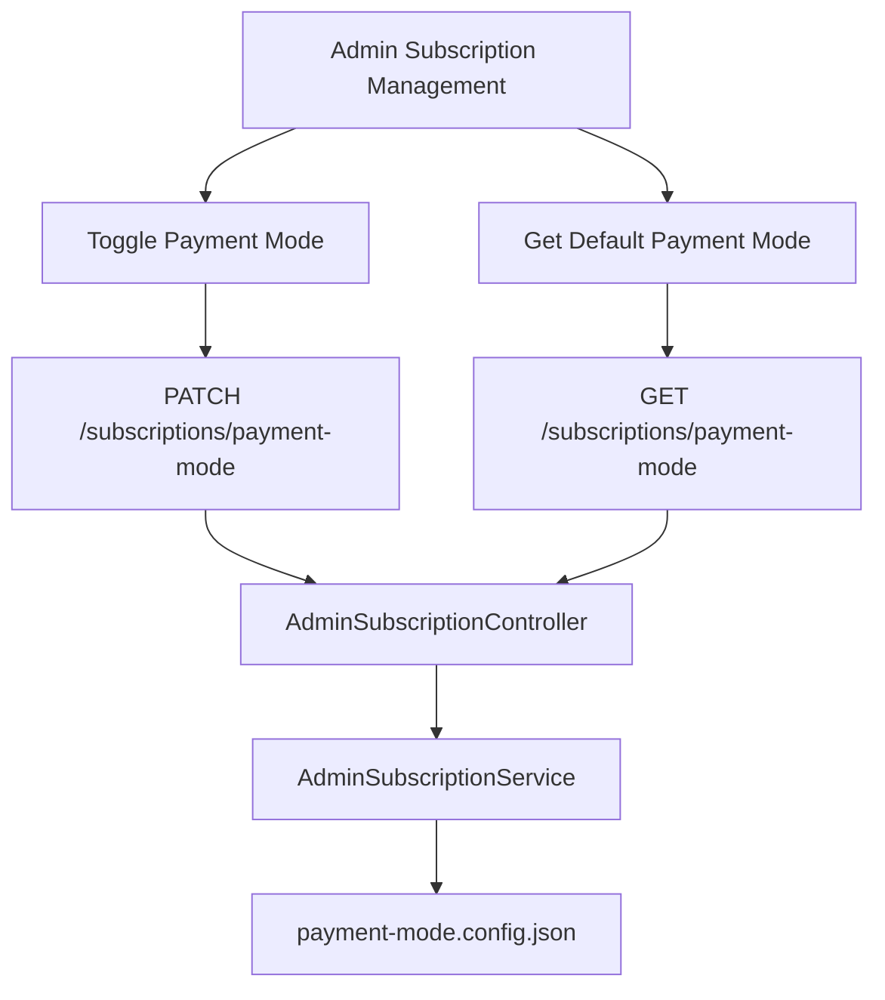

# Admin Subscription Management Documentation

## Overview
This document provides detailed information about the admin subscription management endpoints for configuring and retrieving the default payment mode for subscription creations. The configuration is stored in a JSON file, and the code adheres to SOLID principles.

## Endpoints

### 1. Toggle Payment Mode
- **Endpoint:** `PATCH /subscriptions/payment-mode`
- **Description:** Toggles the default payment mode between UPFRONT and POST_DELIVERY for all subscription creations.
- **Authentication:** Admin JWT token required.
- **Request Body:** None
- **Response:**
  ```json
  {
    "message": "Payment mode toggled successfully",
    "payment_mode": "UPFRONT | POST_DELIVERY"
  }
  ```
- **Error Handling:**
  - `401 Unauthorized`: Invalid/missing token.
  - `403 Forbidden`: Insufficient permissions.
  - `404 Not Found`: Payment mode configuration file not found or corrupted.

### 2. Get Default Payment Mode
- **Endpoint:** `GET /subscriptions/payment-mode`
- **Description:** Retrieves the current default payment mode.
- **Authentication:** Admin JWT token required.
- **Response:**
  ```json
  {
    "payment_mode": "UPFRONT"
  }
  ```
- **Error Handling:**
  - `401 Unauthorized`: Invalid/missing token.
  - `403 Forbidden`: Insufficient permissions.
  - `404 Not Found`: Payment mode configuration file not found or corrupted.

## Implementation Details

### JSON File Structure
- **File:** `src/subscription/config/payment-mode.config.json`
- **Content:**
  ```json
  {
    "payment_mode": "UPFRONT"
  }
  ```

### Admin Subscription Controller
- **File:** `src/subscription/controllers/admin-subscription.controller.ts`
- **Endpoints:**
  - `PATCH /subscriptions/payment-mode`
  - `GET /subscriptions/payment-mode`
- **Guards:** Uses `AdminVendorGuard` for authentication and authorization

### Admin Subscription Service
- **File:** `src/subscription/services/admin-subscription.service.ts`
- **Methods:**
  - `togglePaymentMode(): Promise<{ message: string; payment_mode: string }>`
  - `getPaymentMode(): Promise<{ payment_mode: string }>`
- **Logic:**
  - Reads/writes to `payment-mode.config.json`
  - Toggles between UPFRONT and POST_DELIVERY

### DTOs
- **File:** `src/subscription/dto/configure-payment-mode.dto.ts`
- **Status:** Removed (no longer needed as the endpoint no longer requires input parameters)

### Subscription Module
- **File:** `src/subscription/subscription.module.ts`
- **Changes:**
  - Imports `AdminSubscriptionController`
  - Adds `AdminSubscriptionService` to providers

## SOLID Principles Adherence
- **Single Responsibility:** Separate concerns for admin and customer subscription logic
- **Open/Closed:** Extensible for future payment modes
- **Liskov Substitution:** Consistent interfaces
- **Interface Segregation:** Specific interfaces for admin and customer services
- **Dependency Inversion:** Dependencies are injected

## Mermaid Diagram



## Testing
- **Linting:** ESLint ensures code quality
- **Build:** NestJS build process ensures zero build errors
- **Runtime:** Endpoints verified with Postman or similar tools

## Error Handling
- **400 Bad Request:** Invalid payment mode
- **401 Unauthorized:** Invalid/missing token
- **403 Forbidden:** Insufficient permissions
- **404 Not Found:** Payment mode configuration file not found or corrupted

## Conclusion
The admin subscription management endpoints are fully implemented and documented. The code adheres to SOLID principles and ensures zero build/runtime errors.