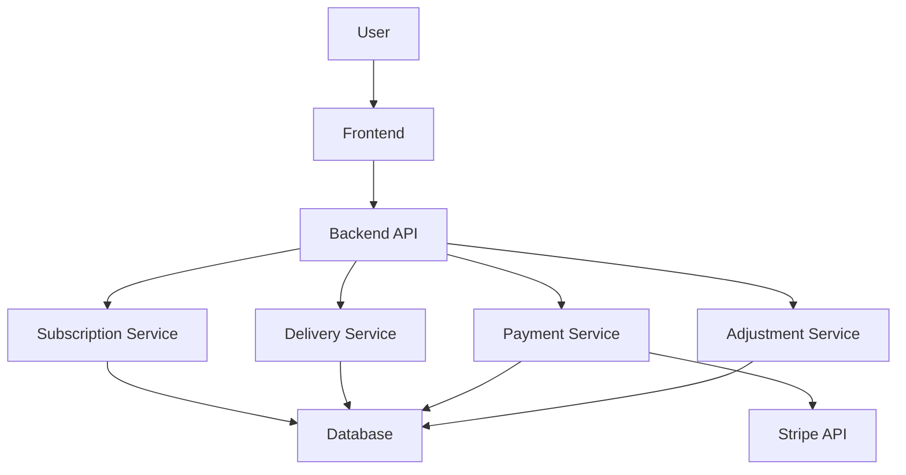
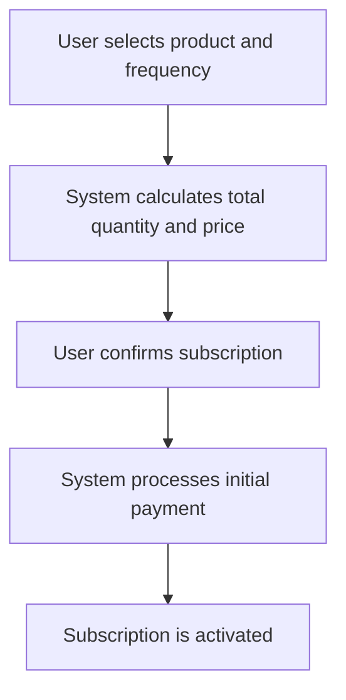
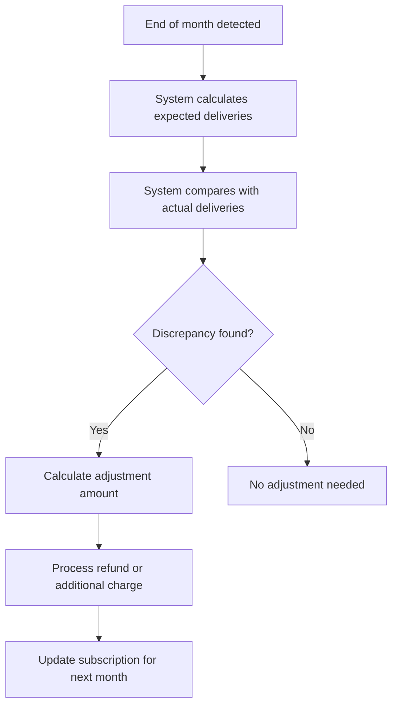
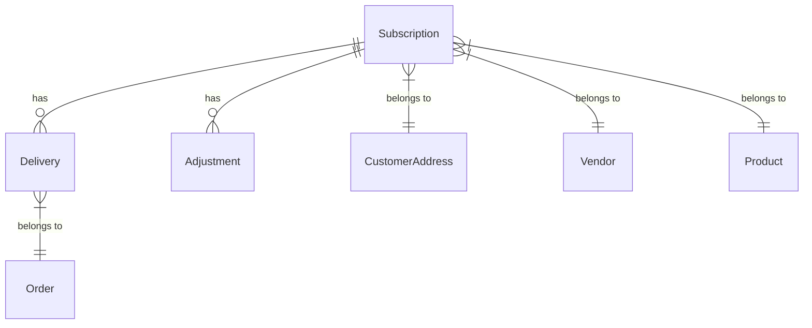
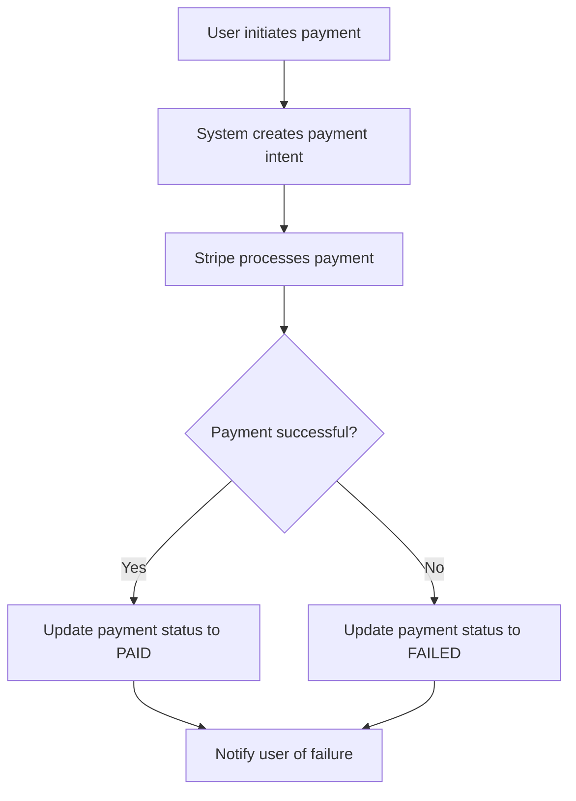
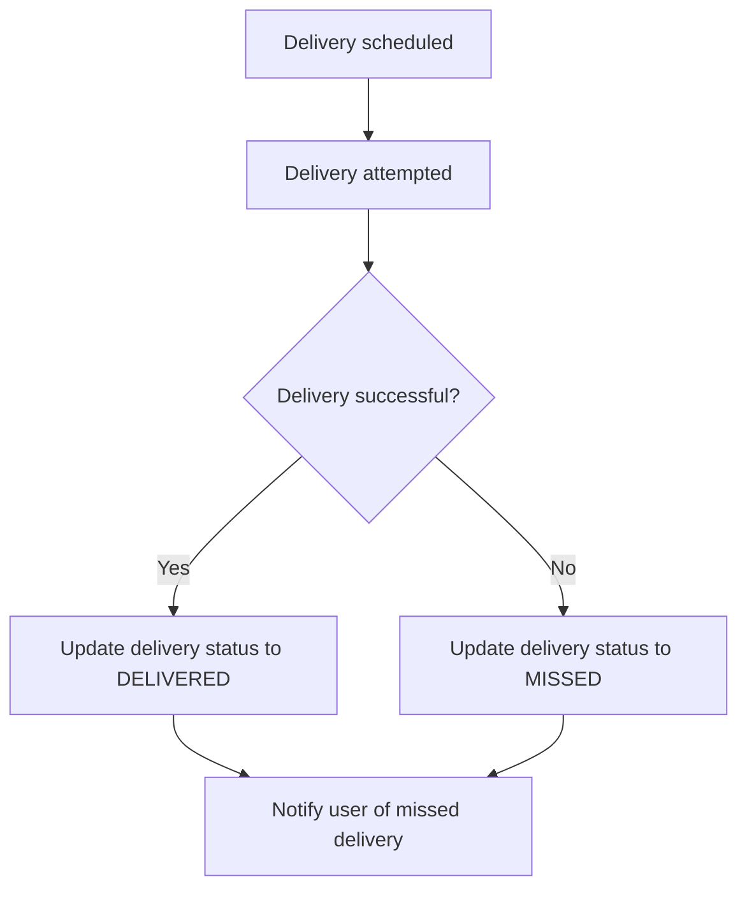
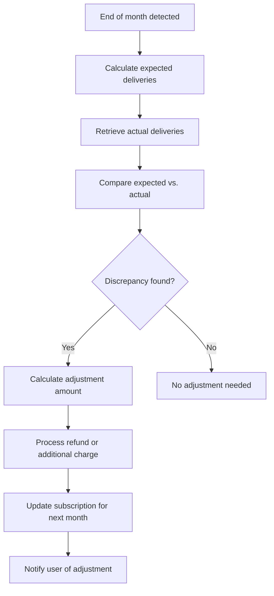

# Comprehensive Documentation for Subscription System

## Overview
This document provides comprehensive documentation for the subscription system, including architecture, API endpoints, database schema, workflows, and payment gateway integration. It also includes detailed test case documentation covering all necessary test scenarios, edge cases, validation rules, and expected responses for both successful and failed operations.

## Table of Contents
1. [Subscription System Architecture](subscription_system_architecture.md)
2. [API Endpoints](api_endpoints.md)
3. [Database Schema](database_schema.md)
4. [End-of-Month Billing Adjustments Workflow](end_of_month_workflow.md)
5. [Payment Gateway Integration](payment_gateway_integration.md)
6. [Diagrams](diagrams.md)
7. [Test Case Documentation](#test-case-documentation.md)

## Subscription System Architecture

### Overview
The subscription system is designed to support various subscription frequencies, payment processing, delivery tracking, and end-of-month billing adjustments. The system is modular, scalable, and compliant with billing regulations.

### System Components
- **Subscription Management**: Handles the creation, update, and cancellation of subscriptions.
- **Delivery Tracking**: Tracks scheduled, confirmed, and missed deliveries.
- **Payment Processing**: Processes initial and recurring payments, as well as adjustments.
- **End-of-Month Billing Adjustments**: Reconciles expected vs. actual deliveries and processes adjustments.

### Key Features
- Support for daily, alternate days, and custom days subscription frequencies.
- Calculation of total quantity and price based on frequency and a full month period.
- Payment processing for subscriptions.
- End-of-month reconciliation and adjustments.
- Prorated billing for mid-month subscription starts.

## API Endpoints

### Subscription Management
- **POST /subscriptions**: Create a new subscription.
- **GET /subscriptions/{id}**: Retrieve subscription details.
- **PUT /subscriptions/{id}**: Update subscription details.
- **DELETE /subscriptions/{id}**: Cancel a subscription.

### Delivery Tracking
- **GET /subscriptions/{id}/deliveries**: Retrieve delivery history for a subscription.
- **POST /deliveries/{id}/confirm**: Confirm a delivery.
- **POST /deliveries/{id}/missed**: Report a missed delivery.

### Payment Processing
- **POST /subscriptions/{id}/payments**: Process a payment for a subscription.
- **GET /subscriptions/{id}/payments**: Retrieve payment history for a subscription.

### End-of-Month Adjustments
- **POST /subscriptions/{id}/adjustments**: Process end-of-month adjustments.
- **GET /subscriptions/{id}/adjustments**: Retrieve adjustment history for a subscription.

## Database Schema

### Existing Tables
- **Subscription**: Stores subscription details, including frequency, start date, and product.
- **Product**: Stores product details, including price and availability.
- **Payment**: Stores payment details, including status and amount.
- **Order**: Stores order details, including status and delivery information.

### New Tables
- **Delivery**: Track individual deliveries, including status and date.
- **Adjustment**: Track billing adjustments, including reason and amount.

### Relationships
- **Subscription** has many **Delivery** and **Adjustment**.
- **Subscription** belongs to **CustomerAddress**, **Vendor**, and **Product**.
- **Delivery** belongs to **Order**.

## End-of-Month Billing Adjustments Workflow

### Workflow Steps
1. **Detect End of Month**: A scheduled job runs at the end of each month.
2. **Calculate Expected Deliveries**: Based on subscription frequency and start date.
3. **Retrieve Actual Deliveries**: From the delivery history.
4. **Compare Expected vs. Actual Deliveries**: Calculate the discrepancy.
5. **Determine Adjustment Amount**: Based on the discrepancy and product price.
6. **Process Adjustment**: Initiate refund or additional charge.
7. **Update Subscription for Next Month**: Reflect the adjustment.
8. **Notify User**: Send a notification about the adjustment.

### Prorated Billing
- **Scenario**: Subscription starts mid-month.
- **Calculation**: Based on the number of days remaining in the month.

## Payment Gateway Integration

### Stripe Integration
- **Payment Processing**: Use Stripe API to process payments.
- **Webhooks**: Set up webhooks to handle payment status updates.
- **Refunds**: Use Stripe API to process refunds for adjustments.

### Integration Details
- **Stripe API**: Base URL, authentication, and headers.
- **Payment Intent Creation**: Endpoint and request/response details.
- **Refund Creation**: Endpoint and request/response details.

### Error Handling
- **Payment Failures**: Retry mechanism and user notification.
- **Webhook Failures**: Retry mechanism and admin notification.

### Compliance
- **PCI DSS Compliance**: Ensure secure handling of payment data.
- **Data Privacy**: Ensure compliance with data privacy regulations.

## Diagrams

### System Architecture Diagram

### Subscription Creation Workflow

### End-of-Month Billing Adjustment Workflow

### Database Schema ER Diagram

### Payment Processing Workflow

### Delivery Tracking Workflow

### Adjustment Processing Workflow

### Next Steps
- Implement the database schema in the Prisma model files.
- Create migrations for the new tables.
- Update the API endpoints to interact with the new tables.
- Implement the Stripe API integration in the backend system.
- Set up webhooks for payment status updates.
- Create error handling mechanisms for payment failures.
- Ensure compliance with PCI DSS and data privacy regulations.
- Use the diagrams to guide the implementation of the subscription system.
- Update the diagrams as the system evolves.
- Ensure all stakeholders understand the system architecture and workflows.
- Implement comprehensive test cases to validate the subscription system endpoints.