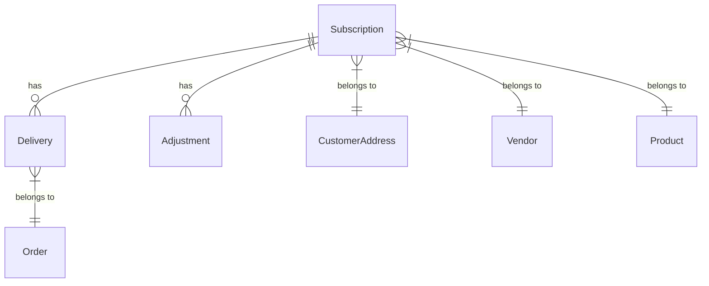

# Database Schema for Subscription System

## Overview
This document outlines the database schema for the subscription system, including tables for subscriptions, deliveries, adjustments, and their relationships.

## Existing Tables

### Subscription
- **Purpose**: Stores subscription details, including frequency, start date, and product.
- **Fields**:
  - `id`: Unique identifier for the subscription.
  - `customerAddressId`: Reference to the customer's address.
  - `vendorId`: Reference to the vendor.
  - `productId`: Reference to the product.
  - `quantity`: Quantity of the product in the subscription.
  - `frequency`: Frequency of deliveries (DAILY, ALTERNATIVE_DAYS, CUSTOM_DAYS).
  - `custom_days`: Days of the week for custom frequency subscriptions.
  - `next_delivery_date`: Date of the next scheduled delivery.
  - `status`: Status of the subscription (ACTIVE, INACTIVE, PENDING).
  - `start_date`: Start date of the subscription.
  - `created_at`: Timestamp when the subscription was created.
  - `updated_at`: Timestamp when the subscription was last updated.

### Product
- **Purpose**: Stores product details, including price and availability.
- **Fields**:
  - `id`: Unique identifier for the product.
  - `name`: Name of the product.
  - `categoryId`: Reference to the product category.
  - `images`: Array of image URLs.
  - `description`: Description of the product.
  - `created_at`: Timestamp when the product was created.
  - `vendorId`: Reference to the vendor.
  - `price`: Price of the product.
  - `deposit`: Deposit amount for the product.
  - `is_active`: Indicates if the product is active.
  - `approval_status`: Approval status of the product.
  - `approved_by`: Reference to the admin who approved the product.
  - `approved_at`: Timestamp when the product was approved.
  - `is_schedulable`: Indicates if the product can be scheduled.
  - `updated_at`: Timestamp when the product was last updated.

### Payment
- **Purpose**: Stores payment details, including status and amount.
- **Fields**:
  - `id`: Unique identifier for the payment.
  - `order_id`: Reference to the order.
  - `amount`: Amount of the payment.
  - `currency`: Currency of the payment.
  - `provider`: Payment provider (e.g., Stripe).
  - `provider_payment_id`: Payment ID from the provider.
  - `provider_payload`: Additional data from the provider.
  - `status`: Status of the payment (PENDING, PAID, FAILED, REFUND_INITIATED, REFUNDED).
  - `initiated_at`: Timestamp when the payment was initiated.
  - `completed_at`: Timestamp when the payment was completed.
  - `reconciled`: Indicates if the payment has been reconciled.
  - `metadata`: Additional metadata.
  - `created_at`: Timestamp when the payment was created.
  - `updated_at`: Timestamp when the payment was last updated.

### Order
- **Purpose**: Stores order details, including status and delivery information.
- **Fields**:
  - `id`: Unique identifier for the order.
  - `orderNo`: Unique order number.
  - `customerId`: Reference to the customer.
  - `vendorId`: Reference to the vendor.
  - `addressId`: Reference to the customer's address.
  - `cartId`: Reference to the cart.
  - `total_amount`: Total amount of the order.
  - `status`: Status of the order.
  - `payment_status`: Payment status of the order.
  - `assigned_rider_phone`: Phone number of the assigned rider.
  - `created_at`: Timestamp when the order was created.
  - `updated_at`: Timestamp when the order was last updated.
  - `payment_mode`: Payment mode (ONLINE, COD, MONTHLY).
  - `subscriptionId`: Reference to the subscription.
  - `delivery_otp`: OTP for delivery verification.
  - `otp_verified`: Indicates if the OTP has been verified.
  - `otp_generated_at`: Timestamp when the OTP was generated.
  - `cancelledAt`: Timestamp when the order was cancelled.
  - `cancelReason`: Reason for cancellation.
  - `paymentId`: Reference to the payment.

## New Tables

### Delivery
- **Purpose**: Track individual deliveries, including status and date.
- **Fields**:
  - `id`: Unique identifier for the delivery.
  - `subscriptionId`: Reference to the subscription.
  - `delivery_date`: Date of the delivery.
  - `status`: Status of the delivery (DELIVERED, MISSED, PENDING).
  - `orderId`: Reference to the order.
  - `created_at`: Timestamp when the delivery was created.
  - `updated_at`: Timestamp when the delivery was last updated.

### Adjustment
- **Purpose**: Track billing adjustments, including reason and amount.
- **Fields**:
  - `id`: Unique identifier for the adjustment.
  - `subscriptionId`: Reference to the subscription.
  - `expected_deliveries`: Expected number of deliveries.
  - `actual_deliveries`: Actual number of deliveries.
  - `adjustment_amount`: Amount of the adjustment.
  - `reason`: Reason for the adjustment.
  - `status`: Status of the adjustment (PROCESSED, PENDING, FAILED).
  - `created_at`: Timestamp when the adjustment was created.
  - `updated_at`: Timestamp when the adjustment was last updated.

## Relationships

### Subscription Relationships
- **CustomerAddress**: One-to-one relationship with the customer's address.
- **Vendor**: One-to-one relationship with the vendor.
- **Product**: One-to-one relationship with the product.
- **Delivery**: One-to-many relationship with deliveries.
- **Adjustment**: One-to-many relationship with adjustments.

### Delivery Relationships
- **Subscription**: Many-to-one relationship with the subscription.
- **Order**: One-to-one relationship with the order.

### Adjustment Relationships
- **Subscription**: Many-to-one relationship with the subscription.

## ER Diagram

## Indexes

### Subscription Indexes
- `customerAddressId`: Index for faster lookups by customer address.
- `vendorId`: Index for faster lookups by vendor.
- `productId`: Index for faster lookups by product.

### Delivery Indexes
- `subscriptionId`: Index for faster lookups by subscription.
- `orderId`: Index for faster lookups by order.

### Adjustment Indexes
- `subscriptionId`: Index for faster lookups by subscription.

## Next Steps
- Implement the database schema in the Prisma model files.
- Create migrations for the new tables.
- Update the API endpoints to interact with the new tables.