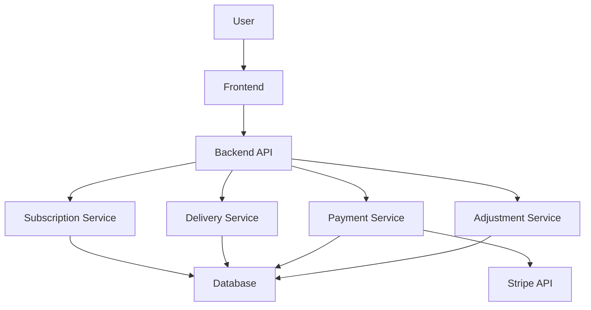
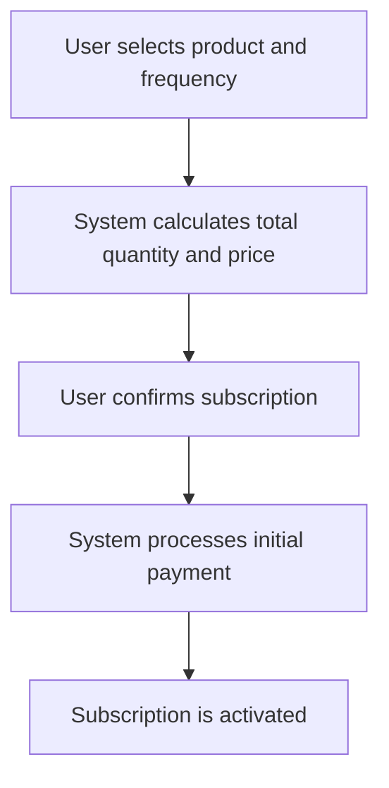
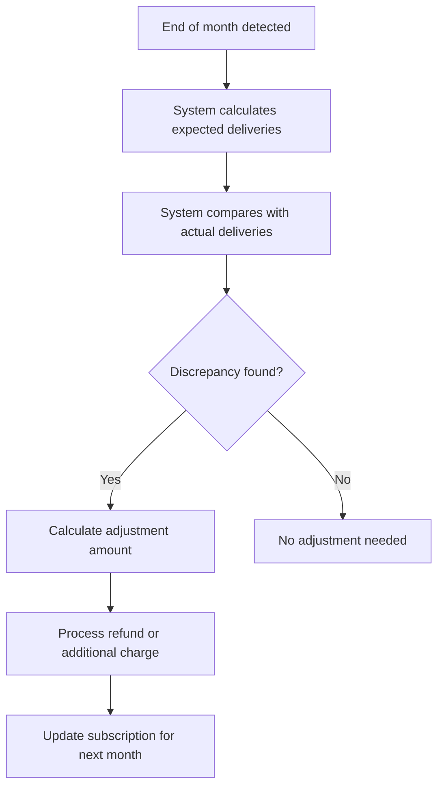
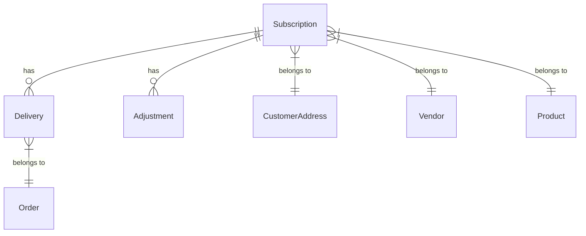
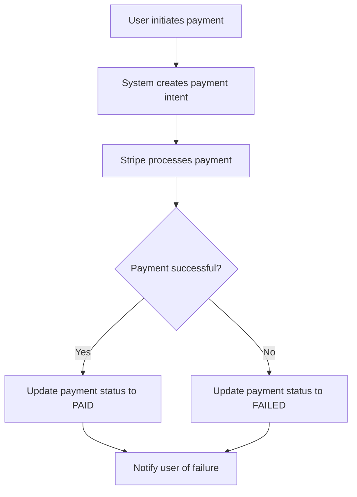
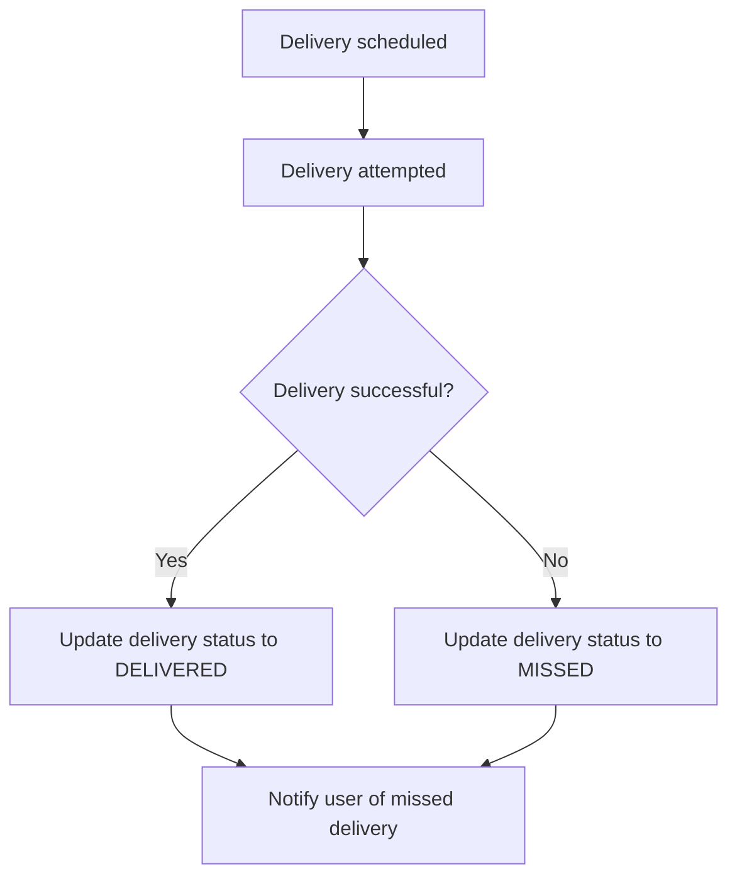
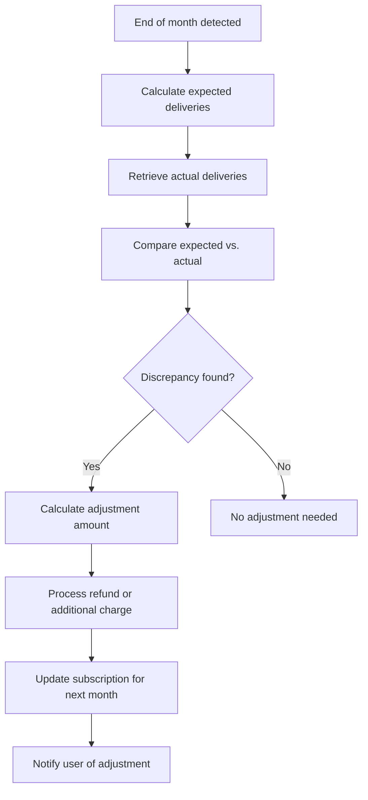

# Diagrams for Subscription System

## Overview
This document contains Mermaid diagrams to visualize the subscription system's architecture, workflows, and database schema.

## System Architecture Diagram

## Subscription Creation Workflow

## End-of-Month Billing Adjustment Workflow

## Database Schema ER Diagram

## Payment Processing Workflow

## Delivery Tracking Workflow

## Adjustment Processing Workflow

## Next Steps
- Use these diagrams to guide the implementation of the subscription system.
- Update the diagrams as the system evolves.
- Ensure all stakeholders understand the system architecture and workflows.