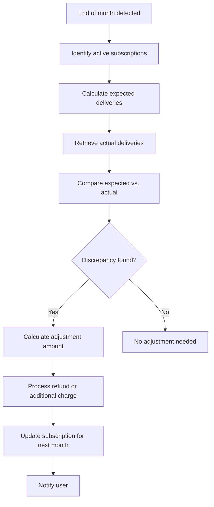

# End-of-Month Billing Adjustments Workflow

## Overview
This document outlines the workflow for processing end-of-month billing adjustments for subscriptions. The workflow includes calculating expected and actual deliveries, determining adjustments, and applying them to the next month's billing.

## Workflow Steps

### 1. Detect End of Month
- **Trigger**: A scheduled job runs at the end of each month to process adjustments for all active subscriptions.
- **Action**: Identify all active subscriptions that require adjustment processing.

### 2. Calculate Expected Deliveries
- **Input**: Subscription frequency and start date.
- **Calculation**:
  - **Daily**: Number of days in the month.
  - **Alternate Days**: Number of days in the month divided by 2, rounded up.
  - **Custom Days**: Number of specified days in the month.
- **Output**: Expected number of deliveries for the month.

### 3. Retrieve Actual Deliveries
- **Input**: Delivery history for the subscription.
- **Action**: Query the `Delivery` table to count the number of deliveries with status `DELIVERED` for the month.
- **Output**: Actual number of deliveries for the month.

### 4. Compare Expected vs. Actual Deliveries
- **Input**: Expected and actual deliveries.
- **Action**: Calculate the difference between expected and actual deliveries.
- **Output**: Discrepancy (positive or negative).

### 5. Determine Adjustment Amount
- **Input**: Discrepancy and product price.
- **Calculation**:
  - **Refund**: If actual deliveries are less than expected, calculate refund amount.
  - **Additional Charge**: If actual deliveries are more than expected, calculate additional charge.
- **Output**: Adjustment amount.

### 6. Process Adjustment
- **Input**: Adjustment amount and reason.
- **Action**:
  - **Refund**: Initiate a refund through the payment gateway.
  - **Additional Charge**: Process an additional charge through the payment gateway.
- **Output**: Updated payment status and adjustment record.

### 7. Update Subscription for Next Month
- **Input**: Adjustment details.
- **Action**:
  - Update the subscription record to reflect the adjustment.
  - Carry forward any adjustments to the next month's billing.
- **Output**: Updated subscription record.

### 8. Notify User
- **Input**: Adjustment details.
- **Action**: Send a notification to the user about the adjustment.
- **Output**: Notification sent.

## Workflow Diagram

## Prorated Billing

### Scenario: Subscription Starts Mid-Month
- **Input**: Subscription start date and frequency.
- **Calculation**:
  - Calculate the number of days remaining in the month from the start date.
  - Determine the expected deliveries for the remaining days.
- **Output**: Prorated billing amount.

### Example
- **Start Date**: 15th of the month.
- **Frequency**: Daily.
- **Days Remaining**: 16 days.
- **Expected Deliveries**: 16.
- **Prorated Amount**: 16 * product price.

## Error Handling

### Missed Deliveries
- **Action**: Retry delivery or notify the user.
- **Output**: Updated delivery status.

### Payment Failures
- **Action**: Retry payment or notify the user.
- **Output**: Updated payment status.

## Compliance

### Billing Regulations
- **Transparent Billing**: Ensure all billing details are clearly communicated to users.
- **Refund Policy**: Clearly define and communicate the refund policy.
- **Data Privacy**: Ensure compliance with data privacy regulations (e.g., GDPR).

## Next Steps
- Implement the workflow in the backend system.
- Create scheduled jobs for end-of-month processing.
- Integrate with payment gateways for refunds and additional charges.
- Set up notification systems for user communication.