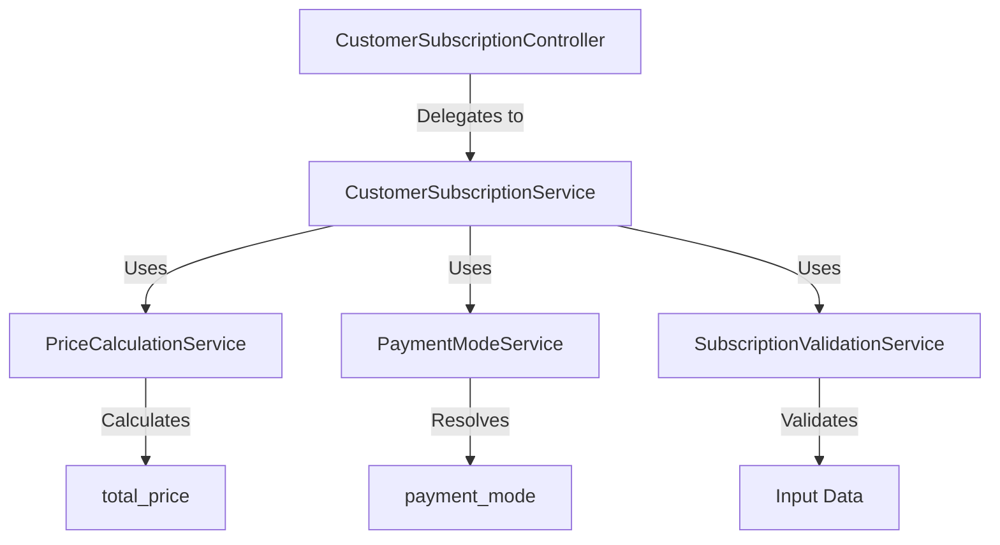

# Refactored Architecture for `createSubscription` Endpoint

## Current Implementation Analysis

The current implementation of the `createSubscription` endpoint in `customer-subscription.controller.ts` and `customer-subscription.service.ts` has the following characteristics:

1. **Controller Layer**: The controller is minimal and delegates the logic to the service layer.
2. **Service Layer**: The service layer handles input validation, business logic, and database operations. However, it violates the Single Responsibility Principle (SRP) by managing multiple concerns such as validation, price calculation, and subscription creation.
3. **Payment Mode Configuration**: The payment mode is hardcoded in `payment-mode.config.json` and not dynamically integrated into the response.
4. **Response Structure**: The response lacks a structured format, particularly for `total_price` calculation and payment mode details.

## Refactored Architecture

### 1. Response Structure

The structured response will include:
- **Subscription Details**: Basic subscription information (e.g., `id`, `productId`, `quantity`, `frequency`).
- **Price Calculation**: `total_price` based on:
  - Quantity
  - Price per unit
  - Subscription frequency
  - Proration for mid-month start dates
- **Payment Mode**: Dynamically read from `payment-mode.config.json`.

### 2. Payment Mode Logic

- **Dynamic Configuration**: A new service, `PaymentModeService`, will read the payment mode from `payment-mode.config.json` and integrate it into the response.
- **Interface**: Define an interface for payment mode resolution to allow for future extensibility.

### 3. Code Refactoring

#### New Services
1. **PriceCalculationService**: Handles the calculation of `total_price` based on the subscription details.
2. **PaymentModeService**: Reads and resolves the payment mode from the configuration file.
3. **SubscriptionValidationService**: Validates input data for creating a subscription.

#### Dependency Injection
- Use dependency injection to inject `PriceCalculationService`, `PaymentModeService`, and `SubscriptionValidationService` into `CustomerSubscriptionService`.

### 4. Cleanup & Optimization

- **Unused Variables**: Remove any unused variables or imports in the existing files.
- **Test Files**: Ensure all test files are relevant and up-to-date.

### 5. Documentation

- **Swagger/OpenAPI**: Update the endpoint documentation to reflect the new response structure and payment mode integration.
- **Inline Comments**: Add comments for complex logic, such as price calculation and payment mode resolution.

### 6. Validation & Error Handling

- **Input Validation**: Ensure all inputs (e.g., customer details, product description, pricing, subscription start date) are validated.
- **Error Handling**: Implement error handling for edge cases, such as invalid payment modes or missing configuration files.

### 7. Testing Considerations

- **Test Cases**: Include test cases for:
  - Full-month subscription starts
  - Mid-month subscription starts
  - Both payment modes
  - Invalid inputs

## Implementation Plan

### Step 1: Create New Services
1. **PriceCalculationService**: Implement logic for calculating `total_price`.
2. **PaymentModeService**: Implement logic for reading and resolving payment modes.
3. **SubscriptionValidationService**: Implement validation logic for subscription inputs.

### Step 2: Refactor `CustomerSubscriptionService`
1. Inject the new services into `CustomerSubscriptionService`.
2. Delegate price calculation, payment mode resolution, and input validation to the respective services.

### Step 3: Update Response Structure
1. Modify the response structure to include `total_price` and payment mode details.

### Step 4: Update Documentation
1. Update Swagger/OpenAPI documentation for the endpoint.
2. Add inline comments for complex logic.

### Step 5: Implement Validation & Error Handling
1. Add validation for all inputs.
2. Implement error handling for edge cases.

### Step 6: Testing
1. Write test cases for the new services and updated endpoint.
2. Ensure all test cases pass.

## Mermaid Diagram

## Conclusion

The refactored architecture adheres to SOLID principles by:
- **Single Responsibility Principle (SRP)**: Each service has a single responsibility.
- **Open/Closed Principle (OCP)**: Services are open for extension but closed for modification.
- **Dependency Inversion Principle (DIP)**: High-level modules depend on abstractions, not concrete implementations.

This design ensures maintainability, scalability, and backward compatibility.