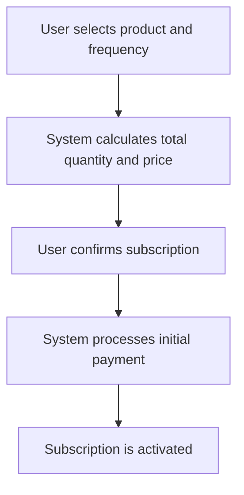
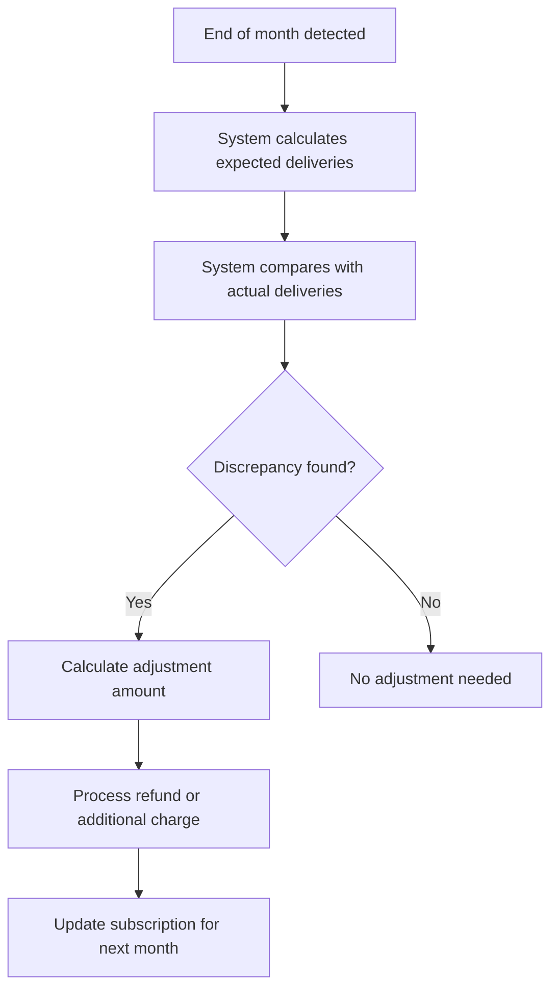

# Subscription System Architecture

## Overview
This document outlines the architecture for a comprehensive backend system to support product subscriptions. The system will handle various subscription frequencies, payment processing, delivery tracking, and end-of-month billing adjustments.

## System Components

### 1. Subscription Management
- **Subscription Creation**: Users can create subscriptions with specified frequencies (daily, alternate days, custom days), start dates, and products.
- **Subscription Update**: Users can update subscription frequencies or other details.
- **Subscription Cancellation**: Users can cancel subscriptions at any time.

### 2. Delivery Tracking
- **Delivery Scheduling**: Automatically schedule deliveries based on subscription frequency.
- **Delivery Confirmation**: Track confirmed deliveries and missed deliveries.
- **Delivery History**: Maintain a history of all deliveries for each subscription.

### 3. Payment Processing
- **Initial Payment**: Process the initial payment when a subscription is created.
- **Recurring Payments**: Handle recurring payments based on the subscription frequency.
- **Adjustments**: Process refunds or additional charges for missed or extra deliveries.

### 4. End-of-Month Billing Adjustments
- **Delivery Reconciliation**: Compare actual deliveries against expected deliveries.
- **Billing Adjustments**: Calculate refunds or additional charges based on discrepancies.
- **Prorated Billing**: Handle prorated billing for subscriptions that start mid-month.

## Database Schema

### Existing Models
- **Subscription**: Contains details about the subscription, including frequency, start date, and product.
- **Product**: Contains product details, including price and availability.
- **Payment**: Tracks payment details, including status and amount.
- **Order**: Tracks order details, including status and delivery information.

### New Models Required
- **Delivery**: Track individual deliveries, including status and date.
- **Adjustment**: Track billing adjustments, including reason and amount.

## API Endpoints

### Subscription Management
- **POST /subscriptions**: Create a new subscription.
- **GET /subscriptions/{id}**: Retrieve subscription details.
- **PUT /subscriptions/{id}**: Update subscription details.
- **DELETE /subscriptions/{id}**: Cancel a subscription.

### Delivery Tracking
- **GET /subscriptions/{id}/deliveries**: Retrieve delivery history for a subscription.
- **POST /deliveries/{id}/confirm**: Confirm a delivery.
- **POST /deliveries/{id}/missed**: Report a missed delivery.

### Payment Processing
- **POST /subscriptions/{id}/payments**: Process a payment for a subscription.
- **GET /subscriptions/{id}/payments**: Retrieve payment history for a subscription.

### End-of-Month Adjustments
- **POST /subscriptions/{id}/adjustments**: Process end-of-month adjustments.
- **GET /subscriptions/{id}/adjustments**: Retrieve adjustment history for a subscription.

## Workflow Diagrams

### Subscription Creation Workflow

### End-of-Month Billing Adjustment Workflow

## Payment Gateway Integration

### Stripe Integration
- **Payment Processing**: Use Stripe API to process payments.
- **Webhooks**: Set up webhooks to handle payment status updates.
- **Refunds**: Use Stripe API to process refunds for adjustments.

## Scalability and Error Handling

### Scalability
- **Database Indexing**: Ensure proper indexing for frequently queried fields.
- **Caching**: Implement caching for frequently accessed data.
- **Load Balancing**: Use load balancing to handle high traffic.

### Error Handling
- **Retry Mechanism**: Implement retry mechanisms for failed deliveries.
- **Notification System**: Notify users of missed deliveries or payment failures.
- **Logging**: Maintain detailed logs for troubleshooting.

## Compliance

### Billing Regulations
- **Transparent Billing**: Ensure all billing details are clearly communicated to users.
- **Refund Policy**: Clearly define and communicate the refund policy.
- **Data Privacy**: Ensure compliance with data privacy regulations (e.g., GDPR).

## Next Steps
- Detailed API specifications
- Database schema definitions
- Integration details for payment gateways
- Comprehensive test plans