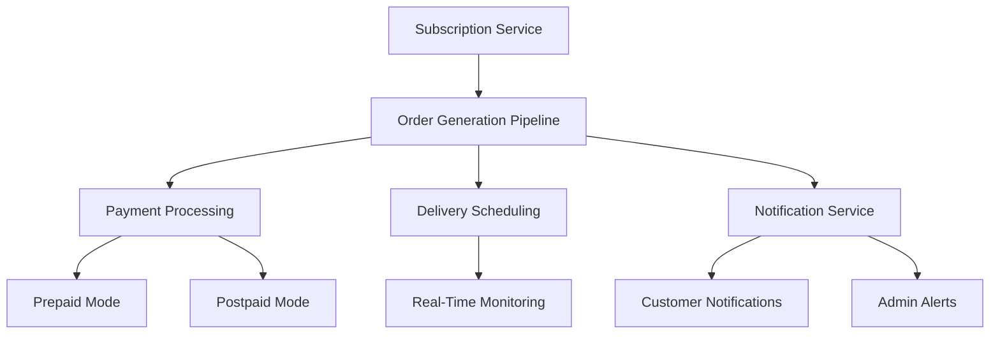

# Automated Order Generation Pipeline

## Overview
This document outlines the implementation of a fully automated order generation pipeline capable of processing 1 to 10 million subscription-based orders without human intervention. The solution includes a detailed step-by-step implementation guide covering architecture design, tool selection, real-time monitoring, performance testing, and failure recovery mechanisms. The system integrates seamlessly with existing payment modes (prepaid/postpaid), admin controls, and edge-case handling documented in `plans/subscription/test-docs/admin_test_cases.md` and `plans/subscription/test-docs/admin_payment_modes.md`.

## Table of Contents
1. [Architecture Design](#architecture-design)
2. [Tool Selection](#tool-selection)
3. [Real-Time Monitoring](#real-time-monitoring)
4. [Performance Testing](#performance-testing)
5. [Failure Recovery Mechanisms](#failure-recovery-mechanisms)
6. [Integration with Existing Systems](#integration-with-existing-systems)
7. [Scalability Benchmarks](#scalability-benchmarks)
8. [Load Testing Strategies](#load-testing-strategies)
9. [Observability Metrics](#observability-metrics)
10. [Validation and Compliance](#validation-and-compliance)

## Architecture Design

### High-Level Architecture

### Components
1. **Subscription Service**: Manages subscription creation, updates, and cancellations.
2. **Order Generation Pipeline**: Automates the generation of orders based on subscription details.
3. **Payment Processing**: Handles payments for both prepaid and postpaid modes.
4. **Delivery Scheduling**: Schedules deliveries based on subscription frequency and customer preferences.
5. **Notification Service**: Sends notifications to customers and admins.
6. **Real-Time Monitoring**: Monitors the pipeline for performance and failures.

## Tool Selection

### Core Tools
- **Message Queue**: Apache Kafka for handling high-throughput order generation.
- **Database**: PostgreSQL for storing subscription and order data.
- **Monitoring**: Prometheus and Grafana for real-time monitoring and observability.
- **Load Testing**: Locust for performance testing and scalability benchmarks.
- **Logging**: ELK Stack (Elasticsearch, Logstash, Kibana) for centralized logging and analysis.

### Integration Tools
- **API Gateway**: Kong for managing API contracts and ensuring adherence.
- **Idempotency**: Redis for implementing idempotency checks to prevent duplicate order processing.
- **Rollback**: Custom scripts for automated rollback procedures for failed transactions.

## Real-Time Monitoring

### Monitoring Metrics
- **Order Generation Rate**: Number of orders generated per second.
- **Processing Latency**: Time taken to process an order from generation to completion.
- **Error Rate**: Percentage of orders that fail during processing.
- **Resource Utilization**: CPU, memory, and disk usage of the pipeline components.

### Alerting
- **Thresholds**: Set thresholds for each metric to trigger alerts.
- **Notification Channels**: Email, Slack, and PagerDuty for sending alerts to admins.
- **Escalation Policies**: Define escalation policies for critical failures.

## Performance Testing

### Load Testing Strategies
- **Baseline Testing**: Establish baseline performance metrics under normal load.
- **Stress Testing**: Test the system under extreme load to identify breaking points.
- **Soak Testing**: Run the system under sustained load to identify memory leaks and performance degradation.

### Scalability Benchmarks
- **Throughput**: Aim for a throughput of at least 10,000 orders per second.
- **Latency**: Ensure processing latency is less than 500ms for 99% of orders.
- **Uptime**: Guarantee 99.99% uptime during peak processing.

## Failure Recovery Mechanisms

### Automated Retries
- **Retry Logic**: Implement retry logic for failed orders with exponential backoff.
- **Max Retries**: Limit the number of retries to prevent infinite loops.
- **Dead Letter Queue**: Move orders that fail after max retries to a dead letter queue for manual intervention.

### Rollback Procedures
- **Automated Rollback**: Implement automated rollback procedures for failed transactions.
- **Idempotency Checks**: Ensure idempotency to prevent duplicate processing during retries.
- **Compensation Transactions**: Use compensation transactions to reverse the effects of failed orders.

## Integration with Existing Systems

### Payment Modes
- **Prepaid Mode**: Integrate with the prepaid payment mode to process upfront payments.
- **Postpaid Mode**: Integrate with the postpaid payment mode to process payments after service delivery.

### Admin Controls
- **Toggle Pipeline**: Allow admins to toggle the pipeline on/off.
- **Monitor Performance**: Provide real-time performance metrics to admins.
- **Manual Intervention**: Allow admins to manually intervene in case of failures.

### Edge-Case Handling
- **Concurrent Operations**: Handle concurrent order generation and processing.
- **Invalid Inputs**: Validate and handle invalid inputs gracefully.
- **Permission Conflicts**: Resolve permission conflicts during order processing.

## Scalability Benchmarks

### Horizontal Scaling
- **Scale Out**: Add more instances of the pipeline components to handle increased load.
- **Auto-Scaling**: Implement auto-scaling based on real-time monitoring metrics.
- **Load Balancing**: Use load balancers to distribute traffic evenly across instances.

### Vertical Scaling
- **Scale Up**: Increase the resources (CPU, memory) of the pipeline components.
- **Optimization**: Optimize the code and database queries for better performance.

## Load Testing Strategies

### Baseline Testing
- **Objective**: Establish baseline performance metrics under normal load.
- **Methodology**: Run the pipeline with a typical load of 1,000 orders per second.
- **Metrics**: Measure order generation rate, processing latency, and error rate.

### Stress Testing
- **Objective**: Test the system under extreme load to identify breaking points.
- **Methodology**: Gradually increase the load from 1,000 to 10,000 orders per second.
- **Metrics**: Measure the maximum load the system can handle before performance degrades.

### Soak Testing
- **Objective**: Run the system under sustained load to identify memory leaks and performance degradation.
- **Methodology**: Run the pipeline at 5,000 orders per second for 24 hours.
- **Metrics**: Monitor resource utilization and performance over time.

## Observability Metrics

### Key Metrics
- **Order Generation Rate**: Number of orders generated per second.
- **Processing Latency**: Time taken to process an order from generation to completion.
- **Error Rate**: Percentage of orders that fail during processing.
- **Resource Utilization**: CPU, memory, and disk usage of the pipeline components.

### Dashboards
- **Real-Time Dashboard**: Display real-time metrics for monitoring the pipeline.
- **Historical Dashboard**: Show historical trends and performance over time.
- **Alert Dashboard**: Highlight critical alerts and failures.

## Validation and Compliance

### API Contract Adherence
- **API Gateway**: Use Kong to manage API contracts and ensure adherence.
- **Schema Validation**: Validate request and response payloads against defined schemas.
- **Error Handling**: Provide descriptive error messages for API contract violations.

### Idempotency Checks
- **Redis**: Use Redis to implement idempotency checks to prevent duplicate order processing.
- **Unique IDs**: Generate unique IDs for each order to ensure idempotency.
- **Retry Logic**: Implement retry logic with idempotency checks to handle failures gracefully.

### Automated Rollback Procedures
- **Custom Scripts**: Develop custom scripts for automated rollback procedures for failed transactions.
- **Compensation Transactions**: Use compensation transactions to reverse the effects of failed orders.
- **Logging**: Log all rollback actions for audit and security purposes.

## Next Steps
- Implement the architecture design and tool selection.
- Set up real-time monitoring and performance testing.
- Develop failure recovery mechanisms and integrate with existing systems.
- Ensure validation and compliance with API contracts, idempotency checks, and automated rollback procedures.
- Conduct load testing and optimize the pipeline for scalability and performance.