# Vendor Earnings Implementation Plan

This document outlines the implementation details for the Vendor Earnings, Commission & Payout System based on the PRD at [`plans/vendor_earnings_prd.md`](plans/vendor_earnings_prd.md).

---

## 1. Architecture Overview

### 1.1 High-Level System Architecture

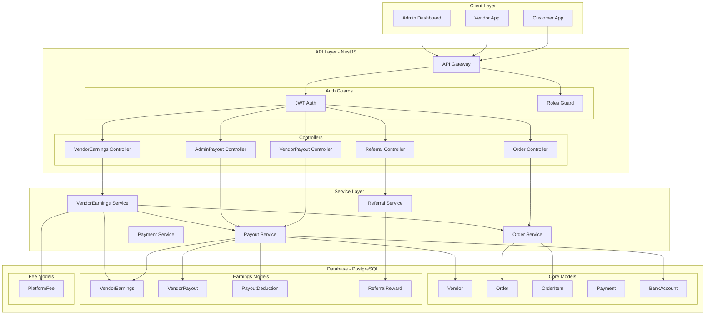
```mermaid
flowchart TB
    subgraph "Client Layer"
        Customer["Customer App"]
        Vendor["Vendor App"]
        Admin["Admin Dashboard"]
    end
    
    subgraph "API Layer - NestJS"
        API["API Gateway"]
        
        subgraph "Controllers"
            VC["VendorEarnings Controller"]
            VPC["VendorPayout Controller"]
            AC["AdminPayout Controller"]
            RC["Referral Controller"]
            OC["Order Controller"]
        end
        
        subgraph "Auth Guards"
            JWT["JWT Auth"]
            Roles["Roles Guard"]
        end
    end
    
    subgraph "Service Layer"
        ES["VendorEarnings Service"]
        PS["Payout Service"]
        RS["Referral Service"]
        OSS["Order Service"]
        PSS["Payment Service"]
    end
    
    subgraph "Database - PostgreSQL"
        subgraph "Core Models"
            VendorDB["Vendor"]
            OrderDB["Order"]
            OrderItemDB["OrderItem"]
            PaymentDB["Payment"]
            BankAccountDB["BankAccount"]
        end
        
        subgraph "Earnings Models"
            EarningsDB["VendorEarnings"]
            PayoutDB["VendorPayout"]
            DeductionDB["PayoutDeduction"]
            ReferralDB["ReferralReward"]
        end
        
        subgraph "Fee Models"
            PlatformFeeDB["PlatformFee"]
        end
    end
    
    Customer --> API
    Vendor --> API
    Admin --> API
    
    API --> JWT
    API --> Roles
    
    JWT --> VC
    JWT --> VPC
    JWT --> AC
    JWT --> RC
    JWT --> OC
    
    VC --> ES
    VPC --> PS
    AC --> PS
    RC --> RS
    OC --> OSS
    
    ES --> PS
    ES --> OSS
    
    OSS --> OrderDB
    OSS --> OrderItemDB
    PS --> EarningsDB
    PS --> PayoutDB
    PS --> DeductionDB
    PS --> VendorDB
    PS --> BankAccountDB
    RS --> ReferralDB
    
    ES --> EarningsDB
    ES --> PlatformFeeDB
```

**Developer Notes:**
- Controllers follow NestJS dependency injection pattern
- Services are singletons with Prisma transaction support
- Auth guards ensure role-based access (vendor, admin)
- Database uses PostgreSQL with Prisma ORM

---

## 2. Database Schema Design

### 2.1 New Models Required

```prisma
// prisma/models/vendor_earnings.prisma

model VendorEarnings {
  id                    String   @id @default(uuid())
  vendorId              String
  vendor                Vendor   @relation(fields: [vendorId], references: [id], onDelete: Cascade)
  
  // Order reference
  orderId               String?
  order                 Order?   @relation(fields: [orderId], references: [id])
  
  // Earnings breakdown
  totalSales            Decimal  @db.Decimal(12, 2)      // Total order value
  commissionRate        Decimal  @db.Decimal(5, 2)       // Commission percentage (e.g., 10.00)
  commissionAmount      Decimal  @db.Decimal(12, 2)      // Calculated commission
  paymentGatewayFee     Decimal  @db.Decimal(12, 2) @default(0)  // Future: PG fee
  otherFees             Decimal  @db.Decimal(12, 2) @default(0)  // Future: marketing fees
  netPayoutAmount       Decimal  @db.Decimal(12, 2)      // Final vendor payout
  
  // Metadata
  currency              String   @default("INR")
  periodStart           DateTime // Earnings period start
  periodEnd             DateTime // Earnings period end
  status                EarningsStatus @default(PENDING)
  
  createdAt             DateTime @default(now())
  updatedAt             DateTime @updatedAt

  @@index([vendorId])
  @@index([orderId])
  @@index([vendorId, status])
  @@index([periodStart, periodEnd])
}

enum EarningsStatus {
  PENDING      // Earnings not yet processed
  CALCULATED   // Commission calculated
  READY        // Ready for payout
  PAID         // Payout completed
  ADJUSTED     // Manual adjustment made
}

model VendorPayout {
  id                    String   @id @default(uuid())
  payoutNo              String   @unique
  
  vendorId              String
  vendor                Vendor   @relation(fields: [vendorId], references: [id], onDelete: Cascade)
  
  // Payout amounts
  grossAmount           Decimal  @db.Decimal(12, 2)      // Total before deductions
  totalDeductions       Decimal  @db.Decimal(12, 2) @default(0)
  netAmount             Decimal  @db.Decimal(12, 2)      // Final payout
  
  // Status tracking
  status                PayoutStatus @default(PENDING)
  
  // Payment reference
  paymentMethod         String?  // BANK_TRANSFER, UPI, etc.
  referenceNumber       String?  // Bank transfer reference
  
  // Timestamps
  initiatedAt           DateTime @default(now())
  processedAt           DateTime?
  completedAt           DateTime?
  
  // Admin tracking
  processedBy           String?  // Admin ID
  notes                 String?
  
  createdAt             DateTime @default(now())
  updatedAt             DateTime @updatedAt

  @@index([vendorId])
  @@index([status])
  @@index([payoutNo])
}

enum PayoutStatus {
  PENDING       // Awaiting processing
  APPROVED      // Approved by admin
  PROCESSING    // Payment being processed
  COMPLETED     // Payment successful
  FAILED        // Payment failed
  CANCELLED     // Payout cancelled
}

model PayoutDeduction {
  id                    String   @id @default(uuid())
  payoutId              String
  payout                VendorPayout @relation(fields: [payoutId], references: [id], onDelete: Cascade)
  
  // Deduction details
  deductionType         DeductionType
  description           String
  amount                Decimal  @db.Decimal(12, 2)
  
  // Optional reference
  orderId               String?  // Associated order if applicable
  
  createdAt             DateTime @default(now())

  @@index([payoutId])
  @@index([deductionType])
}

enum DeductionType {
  COMMISSION         // Platform commission
  PAYMENT_GATEWAY    // PG fees (future)
  MARKETING_FEE      // Marketing campaign fees (future)
  ADJUSTMENT         // Manual adjustments
  REFUND             // Refund deductions (future)
}

model ReferralReward {
  id                    String   @id @default(uuid())
  
  // Referral participants
  referrerCustomerId    String   // Customer A who referred
  referredCustomerId    String   // Customer B who was referred
  
  // Reward tracking
  rewardType            String   @default("FREE_JARS")
  rewardValue           Int      @default(2)  // 2 free jars
  rewardStatus          ReferralRewardStatus @default(PENDING)
  
  // Order reference (triggered by first delivered order)
  triggerOrderId        String?
  
  // Timestamps
  createdAt             DateTime @default(now())
  rewardIssuedAt        DateTime?
  expiresAt             DateTime?  // Validity period

  @@unique([referrerCustomerId, referredCustomerId])
  @@index([referrerCustomerId])
  @@index([referredCustomerId])
  @@index([rewardStatus])
}

enum ReferralRewardStatus {
  PENDING       // Waiting for qualifying order
  QUALIFIED     // First order delivered, reward earned
  ISSUED        // Reward manually credited to customer
  EXPIRED       // Reward validity period passed
  CANCELLED     // Referral cancelled (refund, etc.)
}
```

### 2.2 Updated Existing Models

```prisma
// Updates to prisma/models/order.prisma
model Order {
  // ... existing fields ...
  
  // New fields for earnings integration
  earningsCalculated   Boolean  @default(false)
  earningsId           String?  // Link to VendorEarnings record
  
  @@index([earningsCalculated])
}

// Updates to prisma/models/vendor.prisma
model Vendor {
  // ... existing fields ...
  
  // Payout balance
  totalEarnings        Decimal  @db.Decimal(12, 2) @default(0)
  totalPaidOut         Decimal  @db.Decimal(12, 2) @default(0)
  pendingBalance       Decimal  @db.Decimal(12, 2) @default(0)
  
  @@index([pendingBalance])
}
```

### 2.3 Entity Relationship Diagram

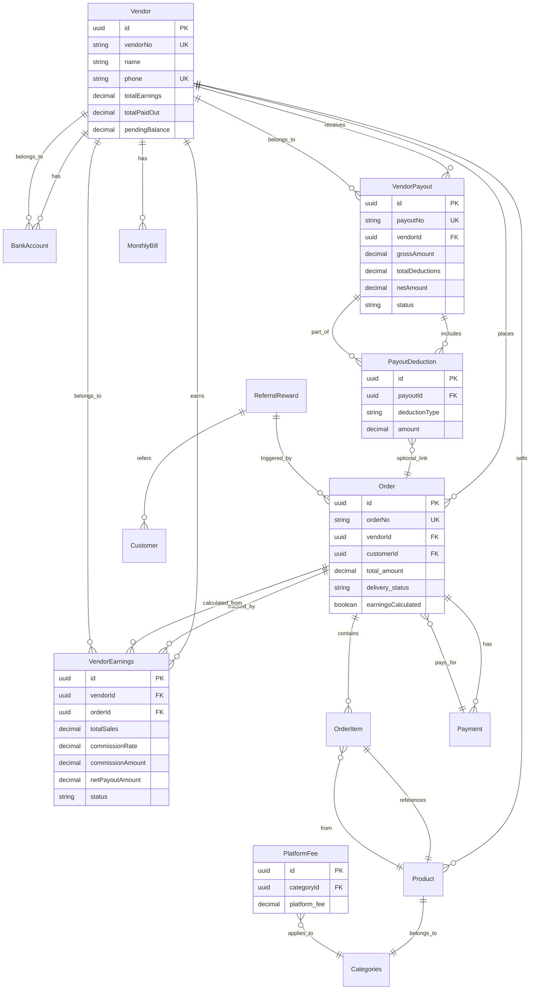
```mermaid
erDiagram
    Vendor ||--o{ Order : places
    Vendor ||--o{ Product : sells
    Vendor ||--o{ BankAccount : has
    Vendor ||--o{ VendorEarnings : earns
    Vendor ||--o{ VendorPayout : receives
    Vendor ||--o{ MonthlyBill : has
    
    Order ||--o{ OrderItem : contains
    Order ||--o{ Payment : has
    Order ||--o{ VendorEarnings : tracked_by
    
    OrderItem ||--|| Product : references
    OrderItem }o--|| Product : from
    
    Product ||--|| Categories : belongs_to
    
    Payment ||--o{ Order : pays_for
    
    BankAccount }o--|| Vendor : belongs_to
    
    VendorEarnings }o--|| Order : calculated_from
    VendorEarnings }o--|| Vendor : belongs_to
    
    VendorPayout }o--|| Vendor : belongs_to
    VendorPayout ||--o{ PayoutDeduction : includes
    
    PayoutDeduction }o--|| VendorPayout : part_of
    PayoutDeduction }o--|| Order : optional_link
    
    PlatformFee }o--|| Categories : applies_to
    
    ReferralReward ||--o{ Customer : refers
    ReferralReward ||--o{ Order : triggered_by
    
    Vendor {
        uuid id PK
        string vendorNo UK
        string name
        string phone UK
        decimal totalEarnings
        decimal totalPaidOut
        decimal pendingBalance
    }
    
    Order {
        uuid id PK
        string orderNo UK
        uuid vendorId FK
        uuid customerId FK
        decimal total_amount
        string delivery_status
        boolean earningsCalculated
    }
    
    VendorEarnings {
        uuid id PK
        uuid vendorId FK
        uuid orderId FK
        decimal totalSales
        decimal commissionRate
        decimal commissionAmount
        decimal netPayoutAmount
        string status
    }
    
    VendorPayout {
        uuid id PK
        string payoutNo UK
        uuid vendorId FK
        decimal grossAmount
        decimal totalDeductions
        decimal netAmount
        string status
    }
    
    PayoutDeduction {
        uuid id PK
        uuid payoutId FK
        string deductionType
        decimal amount
    }
    
    PlatformFee {
        uuid id PK
        uuid categoryId FK
        decimal platform_fee
    }
```

**Cardinality Legend:**
- `||--o{` = One-to-Many
- `||--||` = One-to-One
- `}o--||` = Many-to-One
- `PK` = Primary Key
- `FK` = Foreign Key
- `UK` = Unique Key

---

## 3. Vendor Earnings Flow Diagram

### 3.1 Complete Earnings Lifecycle

```mermaid
flowchart TD
    A[Customer Places Order] --> B{Payment Mode?}
    B -->|Online| C[Payment Initiated]
    B -->|COD| D[Order Confirmed]
    B -->|Monthly| E[Order Recorded]
    
    C --> F{Payment Success?}
    F -->|Yes| G[Payment Captured]
    F -->|No| H[Payment Failed]
    H --> I[Order Cancelled]
    
    G --> J[Order Status: PAID]
    D --> J --> J
    
   
    E J --> K{Vendor Confirms?}
    K -->|No| L[Order Cancelled]
    K -->|Yes| M[Order Status: CONFIRMED]
    
    M --> N[Order Out for Delivery]
    N --> O[Order Delivered]
    
    O --> P[Trigger Earnings Calculation]
    P --> Q[Get Commission Rate]
    Q --> R[Calculate 10% Commission]
    R --> S[Create VendorEarnings Record]
    S --> T[Update Vendor Pending Balance]
    T --> U[Mark Order earningsCalculated]
    
    U --> V[Check Referral Qualification]
    V --> W{First Order Delivered?}
    W -->|Yes| X[Update Referral Status: QUALIFIED]
    W -->|No| Y[No Action]
    
    X --> Z[Earnings Ready for Payout]
    Y --> Z
    
    Z --> AA[Admin Initiates Payout]
    AA --> AB[Calculate Deductions]
    AB --> AC[Create Payout Record]
    AC --> AD[Update Vendor Balances]
    AD --> AE[Payout Status: PENDING]
    
    AE --> AF{Admin Approves?}
    AF -->|No| AG[CANCELLED]
    AF -->|Yes| AH[Payout Status: APPROVED]
    
    AH --> AI[Process Payment]
    AI --> AJ{Bank Transfer Success?}
    AJ -->|Yes| AK[Payout Status: COMPLETED]
    AJ -->|No| AL[Payout Status: FAILED]
    
    AK --> AM[Update Vendor TotalPaidOut]
    AL --> AM
```

**Developer Notes:**
- Earnings calculated only on successful delivery
- Commission rate fetched from PlatformFee by category
- Referral check happens after earnings calculation
- Payout is manual process (automated transfer is future phase)

---

## 4. State Transition Diagrams

### 4.1 Order State Transitions

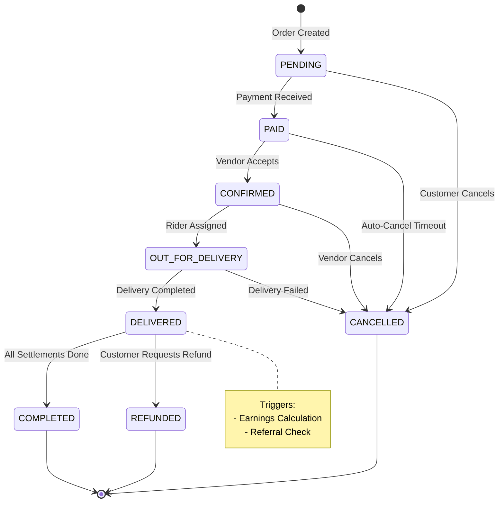
```mermaid
stateDiagram-v2
    [*] --> PENDING: Order Created
    
    PENDING --> PAID: Payment Received
    PENDING --> CANCELLED: Customer Cancels
    
    PAID --> CONFIRMED: Vendor Accepts
    PAID --> CANCELLED: Auto-Cancel Timeout
    
    CONFIRMED --> OUT_FOR_DELIVERY: Rider Assigned
    CONFIRMED --> CANCELLED: Vendor Cancels
    
    OUT_FOR_DELIVERY --> DELIVERED: Delivery Completed
    OUT_FOR_DELIVERY --> CANCELLED: Delivery Failed
    
    DELIVERED --> COMPLETED: All Settlements Done
    DELIVERED --> REFUNDED: Customer Requests Refund
    
    CANCELLED --> [*]
    COMPLETED --> [*]
    REFUNDED --> [*]
    
    note right of DELIVERED
        Triggers:
        - Earnings Calculation
        - Referral Check
    end note
```

### 4.2 Payment State Transitions

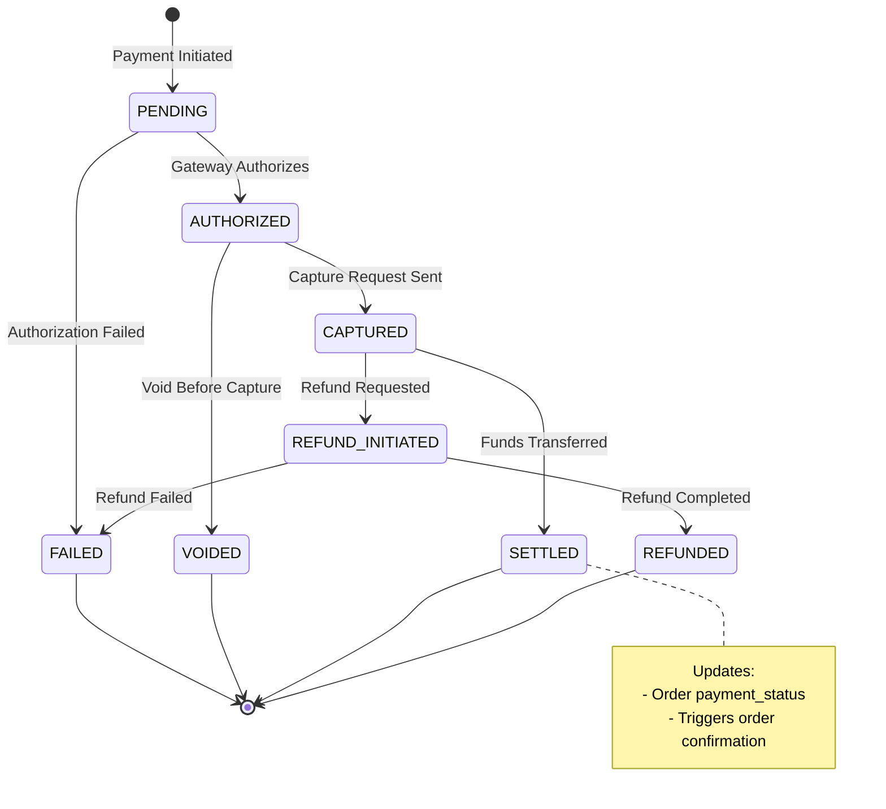
```mermaid
stateDiagram-v2
    [*] --> PENDING: Payment Initiated
    
    PENDING --> AUTHORIZED: Gateway Authorizes
    PENDING --> FAILED: Authorization Failed
    
    AUTHORIZED --> CAPTURED: Capture Request Sent
    AUTHORIZED --> VOIDED: Void Before Capture
    
    CAPTURED --> SETTLED: Funds Transferred
    CAPTURED --> REFUND_INITIATED: Refund Requested
    
    REFUND_INITIATED --> REFUNDED: Refund Completed
    REFUND_INITIATED --> FAILED: Refund Failed
    
    FAILED --> [*]
    VOIDED --> [*]
    SETTLED --> [*]
    REFUNDED --> [*]
    
    note right of SETTLED
        Updates:
        - Order payment_status
        - Triggers order confirmation
    end note
```

### 4.3 Payout State Transitions

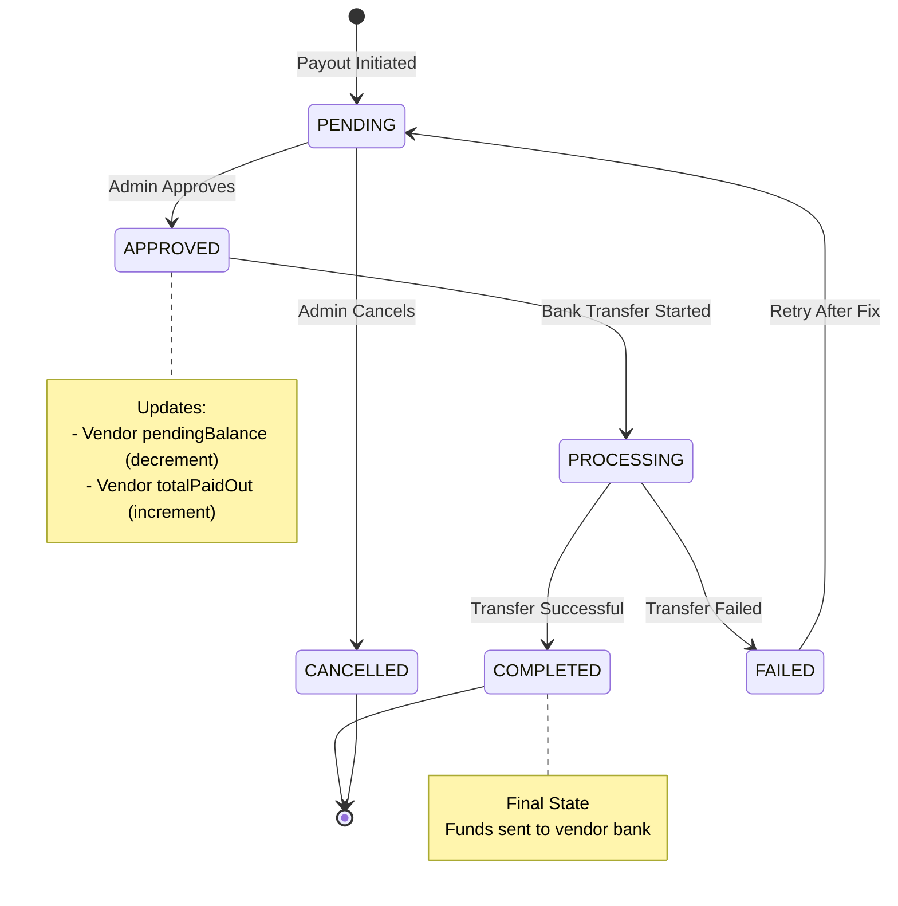
```mermaid
stateDiagram-v2
    [*] --> PENDING: Payout Initiated
    
    PENDING --> APPROVED: Admin Approves
    PENDING --> CANCELLED: Admin Cancels
    
    APPROVED --> PROCESSING: Bank Transfer Started
    PROCESSING --> COMPLETED: Transfer Successful
    PROCESSING --> FAILED: Transfer Failed
    
    COMPLETED --> [*]
    FAILED --> PENDING: Retry After Fix
    CANCELLED --> [*]
    
    note right of APPROVED
        Updates:
        - Vendor pendingBalance (decrement)
        - Vendor totalPaidOut (increment)
    end note
    
    note right of COMPLETED
        Final State
        Funds sent to vendor bank
    end note
```

### 4.4 Earnings Status Transitions

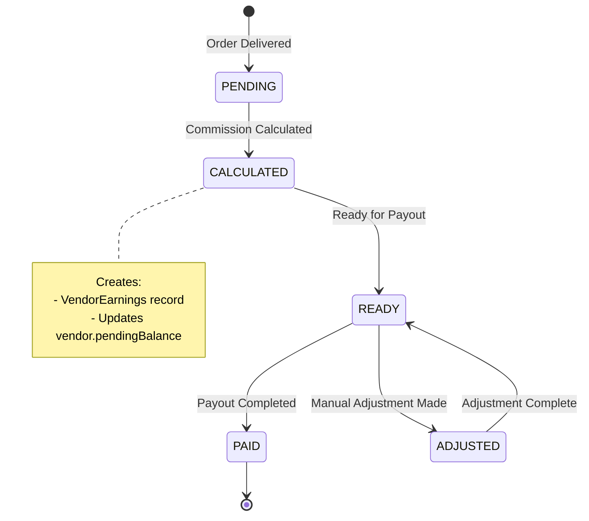
```mermaid
stateDiagram-v2
    [*] --> PENDING: Order Delivered
    
    PENDING --> CALCULATED: Commission Calculated
    CALCULATED --> READY: Ready for Payout
    
    READY --> PAID: Payout Completed
    READY --> ADJUSTED: Manual Adjustment Made
    
    ADJUSTED --> READY: Adjustment Complete
    PAID --> [*]
    
    note right of CALCULATED
        Creates:
        - VendorEarnings record
        - Updates vendor.pendingBalance
    end note
```

---

## 5. Sequence Diagrams

### 5.1 Order Creation and Earning Recording

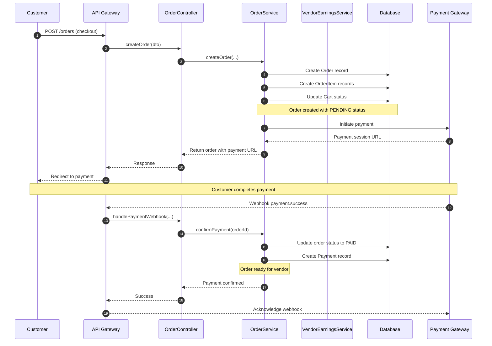
```mermaid
sequenceDiagram
    autonumber
    participant C as Customer
    participant API as API Gateway
    participant OC as OrderController
    participant OSS as OrderService
    participant ESS as VendorEarningsService
    participant DB as Database
    participant PG as Payment Gateway
    
    C->>API: POST /orders (checkout)
    API->>OC: createOrder(dto)
    
    OC->>OSS: createOrder(...)
    OSS->>DB: Create Order record
    OSS->>DB: Create OrderItem records
    OSS->>DB: Update Cart status
    
    Note over OSS, DB: Order created with PENDING status
    
    OSS->>PG: Initiate payment
    PG-->>OSS: Payment session URL
    
    OSS-->>OC: Return order with payment URL
    OC-->>API: Response
    API-->>C: Redirect to payment
    
    Note over C, PG: Customer completes payment
    
    PG-->>API: Webhook payment.success
    API->>OC: handlePaymentWebhook(...)
    OC->>OSS: confirmPayment(orderId)
    
    OSS->>DB: Update order status to PAID
    OSS->>DB: Create Payment record
    
    Note over OSS: Order ready for vendor
    
    OSS-->>OC: Payment confirmed
    OC-->>API: Success
    API-->>PG: Acknowledge webhook
```

**Developer Notes:**
- Payment webhook triggers order status update
- Earning calculation happens at delivery, not order creation
- Order items are snapshotted at creation time

### 5.2 Payment Processing and Commission Split

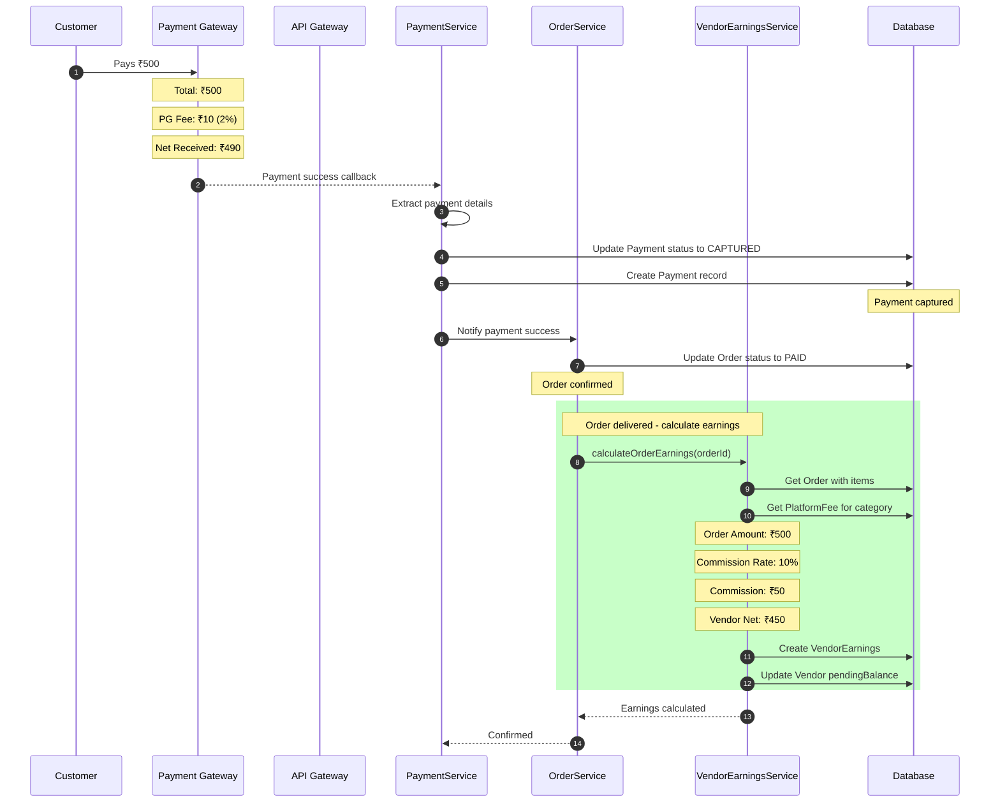
```mermaid
sequenceDiagram
    autonumber
    participant C as Customer
    participant PG as Payment Gateway
    participant API as API Gateway
    participant PS as PaymentService
    participant OSS as OrderService
    participant ESS as VendorEarningsService
    participant DB as Database
    
    C->>PG: Pays ₹500
    
    Note over PG: Total: ₹500
    Note over PG: PG Fee: ₹10 (2%)
    Note over PG: Net Received: ₹490
    
    PG-->>PS: Payment success callback
    PS->>PS: Extract payment details
    
    PS->>DB: Update Payment status to CAPTURED
    PS->>DB: Create Payment record
    
    Note over DB: Payment captured
    
    PS->>OSS: Notify payment success
    OSS->>DB: Update Order status to PAID
    
    Note over OSS: Order confirmed
    
    rect rgb(200, 255, 200)
        Note over OSS, ESS: Order delivered - calculate earnings
        
        OSS->>ESS: calculateOrderEarnings(orderId)
        
        ESS->>DB: Get Order with items
        ESS->>DB: Get PlatformFee for category
        
        Note over ESS: Order Amount: ₹500
        Note over ESS: Commission Rate: 10%
        Note over ESS: Commission: ₹50
        Note over ESS: Vendor Net: ₹450
        
        ESS->>DB: Create VendorEarnings
        ESS->>DB: Update Vendor pendingBalance
    end
    
    ESS-->>OSS: Earnings calculated
    OSS-->>PS: Confirmed
```

**Developer Notes:**
- Payment gateway fees are NOT deducted yet (future phase)
- Commission calculated from order total before PG fees
- Vendor receives net after platform commission

### 5.3 Payout Request and Execution

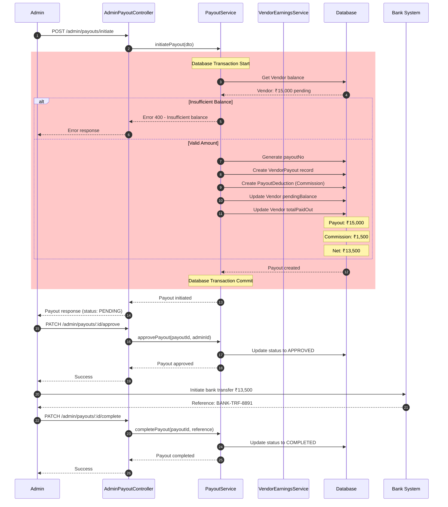
```mermaid
sequenceDiagram
    autonumber
    participant Admin as Admin
    participant APC as AdminPayoutController
    participant PS as PayoutService
    participant ESS as VendorEarningsService
    participant DB as Database
    participant Bank as Bank System
    
    Admin->>APC: POST /admin/payouts/initiate
    APC->>PS: initiatePayout(dto)
    
    rect rgb(255, 200, 200)
        Note over PS: Database Transaction Start
        
        PS->>DB: Get Vendor balance
        DB-->>PS: Vendor: ₹15,000 pending
        
        alt Insufficient Balance
            PS-->>APC: Error 400 - Insufficient balance
            APC-->>Admin: Error response
        else Valid Amount
            PS->>DB: Generate payoutNo
            PS->>DB: Create VendorPayout record
            PS->>DB: Create PayoutDeduction (Commission)
            PS->>DB: Update Vendor pendingBalance
            PS->>DB: Update Vendor totalPaidOut
            
            Note over DB: Payout: ₹15,000
            Note over DB: Commission: ₹1,500
            Note over DB: Net: ₹13,500
        end
        
        DB-->>PS: Payout created
        Note over PS: Database Transaction Commit
    end
    
    PS-->>APC: Payout initiated
    APC-->>Admin: Payout response (status: PENDING)
    
    Admin->>APC: PATCH /admin/payouts/:id/approve
    APC->>PS: approvePayout(payoutId, adminId)
    PS->>DB: Update status to APPROVED
    PS-->>APC: Payout approved
    APC-->>Admin: Success
    
    Admin->>Bank: Initiate bank transfer ₹13,500
    Bank-->>Admin: Reference: BANK-TRF-8891
    
    Admin->>APC: PATCH /admin/payouts/:id/complete
    APC->>PS: completePayout(payoutId, reference)
    PS->>DB: Update status to COMPLETED
    PS-->>APC: Payout completed
    APC-->>Admin: Success
```

**Developer Notes:**
- Payout initiation uses database transaction for consistency
- Commission is automatically deducted from gross amount
- Bank transfer is manual (automated is future phase)

### 5.4 Refund Handling with Commission Reversal

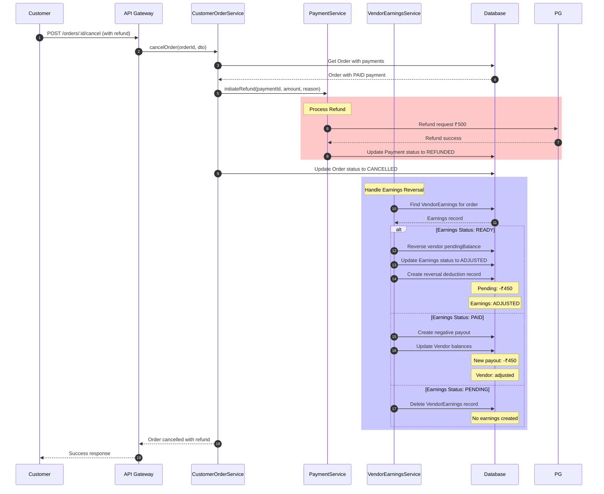
```mermaid
sequenceDiagram
    autonumber
    participant C as Customer
    participant API as API Gateway
    participant CS as CustomerOrderService
    participant PS as PaymentService
    participant ESS as VendorEarningsService
    participant DB as Database
    
    C->>API: POST /orders/:id/cancel (with refund)
    API->>CS: cancelOrder(orderId, dto)
    
    CS->>DB: Get Order with payments
    DB-->>CS: Order with PAID payment
    
    CS->>PS: initiateRefund(paymentId, amount, reason)
    
    rect rgb(255, 200, 200)
        Note over PS: Process Refund
        
        PS->>PG: Refund request ₹500
        PG-->>PS: Refund success
        
        PS->>DB: Update Payment status to REFUNDED
    end
    
    CS->>DB: Update Order status to CANCELLED
    
    rect rgb(200, 200, 255)
        Note over ESS: Handle Earnings Reversal
        
        ESS->>DB: Find VendorEarnings for order
        DB-->>ESS: Earnings record
        
        alt Earnings Status: READY
            ESS->>DB: Reverse vendor pendingBalance
            ESS->>DB: Update Earnings status to ADJUSTED
            ESS->>DB: Create reversal deduction record
            
            Note over DB: Pending: -₹450
            Note over DB: Earnings: ADJUSTED
        else Earnings Status: PAID
            ESS->>DB: Create negative payout
            ESS->>DB: Update Vendor balances
            
            Note over DB: New payout: -₹450
            Note over DB: Vendor: adjusted
        else Earnings Status: PENDING
            ESS->>DB: Delete VendorEarnings record
            Note over DB: No earnings created
        end
    end
    
    CS-->>API: Order cancelled with refund
    API-->>C: Success response
```

**Developer Notes:**
- Refund triggers earnings reversal based on status
- If payout already made, create negative payout
- If payout pending, simply delete earnings record

### 5.5 Periodic Payout Batch Processing

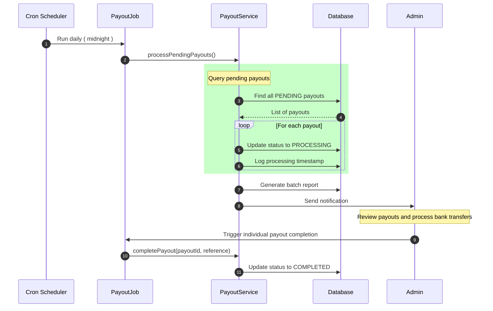
```mermaid
sequenceDiagram
    autonumber
    participant Scheduler as Cron Scheduler
    participant Job as PayoutJob
    participant PS as PayoutService
    participant DB as Database
    participant Admin as Admin
    
    Scheduler->>Job: Run daily ( midnight )
    Job->>PS: processPendingPayouts()
    
    rect rgb(200, 255, 200)
        Note over PS: Query pending payouts
        
        PS->>DB: Find all PENDING payouts
        DB-->>PS: List of payouts
        
        loop For each payout
            PS->>DB: Update status to PROCESSING
            PS->>DB: Log processing timestamp
        end
    end
    
    PS->>DB: Generate batch report
    PS->>Admin: Send notification
    
    Note over Admin: Review payouts and process bank transfers
    
    Admin->>Job: Trigger individual payout completion
    Job->>PS: completePayout(payoutId, reference)
    PS->>DB: Update status to COMPLETED
```

**Developer Notes:**
- Batch job prepares payouts for processing
- Individual completion done by admin
- Future: automate bank transfer integration

---

## 6. Data Flow Diagrams

### 6.1 Order Total Split Flow

```mermaid
flowchart LR
    subgraph "Customer Payment"
        Total["Total: ₹500"]
    end
    
    subgraph "Platform"
        PG["PG Fee: ₹10<br/>(2%)"]
        Comm["Commission: ₹50<br/>(10%)"]
        Net["Net to Vendor"]
    end
    
    Total -->|"₹500"| Split
    
    subgraph "Split"
        Split{ }
    end
    
    Split -->|"₹10"| PG
    Split -->|"₹50"| Comm
    Split -->|"₹440"| Net
    
    PG -->|"Holds"| Wallet1["Platform Wallet"]
    Comm -->|"Debits"| Wallet2["Commission Account"]
    Net -->rues"| Balance["Vendor Pending|"Acc Balance"]
    
    Balance -->|"₹440"| Payout["Payout Pool"]
    Comm -->|"₹50"| Payout
    
    Payout -->|"₹490"| VendorBank["Vendor Bank"]
```

**Data Flow Summary:**
| Component | Amount | Action |
|-----------|--------|--------|
| Customer Payment | ₹500 | Received |
| PG Fee | ₹10 | Held (not deducted yet) |
| Commission | ₹50 | Debited from vendor share |
| Vendor Net | ₹440 | Accrues to pending balance |
| Total Payout | ₹490 | Transferred to vendor |

**Developer Notes:**
- PG fee is shown but NOT deducted (future phase)
- Commission calculated on order total before PG fees
- Vendor net = Order Total - Commission

### 6.2 Payment Amount Flow

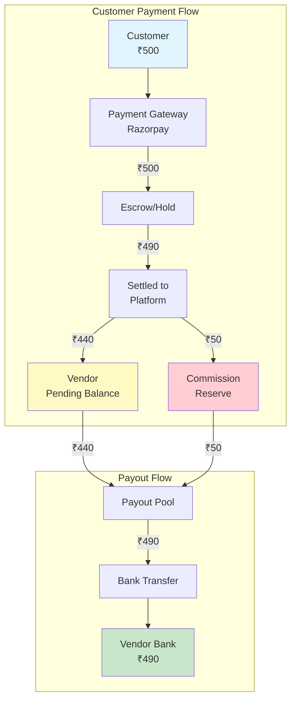
```mermaid
flowchart TB
    subgraph "Customer Payment Flow"
        C["Customer<br/>₹500"] --> PG["Payment Gateway<br/>Razorpay"]
        PG -->|"₹500"| Hold["Escrow/Hold"]
        Hold -->|"₹490"| Settled["Settled to<br/>Platform"]
        Settled -->|"₹50"| Comm["Commission<br/>Reserve"]
        Settled -->|"₹440"| Pending["Vendor<br/>Pending Balance"]
    end
    
    subgraph "Payout Flow"
        Pending -->|"₹440"| Pool["Payout Pool"]
        Comm -->|"₹50"| Pool
        Pool -->|"₹490"| Transfer["Bank Transfer"]
        Transfer --> VB["Vendor Bank<br/>₹490"]
    end
    
    style C fill:#e1f5fe
    style VB fill:#c8e6c9
    style Comm fill:#ffcdd2
    style Pending fill:#fff9c4
```

**Developer Notes:**
- Platform receives ₹490 after PG fees (future)
- Commission held separately
- Pending balance accumulates for payout

### 6.3 Adjustments and Corrections Flow

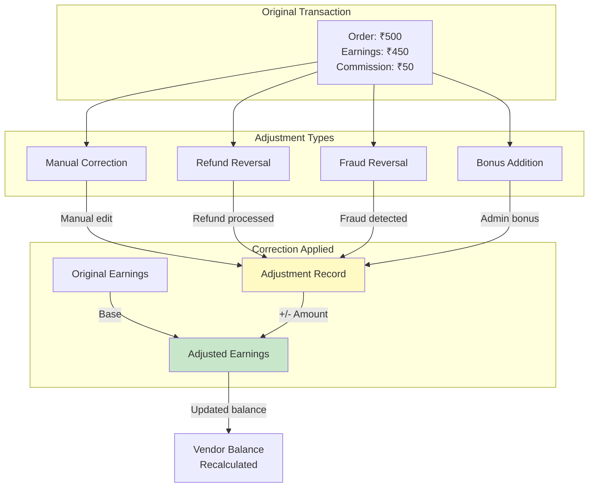
```mermaid
flowchart TD
    subgraph "Original Transaction"
        O1[Order: ₹500<br/>Earnings: ₹450<br/>Commission: ₹50]
    end
    
    subgraph "Adjustment Types"
        A1[Manual Correction]
        A2[Refund Reversal]
        A3[Fraud Reversal]
        A4[Bonus Addition]
    end
    
    subgraph "Correction Applied"
        C1[Original Earnings]
        C2[Adjustment Record]
        C3[Adjusted Earnings]
    end
    
    O1 --> A1
    O1 --> A2
    O1 --> A3
    O1 --> A4
    
    A1 -->|"Manual edit"| C2
    A2 -->|"Refund processed"| C2
    A3 -->|"Fraud detected"| C2
    A4 -->|"Admin bonus"| C2
    
    C1 -->|"Base"| C3
    C2 -->|"+/- Amount"| C3
    
    C3 -->|"Updated balance"| UB["Vendor Balance<br/>Recalculated"]
    
    style C2 fill:#fff9c4
    style C3 fill:#c8e6c9
```

**Developer Notes:**
- Adjustments create new records, don't modify originals
- Vendor balance always calculated from records
- Audit trail maintained for all corrections

---

## 7. Code Flow Charts

### 7.1 Order Completion Triggering Earnings

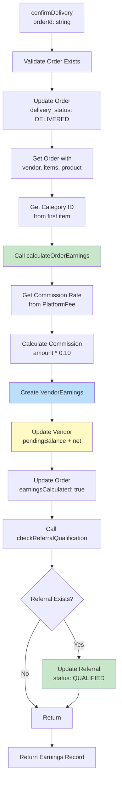
```mermaid
flowchart TD
    A[confirmDelivery<br/>orderId: string] --> B[Validate Order Exists]
    B --> C[Update Order<br/>delivery_status: DELIVERED]
    C --> D[Get Order with<br/>vendor, items, product]
    D --> E[Get Category ID<br/>from first item]
    E --> F[Call calculateOrderEarnings]
    
    F --> G[Get Commission Rate<br/>from PlatformFee]
    G --> H[Calculate Commission<br/>amount * 0.10]
    H --> I[Create VendorEarnings]
    I --> J[Update Vendor<br/>pendingBalance + net]
    J --> K[Update Order<br/>earningsCalculated: true]
    K --> L[Call checkReferralQualification]
    L --> M{Referral Exists?}
    M -->|Yes| N[Update Referral<br/>status: QUALIFIED]
    M -->|No| O[Return]
    N --> O
    O --> P[Return Earnings Record]
    
    style F fill:#c8e6c9
    style I fill:#bbdefb
    style J fill:#fff9c4
    style N fill:#c8e6c9
```

**Method:** `VendorEarningsService.calculateOrderEarnings()`
**Transaction:** Single write, no transaction needed
**Background Jobs:** None

### 7.2 Payment Webhook Processing

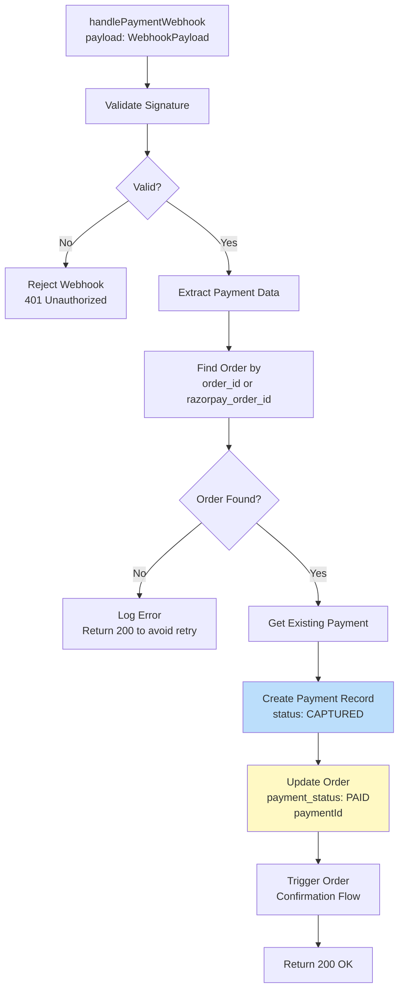
```mermaid
flowchart TD
    A[handlePaymentWebhook<br/>payload: WebhookPayload] --> B[Validate Signature]
    B --> C{Valid?}
    C -->|No| D[Reject Webhook<br/>401 Unauthorized]
    C -->|Yes| E[Extract Payment Data]
    
    E --> F[Find Order by<br/>order_id or razorpay_order_id]
    F --> G{Order Found?}
    G -->|No| H[Log Error<br/>Return 200 to avoid retry]
    G -->|Yes| I[Get Existing Payment]
    
    I --> J[Create Payment Record<br/>status: CAPTURED]
    J --> K[Update Order<br/>payment_status: PAID<br/>paymentId]
    K --> L[Trigger Order<br/>Confirmation Flow]
    L --> M[Return 200 OK]
    
    style J fill:#bbdefb
    style K fill:#fff9c4
```

**Method:** `PaymentService.handleWebhook()`
**Transaction:** Multiple writes, consider transaction
**Background Jobs:** Order confirmation notification

### 7.3 Scheduled Payout Job

```mermaid
flowchart TD
    A[@Cron<br/>EVERY_DAY_6AM] --> B[processPendingPayouts]
    B --> C[Query Payouts<br/>status: PENDING]
    C --> D[Group by Vendor]
    D --> E[For Each Vendor Group]
    
    E --> F[Calculate Total<br/>Gross Amount]
    F --> G[Calculate Total<br/>Deductions]
    G --> H[Update Each Payout<br/>status: PROCESSING]
    H --> I[Add Processing Timestamp]
    I --> J[Generate Summary Report]
    J --> K[Notify Admins]
    
    K --> L[End]
    
    style B fill:#c8e6c9
    style K fill:#ffcdd2
```

**Method:** `PayoutService.processPendingPayouts()`
**Transaction:** Batch updates, use chunking for large datasets
**Background Jobs:** Email/SMS notification to admin

### 7.4 Admin Approval Workflow

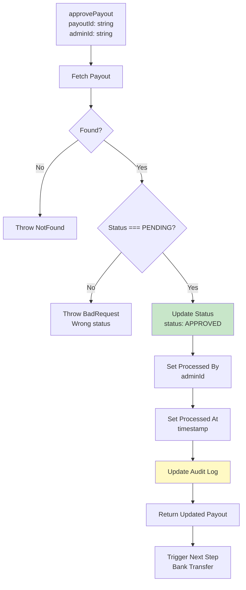
```mermaid
flowchart TD
    A[approvePayout<br/>payoutId: string<br/>adminId: string] --> B[Fetch Payout]
    B --> C{Found?}
    C -->|No| D[Throw NotFound]
    C -->|Yes| E{Status === PENDING?}
    
    E -->|No| F[Throw BadRequest<br/>Wrong status]
    E -->|Yes| G[Update Status<br/>status: APPROVED]
    
    G --> H[Set Processed By<br/>adminId]
    H --> I[Set Processed At<br/>timestamp]
    J[Update Audit Log]
    
    I --> J
    J --> K[Return Updated Payout]
    
    K --> L[Trigger Next Step<br/>Bank Transfer]
    
    style G fill:#c8e6c9
    style J fill:#fff9c4
```

**Method:** `PayoutService.approvePayout()`
**Transaction:** Single update
**Audit:** Admin ID and timestamp recorded

---

## 8. API Endpoints Design

### 8.1 Vendor Earnings Summary API

**Endpoint:** `GET /vendor/earnings/summary`

**Purpose:** Provide vendors a financial overview of their performance

**Request Parameters:**
```json
{
  "startDate": "2026-01-01",
  "endDate": "2026-01-31",
  "includePending": true
}
```

**Response:**
```json
{
  "vendorId": "uuid-string",
  "currency": "INR",
  "period": {
    "startDate": "2026-01-01",
    "endDate": "2026-01-31"
  },
  "summary": {
    "totalSales": 50000.00,
    "totalOrders": 150,
    "commissionRate": 10.00,
    "totalCommission": 5000.00,
    "paymentGatewayFees": 0.00,
    "otherFees": 0.00,
    "netPayout": 45000.00
  },
  "balance": {
    "pendingEarnings": 15000.00,
    "readyForPayout": 30000.00,
    "totalPaidOut": 0.00
  },
  "commissionByCategory": [
    {
      "categoryName": "Water Jars",
      "categoryId": "uuid-string",
      "totalSales": 50000.00,
      "commissionRate": 10.00,
      "commissionAmount": 5000.00,
      "orderCount": 150
    }
  ]
}
```

### 8.2 Vendor Earnings List API

**Endpoint:** `GET /vendor/earnings`

**Response:**
```json
{
  "data": [
    {
      "id": "uuid-string",
      "orderId": "uuid-string",
      "orderNo": "O000123",
      "totalSales": 500.00,
      "commissionRate": 10.00,
      "commissionAmount": 50.00,
      "netPayoutAmount": 450.00,
      "status": "PAID",
      "createdAt": "2026-01-15T10:00:00Z"
    }
  ],
  "pagination": {
    "page": 1,
    "limit": 20,
    "totalItems": 150,
    "totalPages": 8
  }
}
```

### 8.3 Vendor Payout List API

**Endpoint:** `GET /vendor/payouts`

**Response:**
```json
{
  "vendorId": "uuid-string",
  "balanceSummary": {
    "totalPayable": 45000.00,
    "totalPaid": 30000.00,
    "balanceRemaining": 15000.00
  },
  "payouts": [
    {
      "id": "uuid-string",
      "payoutNo": "PAY-2026-001",
      "netAmount": 13500.00,
      "status": "COMPLETED",
      "referenceNumber": "BANK-TRF-8891",
      "processedAt": "2026-02-01T10:00:00Z"
    }
  ]
}
```

### 8.4 Admin: Initiate Payout API

**Endpoint:** `POST /admin/payouts/initiate`

**Request Body:**
```json
{
  "vendorId": "uuid-string",
  "amount": 15000.00,
  "paymentMethod": "BANK_TRANSFER",
  "notes": "Monthly payout"
}
```

**Response:**
```json
{
  "id": "uuid-string",
  "payoutNo": "PAY-2026-002",
  "netAmount": 13500.00,
  "status": "PENDING"
}
```

### 8.5 Admin: Approve Payout API

**Endpoint:** `PATCH /admin/payouts/:payoutId/approve`

**Response:**
```json
{
  "id": "uuid-string",
  "status": "APPROVED",
  "processedAt": "2026-02-02T10:00:00Z"
}
```

### 8.6 Admin: Complete Payout API

**Endpoint:** `PATCH /admin/payouts/:payoutId/complete`

**Request Body:**
```json
{
  "referenceNumber": "BANK-TRF-8892"
}
```

**Response:**
```json
{
  "id": "uuid-string",
  "status": "COMPLETED",
  "referenceNumber": "BANK-TRF-8892",
  "completedAt": "2026-02-02T11:00:00Z"
}
```

### 8.7 Referral APIs

**Create:** `POST /customer/referrals`
```json
{
  "referredPhone": "+91-9876543210"
}
```

**Check Status:** `GET /customer/referrals/:id/status`
```json
{
  "rewardStatus": "QUALIFIED",
  "rewardValue": 2,
  "qualifyingOrder": {
    "orderNo": "O000123"
  }
}
```

---

## 9. Service Layer Design

### 9.1 VendorEarningsService

```typescript
@Injectable()
export class VendorEarningsService {
  /**
   * Calculate earnings for a delivered order
   * Called when order delivery is confirmed
   */
  async calculateOrderEarnings(params: {
    vendorId: string;
    orderId: string;
    categoryId: string;
    orderAmount: number;
  }): Promise<VendorEarnings> {
    const platformFee = await this.getCommissionRate(params.categoryId);
    const commissionRate = platformFee.platform_fee; // 10%
    const commissionAmount = (params.orderAmount * commissionRate) / 100;
    
    return this.prisma.$transaction(async (tx) => {
      const earnings = await tx.vendorEarnings.create({
        data: {
          vendorId: params.vendorId,
          orderId: params.orderId,
          totalSales: params.orderAmount,
          commissionRate,
          commissionAmount,
          netPayoutAmount: params.orderAmount - commissionAmount,
          periodStart: new Date(),
          periodEnd: new Date(),
          status: 'READY',
        },
      });
      
      await tx.vendor.update({
        where: { id: params.vendorId },
        data: {
          pendingBalance: { increment: earnings.netPayoutAmount },
          totalEarnings: { increment: params.orderAmount },
        },
      });
      
      return earnings;
    });
  }

  async getEarningsSummary(vendorId: string, filters?: {
    startDate?: Date;
    endDate?: Date;
  }): Promise<EarningsSummaryResponse> {
    // Aggregate earnings by period and category
  }
}
```

### 9.2 PayoutService

```typescript
@Injectable()
export class PayoutService {
  async initiatePayout(params: {
    vendorId: string;
    amount: number;
    paymentMethod: string;
    notes?: string;
  }): Promise<VendorPayout> {
    return this.prisma.$transaction(async (tx) => {
      const vendor = await tx.vendor.findUnique({
        where: { id: params.vendorId },
      });
      
      if (Number(vendor.pendingBalance) < params.amount) {
        throw new BadRequestException('Insufficient balance');
      }
      
      const payoutNo = await this.generatePayoutNumber();
      const commissionAmount = (params.amount * 10) / 100;
      
      const payout = await tx.vendorPayout.create({
        data: {
          payoutNo,
          vendorId: params.vendorId,
          grossAmount: params.amount,
          totalDeductions: commissionAmount,
          netAmount: params.amount - commissionAmount,
          status: 'PENDING',
          paymentMethod: params.paymentMethod,
          notes: params.notes,
        },
      });
      
      await tx.payoutDeduction.create({
        data: {
          payoutId: payout.id,
          deductionType: 'COMMISSION',
          description: 'Platform commission (10%)',
          amount: commissionAmount,
        },
      });
      
      await tx.vendor.update({
        where: { id: params.vendorId },
        data: {
          pendingBalance: { decrement: params.amount },
          totalPaidOut: { increment: params.amount - commissionAmount },
        },
      });
      
      return payout;
    });
  }
}
```

### 9.3 ReferralService

```typescript
@Injectable()
export class ReferralService {
  async processReferralOnDelivery(orderId: string): Promise<void> {
    const order = await this.prisma.order.findUnique({
      where: { id: orderId },
      include: { customer: true },
    });
    
    const referral = await this.prisma.referralReward.findFirst({
      where: {
        referredCustomerId: order.customerId,
        rewardStatus: 'PENDING',
      },
    });
    
    if (referral) {
      await this.prisma.referralReward.update({
        where: { id: referral.id },
        data: {
          rewardStatus: 'QUALIFIED',
          triggerOrderId: orderId,
        },
      });
    }
  }
}
```

---

## 10. Module Structure

```
src/
├── vendor-earnings/
│   ├── vendor-earnings.module.ts
│   ├── controllers/
│   │   ├── vendor-earnings.controller.ts
│   │   ├── vendor-payout.controller.ts
│   │   ├── admin-vendor-earnings.controller.ts
│   │   ├── admin-payout.controller.ts
│   │   └── referral.controller.ts
│   ├── services/
│   │   ├── vendor-earnings.service.ts
│   │   ├── payout.service.ts
│   │   ├── referral.service.ts
│   │   └── earnings-calculation.service.ts
│   ├── dto/
│   │   ├── earnings-summary-query.dto.ts
│   │   ├── initiate-payout.dto.ts
│   │   ├── create-referral.dto.ts
│   │   └── update-payout-status.dto.ts
│   └── interfaces/
│       ├── earnings.interface.ts
│       └── payout.interface.ts
```

---

## 11. Out of Scope Items (Documented)

The following are explicitly **NOT** implemented in this phase:

### 11.1 Payment Gateway Fee Deduction
- PG fees are stored as `paymentGatewayFee` field with `0` default
- Actual deduction logic will be implemented in future phase
- Schema supports: `VendorEarnings.paymentGatewayFee` field

### 11.2 Automated Bank Transfers
- Manual payout initiation required
- No webhook integration with bank/Razorpay
- Manual status updates by admin

### 11.3 Wallet/Credit System
- Referral rewards tracked but not automatically credited
- `ReferralReward.rewardStatus` tracks state but no wallet balance updates
- Admin must manually issue rewards

---

## 12. Todo List

- [x] Review PRD document and existing codebase structure
- [x] Analyze existing Prisma models
- [x] Create implementation plan document with all diagrams
- [ ] Create Prisma models for VendorEarnings, VendorPayout, PayoutDeduction, ReferralReward
- [ ] Update Order and Vendor models with tracking fields
- [ ] Implement VendorEarningsService with commission calculation
- [ ] Implement PayoutService
- [ ] Implement ReferralService
- [ ] Create vendor-earnings.controller.ts
- [ ] Create vendor-payout.controller.ts
- [ ] Create admin controllers
- [ ] Create referral controller
- [ ] Add integration in OrderService.confirmDelivery
- [ ] Write unit tests

---

## 13. Success Criteria

- [ ] Vendors can view earnings summary via `/vendor/earnings/summary`
- [ ] Vendors can view payout history via `/vendor/payouts`
- [ ] Admin can view all vendor earnings via `/admin/vendors/:id/earnings`
- [ ] Admin can initiate and manage payouts via `/admin/payouts/*`
- [ ] 10% commission is automatically calculated on delivered orders
- [ ] Referral status is tracked on first delivered order
- [ ] No payment gateway fees are deducted (future phase)
- [ ] No automated bank transfers (future phase)
- [ ] No wallet credit system (future phase)
