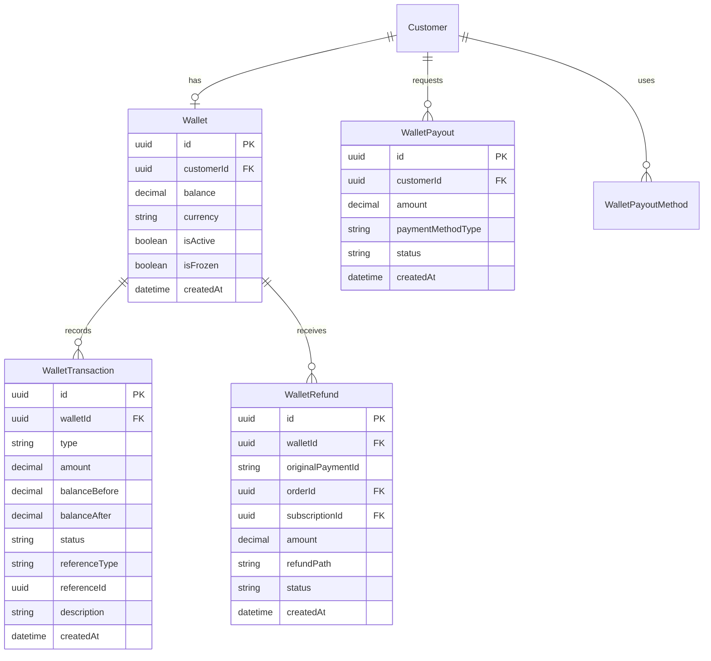
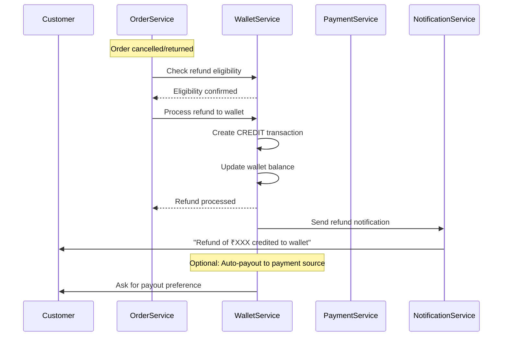
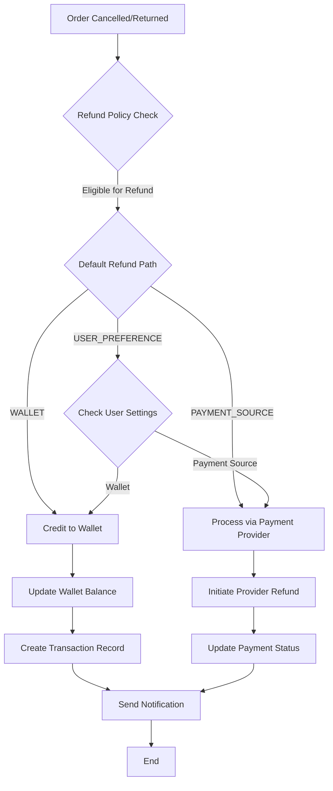
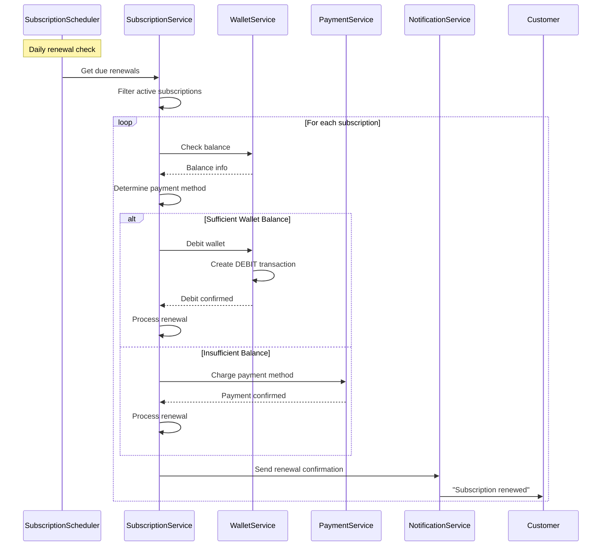
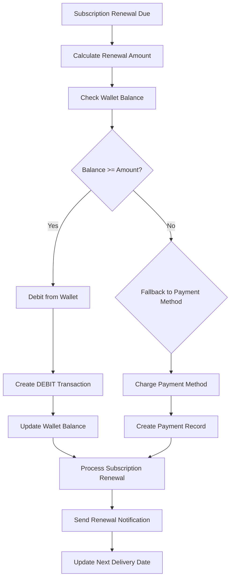
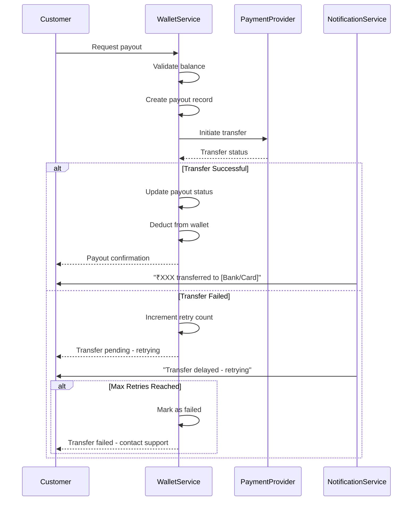
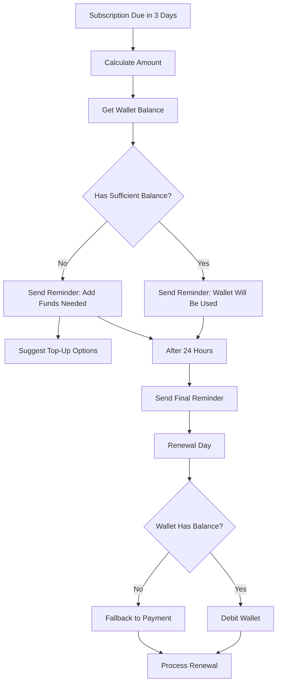

# Wallet System Technical Design Document

## Table of Contents

1. [Executive Summary](#executive-summary)
2. [System Architecture Overview](#system-architecture-overview)
3. [Database Schema Design](#database-schema-design)
4. [API Endpoint Specifications](#api-endpoint-specifications)
5. [Workflow Diagrams](#workflow-diagrams)
6. [Integration Points](#integration-points)
7. [Notification System](#notification-system)
8. [Implementation Approach](#implementation-approach)
9. [Security Considerations](#security-considerations)
10. [Scalability and Performance](#scalability-and-performance)

---

## Executive Summary

This document outlines the technical design for implementing a wallet system within the existing backend infrastructure. The wallet system is designed to support core functionalities including refund handling, subscription renewal management, balance refund capabilities, and notification mechanisms. The implementation follows a phased approach, starting with a simplified version that integrates with the current backend without major architectural changes.

### Key Features

- **Automatic Refund Routing**: Refunds for undelivered, cancelled, or returned items are credited to the user's wallet
- **Subscription Renewal with Wallet Priority**: System checks wallet balance before charging payment source
- **Dual Refund Paths**: Support for wallet-to-payment-source and wallet-to-wallet transactions
- **Pre-Renewal Notifications**: Alert users before subscription renewals with wallet balance status

---

## System Architecture Overview

### Current System Architecture

The existing backend infrastructure follows a modular NestJS architecture with:

```
┌─────────────────────────────────────────────────────────────┐
│                     Application Layer                        │
│  ┌─────────┐ ┌─────────┐ ┌─────────┐ ┌─────────┐ ┌─────────┐│
│  │ Auth    │ │ Customer│ │ Product │ │  Cart   │ │ Order   ││
│  │ Module  │ │ Module  │ │ Module  │ │ Module  │ │ Module  ││
│  └─────────┘ └─────────┘ └─────────┘ └─────────┘ └─────────┘│
│  ┌─────────┐ ┌─────────┐ ┌─────────┐ ┌─────────┐ ┌─────────┐│
│  │Payment  │ │Subscription│ │Address │ │Location │ │Notification│
│  │ Module  │ │ Module   │ │ Module │ │ Module  │ │ Module  ││
│  └─────────┘ └─────────┘ └─────────┘ └─────────┘ └─────────┘│
└─────────────────────────────────────────────────────────────┘
                           │
┌─────────────────────────────────────────────────────────────┐
│                     Database Layer                           │
│              PostgreSQL with Prisma ORM                      │
└─────────────────────────────────────────────────────────────┘
```

### Proposed Wallet System Architecture

The wallet system integrates seamlessly with the existing architecture:

```
┌─────────────────────────────────────────────────────────────────────────────┐
│                            Wallet Module                                     │
│  ┌─────────────────┐  ┌─────────────────┐  ┌─────────────────────────────┐  │
│  │ WalletService   │  │ WalletTransaction│  │ WalletNotificationService   │  │
│  │  - Credit       │  │  Service        │  │  - Pre-renewal alerts       │  │
│  │  - Debit        │  │  - Transaction  │  │  - Balance updates          │  │
│  │  - Balance Check│  │    History      │  │  - Refund confirmations     │  │
│  └─────────────────┘  └─────────────────┘  └─────────────────────────────┘  │
└─────────────────────────────────────────────────────────────────────────────┘
                                    │
┌─────────────────────────────────────────────────────────────────────────────┐
│                            Integration Layer                                 │
│  ┌───────────────┐  ┌───────────────┐  ┌───────────────┐  ┌──────────────┐ │
│  │Payment Module │  │Order Module   │  │Subscription   │  │Notification  │ │
│  │               │  │               │  │Module         │  │Module        │ │
│  │ - Refunds     │  │ - Cancellations│ │ - Renewals   │  │ - Alerts     │ │
│  │ - Charges     │  │ - Returns     │  │ - Balance     │  │ - Updates    │ │
│  └───────────────┘  └───────────────┘  └───────────────┘  └──────────────┘ │
└─────────────────────────────────────────────────────────────────────────────┘
```

### Module Structure

```
src/wallet/
├── wallet.module.ts                    # Main module definition
├── controllers/
│   ├── wallet.controller.ts           # Customer wallet endpoints
│   └── admin-wallet.controller.ts     # Admin wallet management
├── services/
│   ├── wallet.service.ts              # Core wallet operations
│   ├── wallet-transaction.service.ts  # Transaction management
│   ├── wallet-refund.service.ts       # Refund handling
│   └── wallet-notification.service.ts # Notification triggers
├── repositories/
│   └── wallet.repository.ts           # Data access layer
├── dto/
│   ├── credit-wallet.dto.ts
│   ├── debit-wallet.dto.ts
│   ├── wallet-transfer.dto.ts
│   └── wallet-response.dto.ts
└── interfaces/
    ├── wallet.interface.ts
    └── transaction-type.enum.ts
```

---

## Database Schema Design

### Wallet Models

```prisma
// prisma/models/wallet.prisma

// Enum for transaction types
enum WalletTransactionType {
  CREDIT        // Money added to wallet (refunds, deposits)
  DEBIT         // Money deducted from wallet (payments, withdrawals)
  REFUND        // Refund from cancelled/returned order
  TRANSFER_IN   // Transfer from another wallet
  TRANSFER_OUT  // Transfer to another wallet
  ADJUSTMENT    // Manual adjustment by admin
  EXPIRY        // Expired balance
}

// Enum for transaction status
enum WalletTransactionStatus {
  PENDING    // Transaction initiated but not completed
  COMPLETED  // Successfully completed
  FAILED     // Transaction failed
  REVERSED   // Transaction was reversed
  CANCELLED  // Transaction was cancelled
}

// Enum for refund path types
enum RefundPath {
  WALLET_ONLY          // Refund to wallet only
  PAYMENT_SOURCE       // Refund to original payment method
  WALLET_TO_PAYMENT    // Wallet to payment source transfer
}

// Main wallet model
model Wallet {
  id                String   @id @default(uuid())
  customerId        String   @unique
  customer          Customer @relation(fields: [customerId], references: [id], onDelete: Cascade)
  
  // Balance information
  balance           Decimal  @db.Decimal(12, 2) @default(0)
  currency          String   @default("INR")
  
  // Status
  isActive          Boolean  @default(true)
  isFrozen          Boolean  @default(false)
  freezeReason      String?
  
  // Timestamps
  createdAt         DateTime @default(now())
  updatedAt         DateTime @updatedAt
  lastActivityAt    DateTime @default(now())
  
  // Relations
  transactions      WalletTransaction[]
  walletRefunds     WalletRefund[]
  
  @@index([customerId])
  @@index([isActive])
  @@index([createdAt])
}

// Transaction history model
model WalletTransaction {
  id                String   @id @default(uuid())
  walletId          String
  wallet            Wallet   @relation(fields: [walletId], references: [id], onDelete: Cascade)
  
  // Transaction details
  type              WalletTransactionType
  amount            Decimal  @db.Decimal(12, 2)
  balanceBefore     Decimal  @db.Decimal(12, 2)
  balanceAfter      Decimal  @db.Decimal(12, 2)
  currency          String   @default("INR")
  
  // Status
  status            WalletTransactionStatus @default(PENDING)
  
  // Reference information
  referenceType     String?  // ORDER, SUBSCRIPTION, REFUND, MANUAL
  referenceId       String?  // ID of the related entity
  
  // Description
  description       String   @db.VarChar(500)
  metadata          Json?
  
  // Timestamps
  createdAt         DateTime @default(now())
  completedAt       DateTime?
  
  @@index([walletId])
  @@index([type])
  @@index([status])
  @@index([referenceType, referenceId])
  @@index([createdAt])
}

// Refund tracking model
model WalletRefund {
  id                String   @id @default(uuid())
  walletId          String
  wallet            Wallet   @relation(fields: [walletId], references: [id], onDelete: Cascade)
  
  // Refund details
  originalPaymentId String   // Original payment that was refunded
  orderId           String?  // Associated order (if applicable)
  subscriptionId    String?  // Associated subscription (if applicable)
  
  amount            Decimal  @db.Decimal(12, 2)
  currency          String   @default("INR")
  
  // Refund path
  refundPath        RefundPath
  
  // Status
  status            WalletTransactionStatus @default(PENDING)
  
  // External refund tracking (for wallet-to-payment-source)
  externalRefundId  String?  // ID from payment provider
  providerResponse  Json?
  
  // Timestamps
  createdAt         DateTime @default(now())
  processedAt       DateTime?
  completedAt       DateTime?
  
  @@index([walletId])
  @@index([orderId])
  @@index([subscriptionId])
  @@index([status])
  @@index([createdAt])
}

// Wallet-to-payment-source refund tracking
model WalletPayout {
  id                String   @id @default(uuid())
  customerId        String
  customer          Customer @relation(fields: [customerId], references: [id], onDelete: Cascade)
  
  // Payout details
  amount            Decimal  @db.Decimal(12, 2)
  currency          String   @default("INR")
  
  // Destination
  paymentMethodType String   // CARD, BANK_ACCOUNT, UPI
  paymentMethodId   String   // Reference to payment method
  
  // External tracking
  providerPayoutId  String?  // ID from payment provider
  providerResponse  Json?
  
  // Status
  status            String   @default("PENDING") // PENDING, PROCESSING, COMPLETED, FAILED
  
  // Failure tracking
  failureReason     String?
  retryCount        Int      @default(0)
  maxRetries        Int      @default(3)
  
  // Timestamps
  createdAt         DateTime @default(now())
  processedAt       DateTime?
  completedAt       DateTime?
  lastRetryAt       DateTime?
  
  @@index([customerId])
  @@index([status])
  @@index([createdAt])
}
```

### Extended Customer Model

```prisma
// Add to prisma/models/customer.prisma

model Customer {
  // ... existing fields ...
  
  // Wallet relation (already defined in wallet model)
  wallet            Wallet?
  
  // Wallet payout methods
  walletPayoutMethods WalletPayoutMethod[]
  
  // ... existing relations ...
}

model WalletPayoutMethod {
  id                String   @id @default(uuid())
  customerId        String
  customer          Customer @relation(fields: [customerId], references: [id], onDelete: Cascade)
  
  // Method type
  methodType        String   // CARD, BANK_ACCOUNT, UPI
  
  // Method details (encrypted)
  methodDetails     Json     // Encrypted payment method info
  
  // Status
  isDefault         Boolean  @default(false)
  isVerified        Boolean  @default(false)
  
  // Timestamps
  createdAt         DateTime @default(now())
  updatedAt         DateTime @updatedAt
  
  @@index([customerId])
  @@index([isDefault])
}
```

### Database Diagram



---

## API Endpoint Specifications

### Customer Wallet Endpoints

#### 1. Get Wallet Balance

```
GET /customer/wallet/balance
```

**Description**: Retrieves the authenticated customer's wallet balance and status.

**Response**:
```json
{
  "success": true,
  "data": {
    "balance": 500.00,
    "currency": "INR",
    "isActive": true,
    "isFrozen": false,
    "lastActivityAt": "2026-01-15T10:30:00Z"
  }
}
```

**Status Codes**:
- 200: Success
- 401: Unauthorized
- 404: Wallet not found

#### 2. Get Transaction History

```
GET /customer/wallet/transactions
```

**Query Parameters**:
| Parameter | Type | Required | Description |
|-----------|------|----------|-------------|
| page | number | No | Page number (default: 1) |
| limit | number | No | Items per page (default: 20) |
| type | string | No | Filter by transaction type |
| startDate | date | No | Filter from date |
| endDate | date | No | Filter to date |

**Response**:
```json
{
  "success": true,
  "data": {
    "transactions": [
      {
        "id": "uuid",
        "type": "CREDIT",
        "amount": 150.00,
        "balanceBefore": 350.00,
        "balanceAfter": 500.00,
        "description": "Refund for order #ORD-123",
        "referenceType": "ORDER",
        "referenceId": "order-uuid",
        "status": "COMPLETED",
        "createdAt": "2026-01-15T10:30:00Z"
      }
    ],
    "pagination": {
      "page": 1,
      "limit": 20,
      "total": 45,
      "totalPages": 3
    }
  }
}
```

#### 3. Credit Wallet (Admin/Internal)

```
POST /customer/wallet/credit
```

**Description**: Credits amount to customer wallet. Internal use for refunds.

**Request Body**:
```json
{
  "customerId": "uuid",
  "amount": 150.00,
  "description": "Refund for cancelled order",
  "referenceType": "ORDER",
  "referenceId": "order-uuid",
  "metadata": {
    "orderNumber": "ORD-123",
    "reason": "CANCELLATION"
  }
}
```

**Response**:
```json
{
  "success": true,
  "data": {
    "transactionId": "uuid",
    "newBalance": 500.00,
    "message": "Wallet credited successfully"
  }
}
```

#### 4. Debit Wallet (Internal)

```
POST /customer/wallet/debit
```

**Description**: Debits amount from customer wallet. Internal use for payments.

**Request Body**:
```json
{
  "customerId": "uuid",
  "amount": 100.00,
  "description": "Subscription renewal payment",
  "referenceType": "SUBSCRIPTION",
  "referenceId": "subscription-uuid",
  "metadata": {
    "subscriptionName": "Daily Water Delivery"
  }
}
```

**Response**:
```json
{
  "success": true,
  "data": {
    "transactionId": "uuid",
    "newBalance": 400.00,
    "message": "Wallet debited successfully"
  }
}
```

#### 5. Request Payout to Payment Source

```
POST /customer/wallet/payout
```

**Description**: Requests transfer of wallet balance to original payment method.

**Request Body**:
```json
{
  "amount": 200.00,
  "paymentMethodId": "uuid"
}
```

**Response**:
```json
{
  "success": true,
  "data": {
    "payoutId": "uuid",
    "amount": 200.00,
    "status": "PENDING",
    "estimatedArrival": "2026-01-18T10:30:00Z",
    "message": "Payout request submitted successfully"
  }
}
```

#### 6. Get Payout Status

```
GET /customer/wallet/payout/:payoutId
```

**Response**:
```json
{
  "success": true,
  "data": {
    "payoutId": "uuid",
    "amount": 200.00,
    "status": "COMPLETED",
    "paymentMethod": "****4532",
    "completedAt": "2026-01-17T14:30:00Z"
  }
}
```

#### 7. Get Wallet Payout Methods

```
GET /customer/wallet/payout-methods
```

**Response**:
```json
{
  "success": true,
  "data": {
    "methods": [
      {
        "id": "uuid",
        "methodType": "BANK_ACCOUNT",
        "lastFour": "4532",
        "bankName": "HDFC Bank",
        "isDefault": true,
        "isVerified": true
      }
    ]
  }
}
```

#### 8. Add Payout Method

```
POST /customer/wallet/payout-methods
```

**Request Body**:
```json
{
  "methodType": "BANK_ACCOUNT",
  "accountNumber": "1234567890",
  "ifscCode": "HDFC0001234",
  "accountHolderName": "John Doe"
}
```

---

### Admin Wallet Management Endpoints

#### 1. Get Customer Wallet

```
GET /admin/wallet/customer/:customerId
```

**Response**:
```json
{
  "success": true,
  "data": {
    "wallet": {
      "id": "uuid",
      "customerId": "uuid",
      "balance": 500.00,
      "currency": "INR",
      "isActive": true,
      "isFrozen": false,
      "createdAt": "2026-01-01T10:30:00Z"
    },
    "customer": {
      "name": "John Doe",
      "phone": "+91-9876543210",
      "email": "john@example.com"
    }
  }
}
```

#### 2. Freeze/Unfreeze Wallet

```
POST /admin/wallet/:walletId/freeze
POST /admin/wallet/:walletId/unfreeze
```

**Request Body**:
```json
{
  "reason": "Suspicious activity detected"
}
```

#### 3. Manual Adjustment

```
POST /admin/wallet/adjust
```

**Description**: Manual balance adjustment for customer wallet.

**Request Body**:
```json
{
  "customerId": "uuid",
  "amount": 100.00,
  "type": "CREDIT", // or DEBIT
  "description": "Customer compensation for service issue",
  "reason": "Delayed delivery compensation"
}
```

#### 4. Get Wallet Transactions Report

```
GET /admin/wallet/transactions
```

**Query Parameters**:
| Parameter | Type | Required | Description |
|-----------|------|----------|-------------|
| page | number | No | Page number |
| limit | number | No | Items per page |
| customerId | string | No | Filter by customer |
| type | string | No | Filter by transaction type |
| startDate | date | No | Filter from date |
| endDate | date | No | Filter to date |

#### 5. Get Wallet Refunds Report

```
GET /admin/wallet/refunds
```

#### 6. Process Wallet Payout

```
POST /admin/wallet/payout/:payoutId/process
```

---

## Workflow Diagrams

### Refund Handling Workflow



### Refund Decision Flow



### Subscription Renewal with Wallet Priority



### Subscription Renewal Decision Flow



### Wallet-to-Payment-Source Payout Flow



### Pre-Renewal Notification Flow



---

## Integration Points

### Integration with Order Module

**Flow**: When an order is cancelled or returned, the Order Service triggers wallet refund.

```typescript
// Integration point in OrderService
async cancelOrder(orderId: string, reason: string) {
  const order = await this.getOrder(orderId);
  
  // ... existing cancellation logic ...
  
  // Check if refund should go to wallet
  if (this.shouldRefundToWallet(order)) {
    await this.walletService.creditWallet({
      customerId: order.customerId,
      amount: order.total_amount,
      referenceType: 'ORDER',
      referenceId: orderId,
      description: `Refund for cancelled order ${order.orderNo}`,
    });
  }
}
```

**Integration Points**:
- [`OrderService.cancelOrder()`](src/order/services/order.service.ts) - Add wallet refund call
- [`CustomerOrderService.cancelMyOrder()`](src/order/services/customer-order.service.ts) - Trigger refund flow
- Order status update hooks - Listen for CANCELLED/RETURNED status

### Integration with Payment Module

**Flow**: Payment Service integrates with wallet for refund processing.

```typescript
// Integration point in PaymentService
async initiateRefund(paymentId: string, amount: number, reason: string) {
  const payment = await this.prisma.payment.findUnique({
    where: { id: paymentId },
    include: { order: true },
  });
  
  // Determine refund path
  const refundPath = await this.getRefundPath(payment.order.customerId);
  
  if (refundPath === 'WALLET_ONLY' || refundPath === 'WALLET_TO_PAYMENT') {
    // Credit to wallet
    await this.walletService.creditWallet({
      customerId: payment.order.customerId,
      amount,
      referenceType: 'PAYMENT',
      referenceId: paymentId,
      description: `Refund for payment ${paymentId}`,
    });
  }
  
  if (refundPath === 'PAYMENT_SOURCE' || refundPath === 'WALLET_TO_PAYMENT') {
    // Process provider refund
    await this.paymentProvider.initiateRefund({
      paymentId: payment.provider_payment_id,
      amount,
      reason,
    });
  }
}
```

**Integration Points**:
- [`PaymentService.initiateRefund()`](src/payment/services/payment.service.ts) - Add wallet refund
- Payment webhook handlers - Update wallet on refund completion
- Payment provider service - Coordinate wallet and provider refunds

### Integration with Subscription Module

**Flow**: Subscription Service checks wallet before renewal.

```typescript
// Integration point in CustomerSubscriptionService
async processRenewal(subscriptionId: string) {
  const subscription = await this.getSubscription(subscriptionId);
  const renewalAmount = this.calculateRenewalAmount(subscription);
  
  // Check wallet balance
  const wallet = await this.walletService.getWallet(subscription.customerId);
  
  let paymentMethod: 'WALLET' | 'PAYMENT_SOURCE';
  
  if (wallet && wallet.balance >= renewalAmount) {
    // Use wallet
    await this.walletService.debitWallet({
      customerId: subscription.customerId,
      amount: renewalAmount,
      referenceType: 'SUBSCRIPTION',
      referenceId: subscriptionId,
      description: `Subscription renewal - ${subscription.product.name}`,
    });
    paymentMethod = 'WALLET';
  } else {
    // Fallback to payment method
    await this.paymentProvider.chargePaymentMethod({
      customerId: subscription.customerId,
      amount: renewalAmount,
      description: `Subscription renewal - ${subscription.product.name}`,
    });
    paymentMethod = 'PAYMENT_SOURCE';
  }
  
  // Update subscription
  await this.updateNextDeliveryDate(subscriptionId);
  
  return { paymentMethod, renewalAmount };
}
```

**Integration Points**:
- [`CustomerSubscriptionService`](src/subscription/services/customer-subscription.service.ts) - Add wallet check
- Subscription scheduler - Use wallet-first approach
- Subscription renewal hooks - Integrate with wallet balance check

### Integration with Notification Module

**Flow**: Wallet Service triggers notifications for key events.

```typescript
// Notification types for wallet events
enum WalletNotificationType {
  REFUND_CREDITED = 'WALLET_REFUND_CREDITED',
  LOW_BALANCE = 'WALLET_LOW_BALANCE',
  SUBSCRIPTION_RENEWAL_REMINDER = 'WALLET_SUBSCRIPTION_RENEWAL',
  SUBSCRIPTION_RENEWED_WALLET = 'WALLET_SUBSCRIPTION_RENEWED',
  PAYOUT_COMPLETED = 'WALLET_PAYOUT_COMPLETED',
  PAYOUT_FAILED = 'WALLET_PAYOUT_FAILED',
}

// Integration point in WalletService
async creditWallet(data: CreditWalletDto) {
  // ... credit logic ...
  
  // Send notification
  await this.notificationService.sendWalletNotification({
    customerId: data.customerId,
    type: WalletNotificationType.REFUND_CREDITED,
    amount: data.amount,
    newBalance: newBalance,
    referenceType: data.referenceType,
  });
}
```

**Integration Points**:
- [`NotificationService`](src/notification/services/notification.service.ts) - Add wallet-specific methods
- [`PushNotificationService`](src/notification/services/push-notification.service.ts) - Add wallet notification templates
- Notification preferences - Allow users to configure wallet alerts

---

## Notification System

### Notification Types and Templates

#### 1. Refund Credited Notification

```typescript
const refundNotificationTemplate = {
  title: '💰 Refund Credited to Wallet',
  body: 'Your refund of ₹{amount} for {reason} has been credited to your wallet. New balance: ₹{balance}',
  data: {
    type: 'WALLET_REFUND',
    amount: '150.00',
    balance: '500.00',
    referenceId: 'order-uuid',
    referenceType: 'ORDER',
  },
};
```

#### 2. Low Balance Alert

```typescript
const lowBalanceNotificationTemplate = {
  title: '⚠️ Low Wallet Balance',
  body: 'Your wallet balance is ₹{balance}. Your subscription renewal of ₹{renewalAmount} is due on {date}. Top up to avoid payment failures.',
  data: {
    type: 'WALLET_LOW_BALANCE',
    balance: '50.00',
    renewalAmount: '200.00',
    renewalDate: '2026-01-20',
  },
};
```

#### 3. Pre-Renewal Reminder (3 Days Before)

```typescript
const preRenewalNotificationTemplate = {
  title: '📅 Subscription Renewal Reminder',
  body: 'Your subscription for {productName} will renew on {date} for ₹{amount}. Your wallet balance is ₹{balance}. {message}',
  data: {
    type: 'WALLET_SUBSCRIPTION_RENEWAL',
    productName: 'Daily Water Delivery',
    date: '2026-01-18',
    amount: '300.00',
    balance: '250.00',
    message: 'Insufficient balance - payment method will be used',
  },
};
```

#### 4. Renewal Confirmation (Wallet Used)

```typescript
const renewalConfirmationTemplate = {
  title: '✅ Subscription Renewed',
  body: 'Your subscription for {productName} has been renewed using your wallet. Amount: ₹{amount}. New balance: ₹{balance}',
  data: {
    type: 'WALLET_SUBSCRIPTION_RENEWED',
    productName: 'Daily Water Delivery',
    amount: '300.00',
    balance: '450.00',
  },
};
```

#### 5. Payout Completed

```typescript
const payoutNotificationTemplate = {
  title: '💸 Payout Completed',
  body: 'Your wallet payout of ₹{amount} to {paymentMethod} has been completed. Reference: {referenceId}',
  data: {
    type: 'WALLET_PAYOUT_COMPLETED',
    amount: '500.00',
    paymentMethod: '****4532 (HDFC Bank)',
    referenceId: 'PO-12345',
  },
};
```

### Notification Channels

| Notification Type | Push | SMS | Email |
|-------------------|------|-----|-------|
| Refund Credited | ✅ | ✅ | ✅ |
| Low Balance Alert | ✅ | ✅ | - |
| Pre-Renewal Reminder | ✅ | ✅ | ✅ |
| Renewal Confirmation | ✅ | - | - |
| Payout Completed | ✅ | ✅ | ✅ |
| Payout Failed | ✅ | ✅ | ✅ |

### Notification Scheduling

```typescript
// Cron jobs for notification scheduling
@Cron(CronExpression.EVERY_DAY_AT_9AM)
async sendPreRenewalReminders() {
  // Get subscriptions due in 3 days
  const subscriptions = await this.subscriptionRepository.findDueRenewals(3);
  
  for (const subscription of subscriptions) {
    const wallet = await this.walletService.getWallet(subscription.customerId);
    const renewalAmount = this.calculateRenewalAmount(subscription);
    
    const hasSufficientBalance = wallet.balance >= renewalAmount;
    
    await this.walletNotificationService.sendRenewalReminder({
      customerId: subscription.customerId,
      subscription,
      renewalAmount,
      walletBalance: wallet.balance,
      hasSufficientBalance,
    });
  }
}

@Cron(CronExpression.EVERY_DAY_AT_8AM)
async sendLowBalanceAlerts() {
  // Get customers with low balance and upcoming subscriptions
  const customers = await this.walletService.getCustomersWithLowBalance({
    threshold: 100,
    hasUpcomingSubscription: true,
  });
  
  for (const customer of customers) {
    await this.walletNotificationService.sendLowBalanceAlert(customer);
  }
}
```

---

## Implementation Approach

### Phase 1: Core Wallet Operations (Weeks 1-2)

**Objective**: Implement basic wallet functionality without disrupting existing payment flows.

#### Tasks

1. **Database Schema Creation**
   - Create Wallet, WalletTransaction, WalletRefund models
   - Run Prisma migration
   - Create database indexes for performance

2. **Wallet Module Setup**
   - Create wallet.module.ts
   - Create WalletService with basic CRUD operations
   - Create WalletRepository for data access

3. **Core API Endpoints**
   - GET /customer/wallet/balance
   - GET /customer/wallet/transactions
   - POST /customer/wallet/credit (internal)
   - POST /customer/wallet/debit (internal)

4. **Unit Tests**
   - Test wallet balance operations
   - Test transaction creation
   - Test edge cases (insufficient balance, frozen wallet)

**Deliverable**: Basic wallet system with balance management and transaction history.

### Phase 2: Refund Integration (Weeks 3-4)

**Objective**: Integrate wallet with order cancellation and refund flows.

#### Tasks

1. **Refund Path Configuration**
   - Add refund path setting to customer preferences
   - Create default refund policy configuration

2. **Order Module Integration**
   - Modify OrderService to support wallet refunds
   - Add refund routing logic based on policy

3. **Payment Module Integration**
   - Update PaymentService.initiateRefund() to credit wallet
   - Handle wallet-to-payment-source dual refunds

4. **Integration Tests**
   - Test complete refund flow
   - Test dual refund path
   - Test notification triggering

**Deliverable**: Automated refund routing to wallet with notification support.

### Phase 3: Subscription Renewal with Wallet Priority (Weeks 5-6)

**Objective**: Implement wallet-first subscription renewal.

#### Tasks

1. **Wallet Balance Check**
   - Add wallet balance check to subscription renewal logic
   - Create decision matrix for payment method selection

2. **Fallback Mechanism**
   - Implement fallback to payment provider when wallet insufficient
   - Handle payment failures gracefully

3. **Pre-Renewal Notifications**
   - Create notification templates for renewal reminders
   - Implement notification scheduling (3 days, 1 day before)

4. **End-to-End Tests**
   - Test subscription renewal with sufficient wallet balance
   - Test fallback to payment method
   - Test notification delivery

**Deliverable**: Wallet-first subscription renewal with proactive notifications.

### Phase 4: Payout Functionality (Weeks 7-8)

**Objective**: Enable wallet-to-payment-source transfers.

#### Tasks

1. **Payout Methods**
   - Create WalletPayoutMethod model
   - Add endpoint for managing payout methods
   - Integrate with payment provider for payouts

2. **Payout Processing**
   - Implement payout flow
   - Add retry logic with exponential backoff
   - Handle payout failures

3. **Admin Interface**
   - Create admin endpoints for wallet management
   - Add reporting features

4. **Security Implementation**
   - Encrypt payout method details
   - Implement payout limits
   - Add audit logging

**Deliverable**: Complete payout system with multiple payment method support.

---

## Security Considerations

### Data Protection

1. **Payout Method Encryption**
   - All payment method details must be encrypted at rest
   - Use AES-256 encryption for sensitive data
   - Store only last 4 digits for display purposes

2. **Transaction Security**
   - Implement idempotency for all wallet operations
   - Use database transactions with proper locking
   - Validate all amounts before processing

3. **Access Control**
   - Customer can only access their own wallet
   - Admin operations require elevated permissions
   - All wallet operations logged for audit

### Fraud Prevention

1. **Rate Limiting**
   - Limit wallet operations per minute
   - Block suspicious patterns
   - Require CAPTCHA for large operations

2. **Anomaly Detection**
   - Monitor for unusual wallet activity
   - Flag large transactions for review
   - Implement velocity checks

3. **Freeze Mechanism**
   - Admin ability to freeze compromised wallets
   - Automatic freeze on suspicious activity
   - Self-service freeze option for customers

### Audit Trail

```typescript
// Audit log entry for wallet operations
interface WalletAuditLog {
  id: string;
  walletId: string;
  customerId: string;
  operation: 'CREDIT' | 'DEBIT' | 'FREEZE' | 'UNFREEZE' | 'ADJUSTMENT';
  amount?: number;
  previousBalance: number;
  newBalance: number;
  performedBy: string; // user ID or 'SYSTEM'
  ipAddress: string;
  userAgent: string;
  timestamp: Date;
  metadata: Record<string, any>;
}
```

---

## Scalability and Performance

### Database Optimization

1. **Indexes**
   - Index customerId on Wallet model
   - Index walletId, createdAt on WalletTransaction
   - Index referenceType, referenceId on WalletTransaction
   - Use composite indexes for common queries

2. **Query Optimization**
   - Use cursor-based pagination for transactions
   - Avoid N+1 queries with eager loading
   - Cache wallet balance with TTL

3. **Sharding Strategy**
   - Shard by customerId hash for horizontal scaling
   - Keep recent transactions in hot storage
   - Archive old transactions

### Caching Strategy

```typescript
// Cache keys
const WALLET_BALANCE_CACHE_KEY = 'wallet:balance:';
const WALLET_CACHE_TTL = 300; // 5 minutes

// Invalidation
async creditWallet(data: CreditWalletDto) {
  // ... credit logic ...
  
  // Invalidate cache
  await this.cacheService.delete(`${WALLET_BALANCE_CACHE_KEY}${data.customerId}`);
  
  // Update cache with new balance
  await this.cacheService.set(
    `${WALLET_BALANCE_CACHE_KEY}${data.customerId}`,
    newBalance,
    WALLET_CACHE_TTL
  );
}
```

### Concurrency Handling

```typescript
// Optimistic locking for balance updates
async debitWallet(data: DebitWalletDto) {
  return await this.prisma.$transaction(async (tx) => {
    // Get current balance with lock
    const wallet = await tx.wallet.findUnique({
      where: { id: data.walletId },
    });
    
    if (wallet.balance < data.amount) {
      throw new InsufficientBalanceError();
    }
    
    // Update balance
    const updatedWallet = await tx.wallet.update({
      where: { id: data.walletId },
      data: {
        balance: wallet.balance - data.amount,
        lastActivityAt: new Date(),
      },
    });
    
    // Create transaction record
    await tx.walletTransaction.create({
      data: {
        walletId: data.walletId,
        type: 'DEBIT',
        amount: data.amount,
        balanceBefore: wallet.balance,
        balanceAfter: updatedWallet.balance,
        status: 'COMPLETED',
        description: data.description,
        referenceType: data.referenceType,
        referenceId: data.referenceId,
        completedAt: new Date(),
      },
    });
    
    return updatedWallet;
  });
}
```

### Performance Metrics

| Operation | Target P95 | Target P99 |
|-----------|------------|------------|
| Get Balance | < 50ms | < 100ms |
| Credit Wallet | < 100ms | < 200ms |
| Debit Wallet | < 100ms | < 200ms |
| Get Transactions | < 200ms | < 500ms |
| Process Refund | < 500ms | < 1s |

---

## Appendix

### A. Error Codes

| Code | Description |
|------|-------------|
| WALLET_NOT_FOUND | Customer wallet does not exist |
| INSUFFICIENT_BALANCE | Wallet balance is less than requested amount |
| WALLET_FROZEN | Wallet is frozen and cannot be used |
| WALLET_INACTIVE | Wallet is inactive |
| INVALID_AMOUNT | Amount must be positive |
| TRANSACTION_FAILED | Transaction failed to process |
| PAYOUT_FAILED | Payout to payment source failed |
| MAX_RETRIES_EXCEEDED | Maximum retry attempts exceeded |

### B. Database Migrations

```sql
-- Migration: Create wallet tables
CREATE TABLE "Wallet" (
  "id" UUID PRIMARY KEY DEFAULT gen_random_uuid(),
  "customerId" UUID NOT NULL UNIQUE,
  "balance" DECIMAL(12, 2) NOT NULL DEFAULT 0,
  "currency" VARCHAR(3) NOT NULL DEFAULT 'INR',
  "isActive" BOOLEAN NOT NULL DEFAULT true,
  "isFrozen" BOOLEAN NOT NULL DEFAULT false,
  "freezeReason" VARCHAR(500),
  "createdAt" TIMESTAMP NOT NULL DEFAULT now(),
  "updatedAt" TIMESTAMP NOT NULL DEFAULT now(),
  "lastActivityAt" TIMESTAMP NOT NULL DEFAULT now()
);

CREATE TABLE "WalletTransaction" (
  "id" UUID PRIMARY KEY DEFAULT gen_random_uuid(),
  "walletId" UUID NOT NULL REFERENCES "Wallet"("id") ON DELETE CASCADE,
  "type" VARCHAR(50) NOT NULL,
  "amount" DECIMAL(12, 2) NOT NULL,
  "balanceBefore" DECIMAL(12, 2) NOT NULL,
  "balanceAfter" DECIMAL(12, 2) NOT NULL,
  "currency" VARCHAR(3) NOT NULL DEFAULT 'INR',
  "status" VARCHAR(50) NOT NULL DEFAULT 'PENDING',
  "referenceType" VARCHAR(50),
  "referenceId" UUID,
  "description" VARCHAR(500) NOT NULL,
  "metadata" JSONB,
  "createdAt" TIMESTAMP NOT NULL DEFAULT now(),
  "completedAt" TIMESTAMP
);

-- Indexes
CREATE INDEX "idx_wallet_customer" ON "Wallet"("customerId");
CREATE INDEX "idx_wallet_transaction_wallet" ON "WalletTransaction"("walletId");
CREATE INDEX "idx_wallet_transaction_created" ON "WalletTransaction"("createdAt");
CREATE INDEX "idx_wallet_transaction_reference" ON "WalletTransaction"("referenceType", "referenceId");
```

### C. Configuration Variables

```env
# Wallet Configuration
WALLET_MIN_BALANCE=0
WALLET_MAX_BALANCE=100000
WALLET_NOTIFICATION_DAYS_BEFORE=3
WALLET_LOW_BALANCE_THRESHOLD=100
WALLET_PAYOUT_MIN_AMOUNT=100
WALLET_PAYOUT_MAX_AMOUNT=50000

# Encryption
WALLET_ENCRYPTION_KEY=your-256-bit-encryption-key

# Cache
WALLET_CACHE_TTL=300
WALLET_CACHE_ENABLED=true

# Retry Configuration
WALLET_PAYOUT_MAX_RETRIES=3
WALLET_PAYOUT_RETRY_DELAY=3600
```

---

**Document Version**: 1.0
**Last Updated**: 2026-02-02
**Author**: Backend Architecture Team
