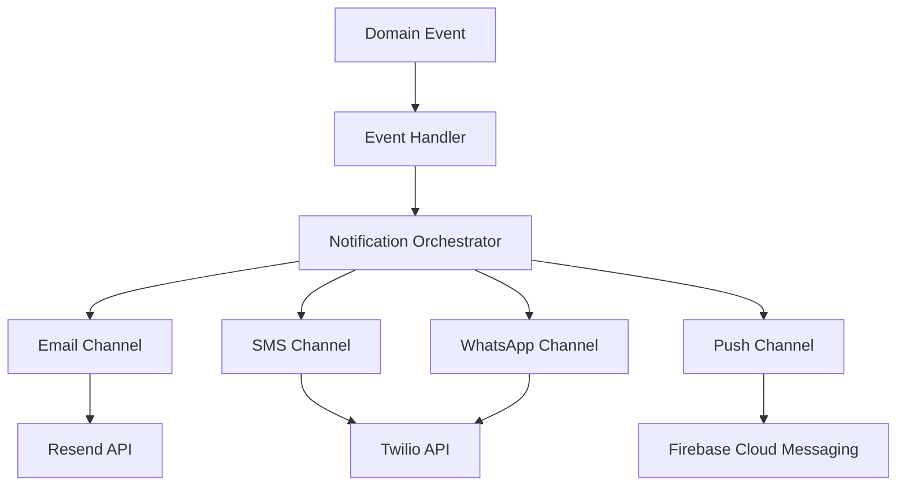

# Notification System Documentation

## 📚 Overview

The Notification System is a robust, modular, and channel-based architecture designed to handle all communication needs of the application. It supports multiple channels (Email, SMS, WhatsApp, Push) and uses an orchestrator pattern to manage complex business logic and multi-channel flows.

## 🚀 Key Features

- **Multi-Channel Support**: dedicated services for Email (Resend), SMS (Twilio), WhatsApp (Twilio), and Push (FCM).
- **Orchestration Layer**: Coordinates complex flows like order lifecycle events across multiple channels.
- **Resilience**: Built-in retry mechanisms with exponential backoff for all channels.
- **Type Safety**: Fully typed DTOs and enums for all notification payloads.
- **Template Engine**: React-based email templates using `@react-email/components`.
- **Clean Architecture**: Separation of concerns between channel delivery, business logic, and event handling.

## 🏗️ Architecture

The system is built on three main layers:

1.  **Event Handlers** (`/handlers`): Listen for domain events (e.g., `PaymentSucceededEvent`) and trigger orchestrators.
2.  **Orchestrators** (`/orchestrators`): Contain business rules for *who* gets notified, *when*, and via *which* channels.
3.  **Channel Services** (`/channels`): Pure delivery mechanisms responsible for sending messages to external providers.



## 🛠️ Usage Guide

### Triggering Notifications

The recommended way to trigger notifications is via **Orchestrators**. Do not use channel services directly in your business logic unless absolutely necessary.

#### Example: Sending Order Confirmation

```typescript
// In your service or controller
constructor(private readonly orderOrchestrator: OrderNotificationOrchestrator) {}

async handleOrderCreation(orderId: string) {
  // Triggers emails to customer, vendor, and admin + push notifications
  await this.orderOrchestrator.sendOrderCreationNotifications(orderId);
}
```

### Supported Notification Flows

| Flow | Orchestrator | Channels |
|------|--------------|----------|
| **Order Created** | `OrderNotificationOrchestrator` | Email (All), Push (Vendor) |
| **Order Cancelled** | `OrderNotificationOrchestrator` | WhatsApp (All) |
| **Subscription Confirmed** | `SubscriptionNotificationOrchestrator` | Email (Customer) |
| **Subscription Renewal** | `SubscriptionNotificationOrchestrator` | Email (Customer) |

## 📂 Code Structure

```
src/notification/
├── config/                 # Centralized configuration (retries, limits)
├── dto/                    # Data Transfer Objects for type safety
├── services/
│   ├── channels/           # Delivery services (Email, SMS, Push, WhatsApp)
│   ├── handlers/           # CQRS Event Handlers
│   └── orchestrators/      # Business logic coordinators
├── types/                  # Enums and interfaces
└── notification.module.ts  # Main module definition
```

## 🔌 Extending the System

### Adding a New Notification Type

1.  **Define DTO**: Create a payload DTO in `dto/` if new data is needed.
2.  **Update Orchestrator**: Add a method to the relevant orchestrator (e.g., `sendShippingUpdate`).
3.  **Call Channels**: Use channel services within the orchestrator to send the message.

```typescript
// src/notification/services/orchestrators/order-notification.orchestrator.ts

async sendShippingUpdate(orderId: string, trackingNumber: string) {
  // 1. Fetch data
  const order = await this.prisma.order.findUnique({ ... });
  
  // 2. Send Email
  await this.emailChannel.sendEmail(
    order.customer.email,
    'Order Shipped',
    rendershippingTemplate(order, trackingNumber)
  );

  // 3. Send SMS
  await this.smsChannel.sendSms(
    order.customer.phone,
    `Your order is on the way! Tracking: ${trackingNumber}`
  );
}
```

### Adding a New Channel

1.  Create a service in `services/channels/` (e.g., `SlackChannelService`).
2.  Implement `send` method with retry logic.
3.  Register in `NotificationModule`.
4.  Export in `services/channels/index.ts`.

## ⚙️ Configuration

Configuration is managed in `config/notification.config.ts`.

- **Retries**: Default 3 per channel.
- **Rate Limits**: Configurable per channel.
- **Timeouts**: 5000ms default.

## 🧪 Testing

The system is designed for easy testing:
- **Unit Tests**: Mock Channel Services to test Orchestrator logic.
- **Integration Tests**: Mock external providers (Resend, Twilio) to test Channel Services.

---
*Maintained by the Backend Team. Last Updated: Feb 2026*
